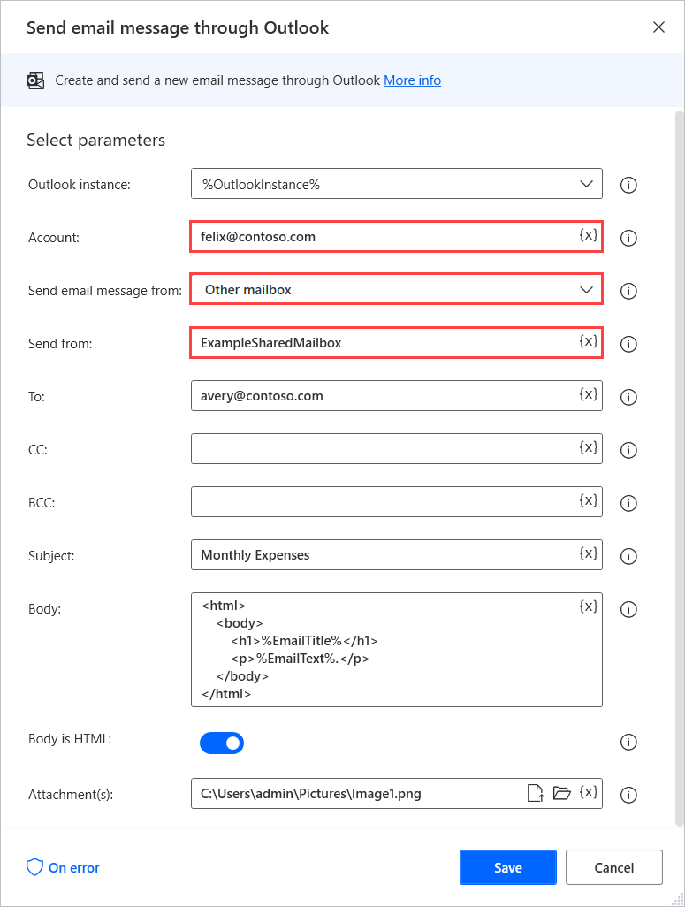

# Use a shared Outlook mailbox in email automations

Shared mailboxes allow groups of people to monitor and send emails from public email aliases. When a group user replies to messages sent to a shared mailbox, the email appears to be from the shared address, not from the individual user.

To retrieve emails from a shared mailbox, use the **Retrieve email messages from Outlook** action and populate the name of the mailbox in the **Account** field.

To send emails through a shared mailbox, use the **Send email message through Outlook** action. 

In the action's properties, select **Other mailbox** in the **Send email message from** drop-down menu, and populate the name of the shared mailbox in the **Send from** field. Additionally, populate the **Account** field with the address of your main account.

