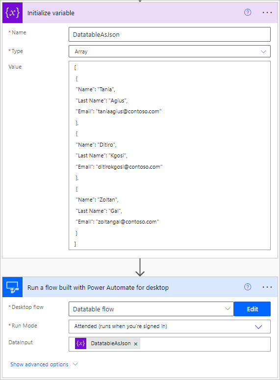

# Pass a datatable from a cloud flow to a desktop flow

Some automation scenarios require users to pass data in tabular form from a cloud flow to a desktop flow. To implement this functionality, replicate the following steps:

1. Create a new [input variable](../manage-variables.md#create-an-input-variable) of a [datatable datatype](../variable-data-types.md#datatable). In this example, the input variable is named **DataInput**.

    

1. Inside your cloud flow, initialize a new string variable with a JSON text representing your datatable. Then, parse it and use the result as an input value in the **Run a flow built with Power Automate for desktop** action.

    


      In the following example, you can see the structure of a JSON block.

    ``` JSON
    [
     {
     "Name": "Tania",
     "Last Name": "Agius",
     "Email": "taniaagius@contoso.com"
     },
     {
     "Name": "Ditiro",
     "Last Name": "Kgosi",
     "Email": "ditirokgosi@contoso.com"
     },
     {
     "Name": "Zoltan",
     "Last Name": "Gal",
     "Email": "zoltangal@contoso.com"
     }
    ]
    ```
To find more information regarding passing data from cloud flows to desktop flows, refer to [Trigger a Power Automate desktop flow from another flow](../link-pad-flow-portal.md).
