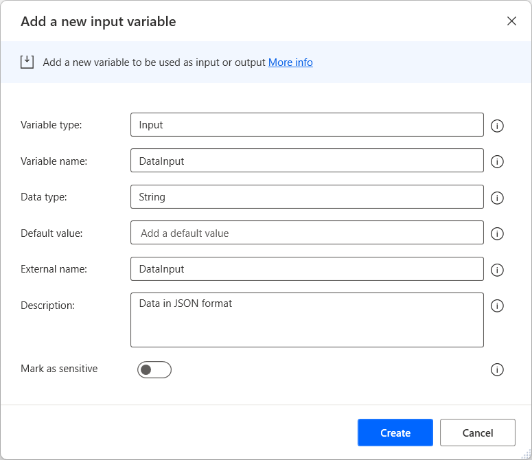
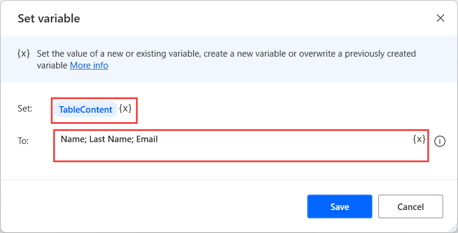
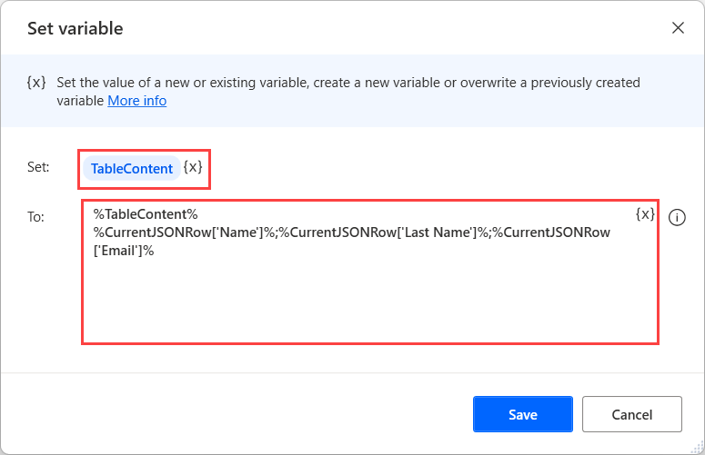
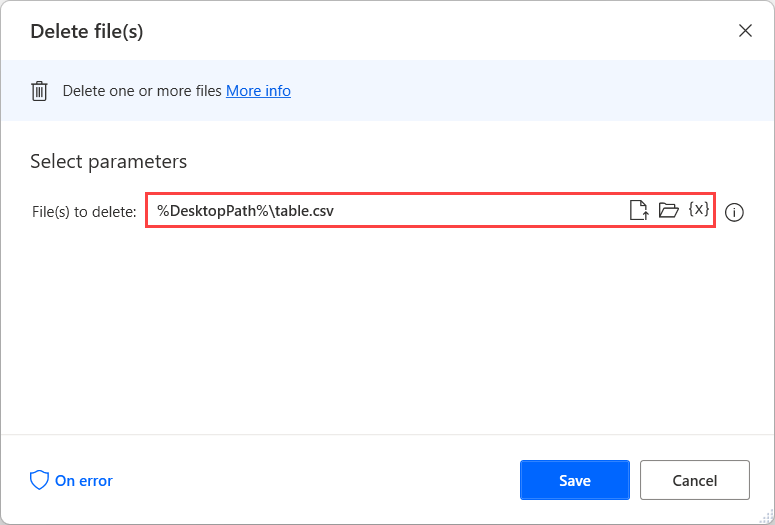

# Pass a datatable from a cloud flow to a desktop flow

Some automation scenarios require users to pass data in tabular form from a cloud flow to a desktop flow. To implement this functionality, replicate the following flow:

1. Before deploying any actions, [create a new input variable](../manage-variables.md#create-an-input-variable). In this example, the input variable is named **DataInput**.

    

    This variable will be used in your cloud flow to pass data to your Power Automate desktop flow. The data must be in JSON format for this flow to run successfully. In the following example, you can see the structure of a JSON block.

    ``` JSON
    [
     {
     "Name": "Tania",
     "Last Name": "Agius",
     "Email": "taniaagius@contoso.com",
     },
     {
     "Name": "Ditiro",
     "Last Name": "Kgosi",
     "Email": "ditirokgosi@contoso.com",
     },
     {
     "Name": "Zoltan",
     "Last Name": "Gal",
     "Email": "zoltangal@contoso.com",
     }
    ]
    ```
    To find more information regarding passing data from cloud flows to desktop flows, refer to [Trigger a Power Automate desktop flow from another flow](../link-pad-flow-portal.md).

1. Convert the imported JSON data to a custom object using the respective action. You can find more information regarding custom objects in [Advanced data types](../variable-data-types.md#advanced-data-types). 

    

1. Deploy a **Set variable** action and create a new variable named **TableContent**. In this step, the variable must contain the headers of the table you want to pass separated by semicolons.

    

1. Use a **For each** loop to iterate through each item of the previously created custom object.

    

1. Use a **Set variable** action and append the appropriate values of the current item to the **TableContent** variable. The values must be separated by semicolons. 

    

1. Outside the loop, deploy the **Get special folder** action to retrieve the path for your desktop folder. 

    

1. Write the content of the **TableContent** variable to a file named **table.txt** located in your desktop folder. If the file doesn't exist, the action will create it automatically.

    

1. Use the **Rename file(s)** action to change the file extension of the previously mentioned file to **.csv**.

    

1. Lastly, read the content of the converted CSV file using the **Read from CSV file** action. The read data will have the form of a datatable.

    

1. Optionally, use the **Delete file(s)** action to delete the **table.csv** file from your desktop. 

    
