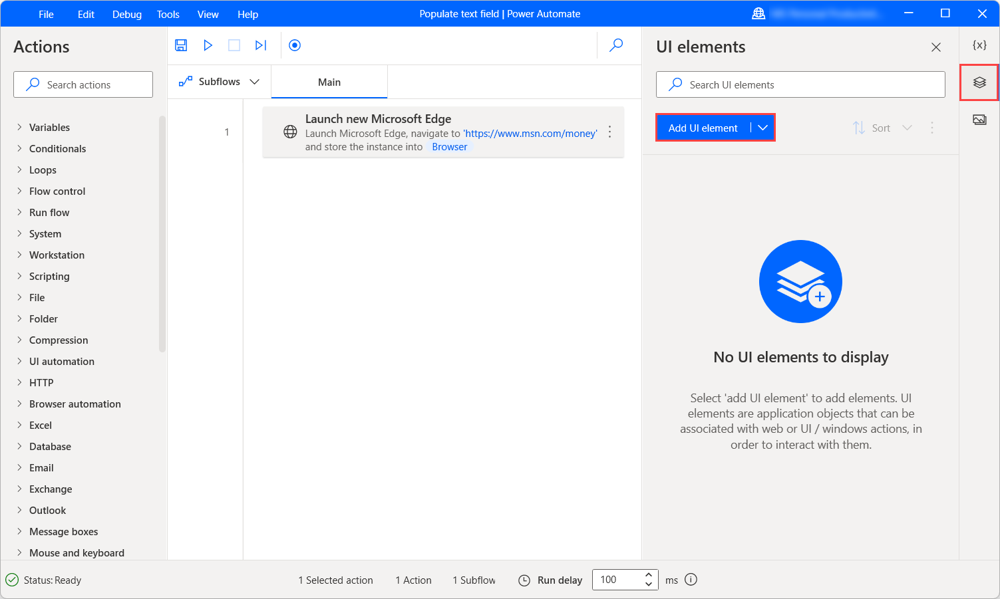
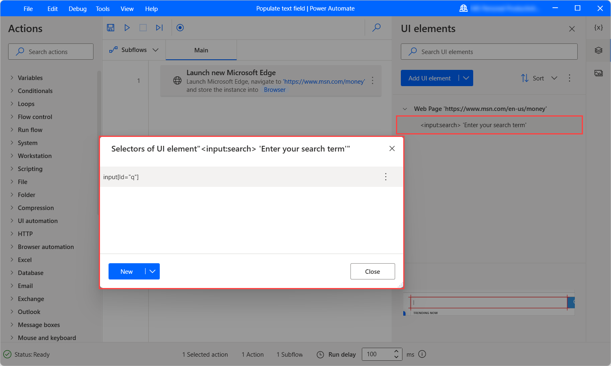
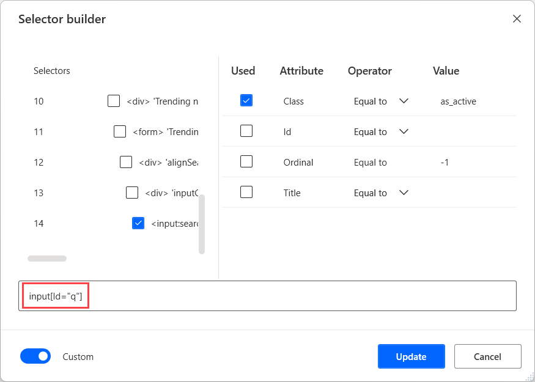

# Populate text fields and click on links using JavaScript

Some web applications may have design constraints that don't allow browser automation actions to populate text fields or click on links and buttons.

An alternative approach to automate these web applications is the use of the **Run JavaScript function on web page** action, which allows you to run JavaScript code on web pages.

Before deploying the **Run JavaScript function on web page** action, you need the CSS selector of the element you want to populate or click. To get the selector, navigate to the **UI elements** tab and select **Add UI element**. 




After creating the UI element, navigate again to the **UI elements** tab, select the created UI element, and open the selector with the **Selector builder**. 



Now, copy the last element of the selector located on the right side of the last occurred **>** character.



> [!NOTE]
> You can find more information about selectors in [Build a custom selector](../build-custom-selectors.md).

To populate a text field, deploy the **Run JavaScript function on web page** action and populate the following code in the **JavaScript function** field. After pasting the code, replace the **CSS-selector** and **value-to-populate** placeholders with the previously copied selector and the value to populate, respectively.

``` JavaScript
function ExecuteScript()
{
document.querySelectorAll('CSS-selector')[0].value="value-to-populate";
}

OR

function ExecuteScript()
{
document.querySelectorAll('CSS-selector')[0].innerText="value-to-populate";
}
```


To click a link or press a button, use the following code:

``` JavaScript
function ExecuteScript()
{
document.querySelectorAll('CSS-Selector')[0].click();
}
```
