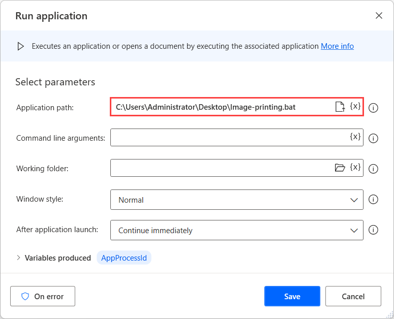

# Print images

Although Power Automate Desktop enables you to print documents using the **Print document** action, printing image files requires a different approach.

To print an image file, create a batch script that launches Microsoft Paint and prints the selected image file through it.

To develop the script, create a new .txt file, copy the following code, and save it as **Image-printing.bat**. 

> [!NOTE]
> Before saving the script, replace the **Image_Path** placeholder with the file path of the image you want to print.

```
@echo off

title Print Images

mspaint /p "Image_Path"

taskkill /IM "mspaint.exe"
```

To run the script, use the **Run application** action and populate the path of the batch file in the **Application path** field.



Alternatively, you can print image files using the **Run DOS command** action with the following command as an input:

> [!NOTE]
> Before running the flow, replace the **Image_Path** and **Printer_Name** placeholders with the file path and the printer's name, respectively.

```
rundll32 C:\WINDOWS\system32\shimgvw.dll,ImageView_PrintTo "Image_Path" "Printer_Name"
```