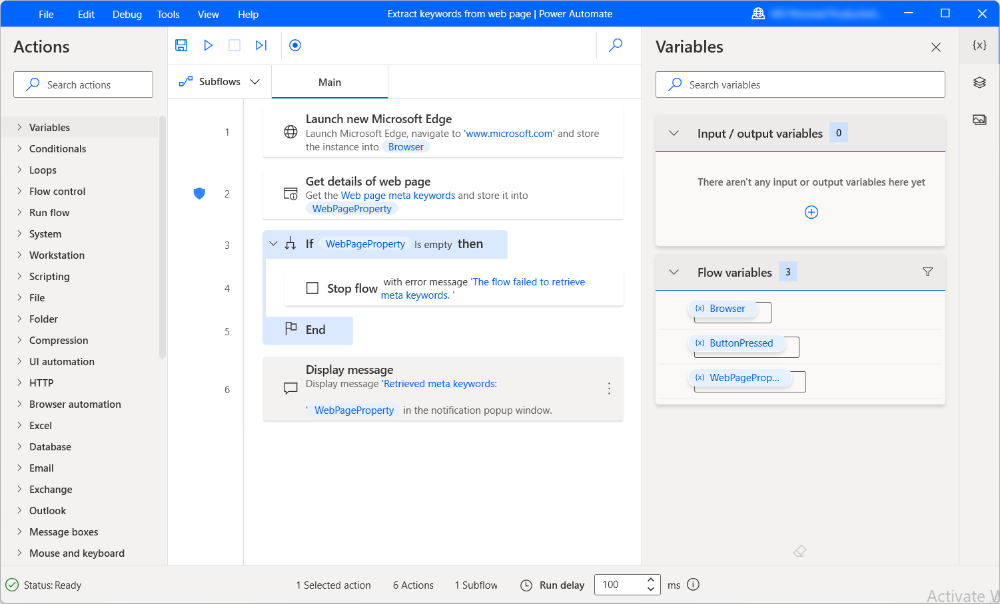

# Retrieve details from a web page 

Extracting information regarding web pages is an essential function in most web-related flows. The **Get details of web page** action allows you to retrieve various details from web pages and handle them in your desktop flows.

To use the action, you need an already created browser instance that specifies the web page you want to extract details from. A browser instance can be created with any [browser-launching action](../actions-reference/webautomation.md). 

After selecting the appropriate browser instance, choose the information you want to extract from the web page. The **Get details of web page** action offers six different options:

- The description of the web page
- The meta keywords of the web page
- The title of the web page
- The text of the web page
- The source code of the web page
- The URL address of the web page

The retrieved information is stored for later use in a text variable named **WebPageProperty**. 

## Prevent errors while retrieving details

Although most properties exist virtually on every web page, there are scenarios in which the **Get details of web page** action fails to retrieve the selected detail. For example, web pages without meta keywords are a common occurrence.

If you're unsure if an attribute exists on a web page, configure the **On error** options of the **Get details of web page** action to continue running the flow after failure. To find more information about action error handling, refer to [Handle errors in desktop flows](../errors.md).

To determine whether the data extraction is successful, use an **If** conditional to check if the **WebPageProperty** variable is empty or not. 

The conditional allows you to implement different functionality for the cases of successful and unsuccessful data extraction. You can find more information regarding conditionals in [Use conditionals](../use-conditionals.md). 

The following example subflow retrieves the available meta keywords from a web page and displays them in a message box. If the extraction is unsuccessful, the flow stops and returns an error message. 

