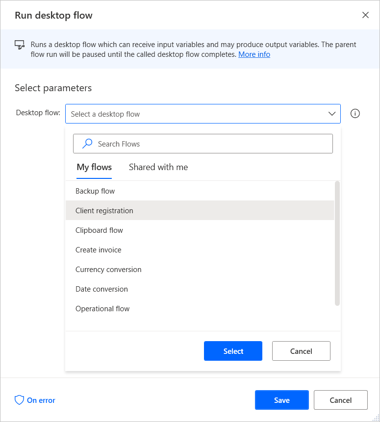
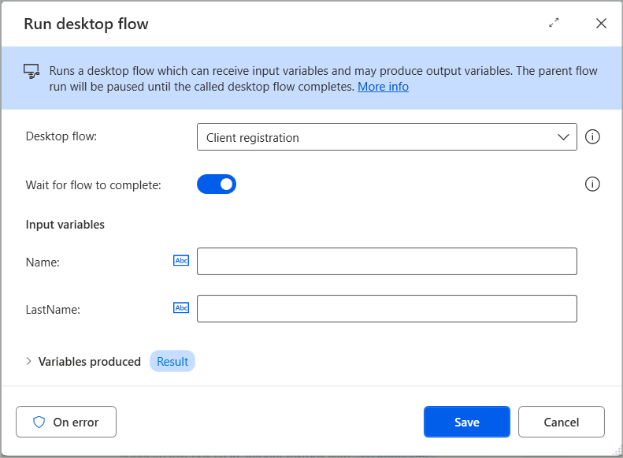

# Run desktop flow from other desktop flows

Power Automate provides the **Run desktop flow** action to enable users to call desktop flows while running other desktop flows.

Using this feature, you can split complicated flows into smaller ones and call them when needed. For example, you can create separate flows to handle specific error scenarios in the main flow.

To use the action, add it to the workspace and select the desktop flow you want to call. 

When the action runs, depending on the state of the 'Wait for flow to complete' toggle, the parent flow either pauses until the called desktop flow completes or runs in parallel. If the called flow contains input variables, you're prompted to populate them. Likewise, if the called flow has output variables, the action returns their values in the parent flow, as long as the parent flow remains paused. If the child flow runs in parallel, no output variables are produced.

>[!IMPORTANT]
>
> - Up to six parallel flows in total can run concurrently with the root flow, shifting the previous limit of just one parallel flow.
> - Child flows can also run other child flows in parallel (no error is thrown in such cases anymore), consuming from the available pool of six parallel flows. Parallel flow runs are no longer limited to being invoked directly from the parent (root) flow, as was previously the case.
> - When a parent flow completes its run or is stopped, it also stops (cancels) its invoked parallel child flows that might still run.

Sometimes, in a parallel run scenario where a parent flow invokes a child flow, there could be some cases where the run logs of the child flow might be completely or partially missing. This is an expected behaviour that occurs because, in a parallel run setup, the parent flow cancels any running child flows once it completes. This cancellation happens only if the child flow is configured to run in parallel with the “Wait for completion” option set to false.

As a result, the child flow may not have enough time to complete all its actions before being terminated. This leads to incomplete or missing logs, depending on how far the child flow progressed before cancellation.

> [!NOTE]
> You can find more information regarding input and output variables in [Input and output variables](../manage-variables.md#input-and-output-variables).

Power Automate doesn't allow two flows to directly or indirectly call each other to prevent recursions. Additionally, a flow can't have more than 150 dependent flows. If a dependent flow is missing or the parent flow has more than 150 dependencies, the flow doesn't run.
