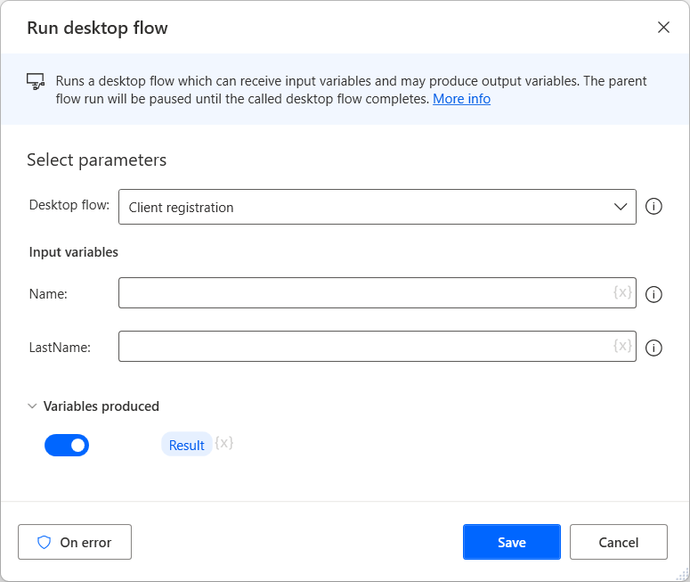

# Run desktop flow from other desktop flows

Power Automate provides the **Run desktop flow** action to enable users to call desktop flows while running other desktop flows.

Using this feature, you can split complicated flows into smaller ones and call them when needed. For example, you can create separate flows to handle specific error scenarios in the main flow.

To use the action, add it to the workspace and select the desktop flow you want to call. 

Every time the action runs, the parent flow is paused until the called desktop flow completes. If the called flow contains input variables, you'll be prompt to populate them. Likewise, if the called flow has output variables, the action will return their values in the parent flow. 

> [!NOTE]
> You can find more information regarding input and output variables in [Input and output variables](../manage-variables.md#input-and-output-variables).

Power Automate doesn't allow two flows to directly or indirectly call each other to prevent recursions. Additionally, a flow can't have more than 30 dependent flows. If a dependent flow is missing or the parent flow has more than 30 dependencies, the flow won't run.