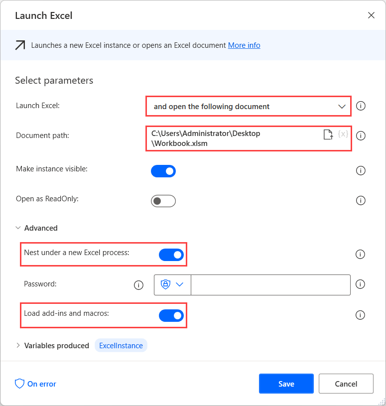
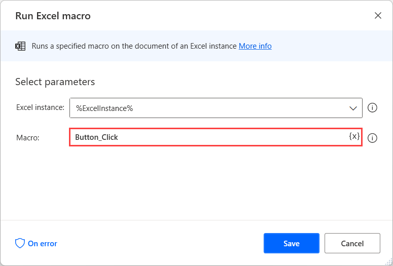
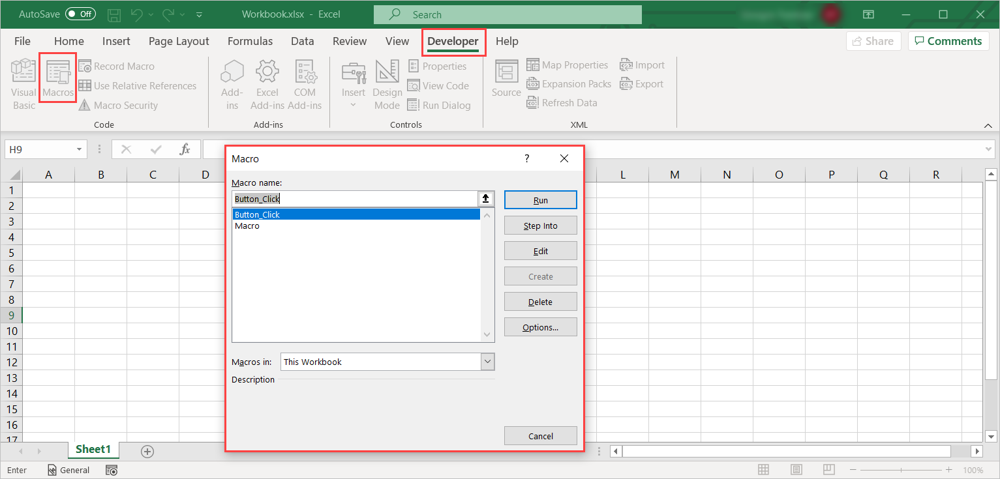
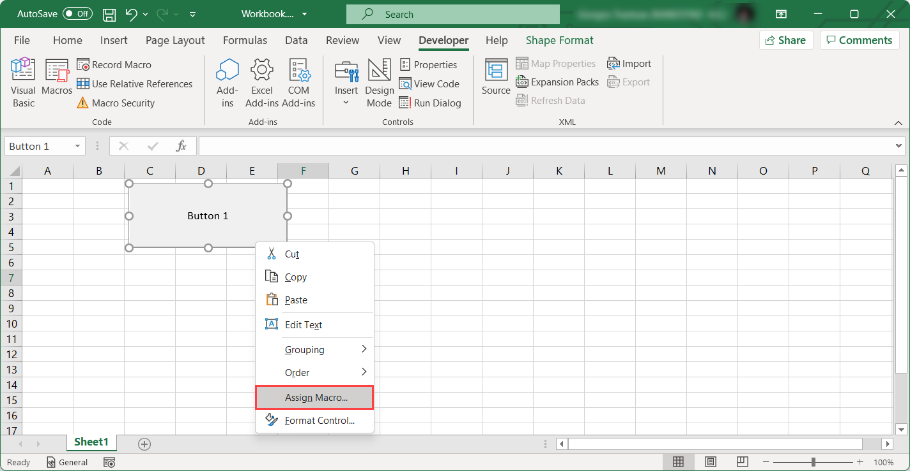

# Run macros on an Excel workbook

The **Run Excel macro** action enables you to run macros in open Excel instances.

To create an Excel instance, deploy the **Launch Excel** action and select to open the Excel file containing the needed macro.

> [!IMPORTANT]
> To run macros stored in your personal macro workbook (PERSONAL.XLSB), enable the **Nest under a new Excel process** and **Load add-ins and macros** options located in the advanced options of the **Launch Excel** action.

To run the macro, deploy the **Run Excel macro** action and populate its name in the **Macro** field.

To find the name of a macro, open the respective workbook and navigate to **Developer** > **Macros**. The pop-up dialog displays all the available macros in the workbook.

To find the name of a macro assigned to a button, open the workbook, right-click on the button, and select **Assign Macro**. The pop-up dialog is the same as in the previous case.

