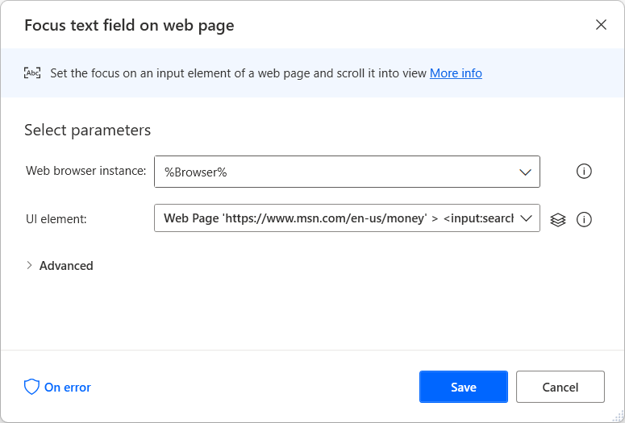
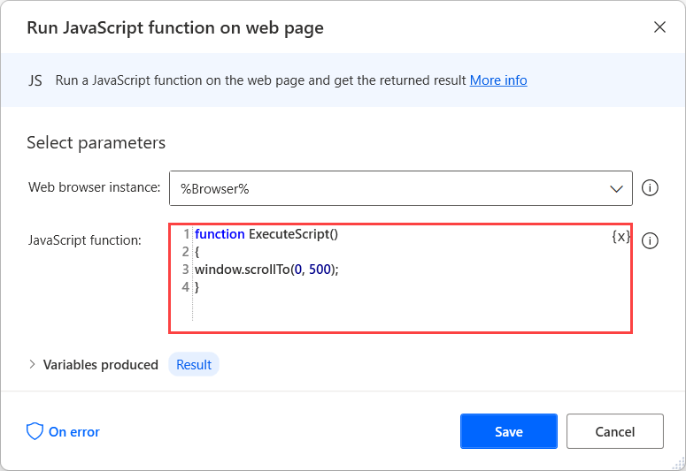
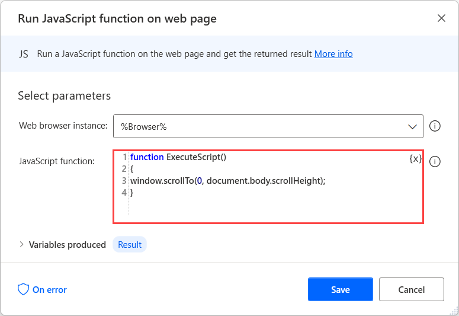
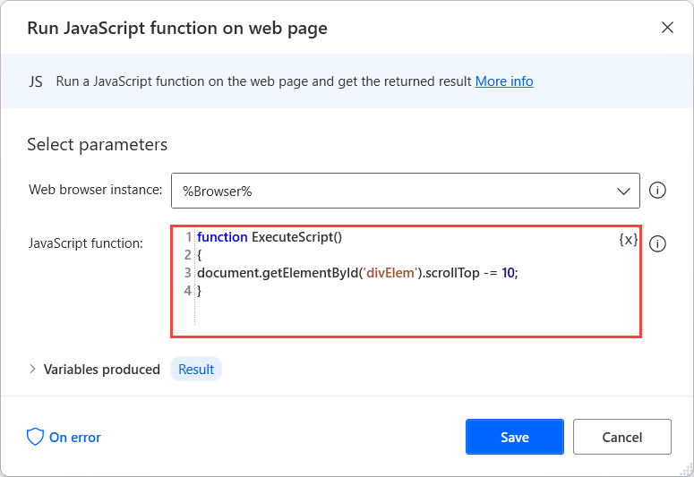

# Scroll on a web page

In some browser automation flows, you may need to scroll on web pages to make specific elements visible on the screen.

Power Automate allows scrolling on web pages through two different approaches. The first one requires the **Focus text field on web page** action, while the second requires JavaScript scripting.

## Scroll on a web page using the Focus text field on web page action

To scroll to a specific element on a web page, you can deploy the **Focus text field on web page** action.

In the action's properties, you have to create a UI element that selects the target element of the scrolling. Although the action's primary purpose is to focus on text fields, you can use it for scrolling to any element.

> [!NOTE]
> You can find more information about UI elements in [Automate using UI elements](..\ui-elements.md).



Usually, web applications contain **loading more** elements at the bottom of pages that display many elements. In these cases, you can target the **loading more** element to scroll at the bottom of the page.

## Scroll on a web page using JavaScript

Apart from the **Focus text field on web page** action, you can scroll on web pages using JavaScript. To run JavaScript on web pages, use the **Execute Javascript function on web page** action.

JavaScript provides the **window.scrollTo(xpos, ypos)** function that scrolls to a specific part of a web page. The **xpos** placeholder indicates the horizontal scroll, while the **ypos** placeholder indicates the vertical scroll.

``` JavaScript
function ExecuteScript() 
{
window.scrollTo(xpos, ypos);
}
```

You can replace both placeholders with hardcoded values, properties, or variables. In the following example, the function contains hardcoded values.



If you want to scroll to the bottom of a web page, you can replace the **ypos** placeholder with the **document.body.scrollHeight** property.

``` JavaScript
function ExecuteScript() 
{
window.scrollTo(0, document.body.scrollHeight);
}
```



If you want to scroll inside an element of a web page, not the page itself, you can use the HTML DOM property **scrollTop**. In the following example, the function locates the **divElem** and scrolls vertically 10 pixels down.

``` JavaScript
function ExecuteScript() 
{
document.getElementById('divElem').scrollTop -= 10;
}
```


