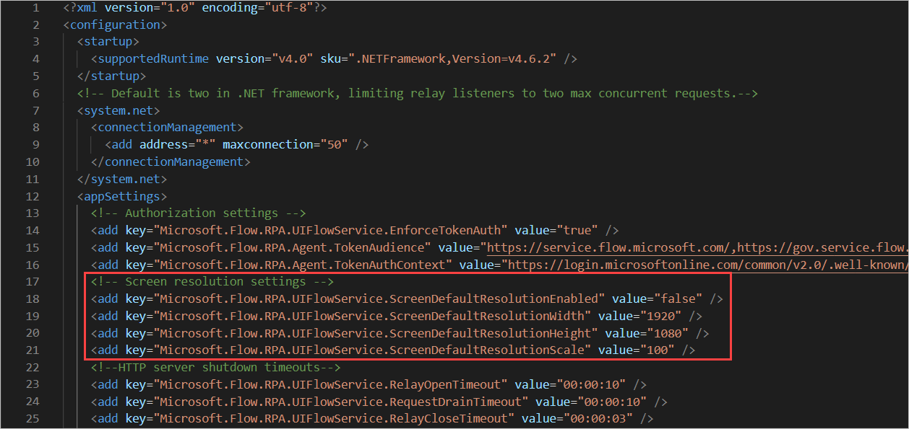

# Set screen resolution on unattended flows

In some scenarios, Power Automate Desktop may run unattended flows in a lower resolution than the one used to develop the flows. As a result, some UI elements could be hidden from the screen and cause flows to fail.

To change the resolution in which unattended flows are run:

1. Navigate to **C:\Program Files (x86)\Power Automate Desktop** and open the **UIFlowService.exe.config** file.

1. Set the value of the **Microsoft.Flow.RPA.UIFlowService.ScreenDefaultResolutionEnabled** key to **true**.

   

1. Change the values of the following keys to the proper screen resolution width, height, and scale, respectively:

    - **Microsoft.Flow.RPA.UIFlowService.ScreenDefaultResolutionWidth**
    - **Microsoft.Flow.RPA.UIFlowService.ScreenDefaultResolutionHeight**
    - **Microsoft.Flow.RPA.UIFlowService.ScreenDefaultResolutionScale**

1. Restart Power Automate Desktop.