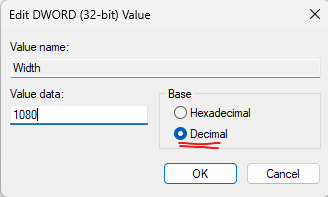
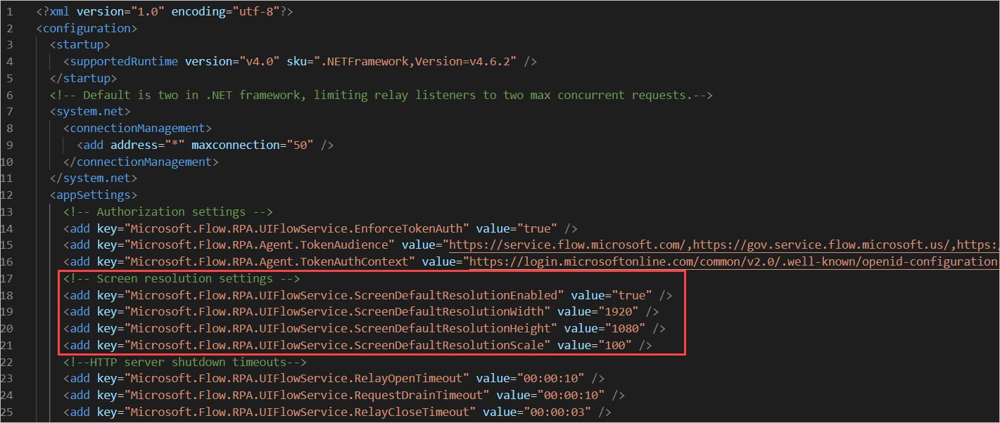
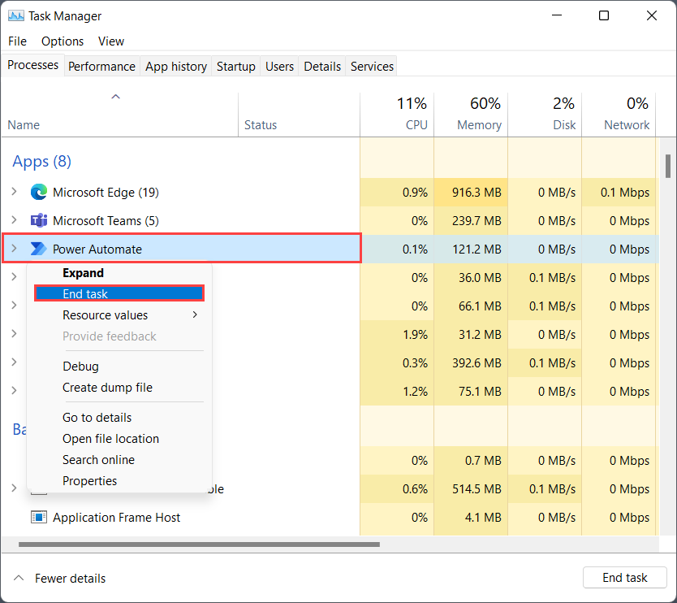

# Set screen resolution on unattended mode

In some scenarios, Power Automate might run unattended flows in a lower resolution than the one used to develop the flows. As a result, some UI elements could be hidden from the screen, while any images captured might not be identified at runtime under a different resolution. This might cause flows to fail. In such cases, you can follow one of the two approaches explained in this article to adjust the screen resolution used for unattended flows accordingly.

> [!NOTE]
> The screen resolution can be adjusted per target machine, not per flow. If you need one of your unattended flows to run in another resolution, a different target machine needs to be used.

## With Windows registry

Set the screen resolution for unattended flows using the Windows registry. This method can be used with Power Automate flows starting with version 2.35.

> [!IMPORTANT]
> Setting the **ScreenResolutionEnabled** registry key to 1 overrides the settings in the UIFlowService.exe.config file. The registry settings for screen resolution persist after an upgrade of Power Automate Desktop, the **UIFlowService.exe.config** file is overwritten with default values during upgrades.

1. This task explains how to modify the Windows registry. We recommend that you first back up any registry keys you modify, such as the Power Automate Desktop key. More information: [How to back up and restore the registry in Windows](https://support.microsoft.com/en-us/topic/how-to-back-up-and-restore-the-registry-in-windows-855140ad-e318-2a13-2829-d428a2ab0692#ID0EBD=Windows_11)
1. Open the registry editor (Windows key + R, and type 'regedit') and expand the **HKEY_LOCAL_MACHINE** hive.
1. Locate the **Screen** key in _SOFTWARE\WOW6432Node\Microsoft\Power Automate Desktop\Global_. If it doesn't exist, create it: right-click the **Global** key, select **New** > **Key**, type **Screen**, and press Enter.
1. Locate the following values in _SOFTWARE\WOW6432Node\Microsoft\Power Automate Desktop\Global\Screen_ and set the corresponding values. If the value names don’t exist, create them. To create them, right-click the **Screen** key, select **New** > **DWORD (32-bit) Value**, type *ScreenResolutionEnabled*, and press Enter. Double-click **ScreenResolutionEnabled**, enter *1*, select **Decimal**, and then select **OK**. Repeat these steps for each value in the following table.

   When editing DWORD values, be sure to select the **Decimal** base (hexadecimal is selected by default), to avoid having your values interpreted as hexadecimal which results in incorrect resolution settings.

   

| Key | Name | Type | Value |
|---|---|---|---|
| SOFTWARE\WOW6432Node\Microsoft\Power Automate Desktop\Global\Screen | ScreenResolutionEnabled | DWORD | If set to '1', will enable the custom resolution settings. |
| SOFTWARE\WOW6432Node\Microsoft\Power Automate Desktop\Global\Screen | Width | DWORD | Set the screen resolution width, such as 1920. |
| SOFTWARE\WOW6432Node\Microsoft\Power Automate Desktop\Global\Screen | Height | DWORD | Set the screen resolution height, such as 1080. |
| SOFTWARE\WOW6432Node\Microsoft\Power Automate Desktop\Global\Screen | Scale | DWORD | Set the screen resolution scale, such as 100. |

## With UIFlowService.exe.config file

> [!IMPORTANT]
> The **UIFlowService.exe.config** file is overwritten with default values during upgrades and screen resolution settings will therefore be reset. We recommend setting the resolution [with Windows registry](#with-windows-registry) settings instead.

To change the resolution in which unattended flows are run by editing the UIFlowService.exe.config:

1. Go to **C:\Program Files (x86)\Power Automate Desktop**, and then open the **UIFlowService.exe.config** file.

1. Set the value of the **Microsoft.Flow.RPA.UIFlowService.ScreenDefaultResolutionEnabled** element to **true**.

    ``` XML
    <add key="Microsoft.Flow.RPA.UIFlowService.ScreenDefaultResolutionEnabled" value="true" />
    ```

1. Change the values of the following elements to the proper screen resolution width, height, and scale, respectively. The following code sets the default resolution to 1920 x 1,080 pixels.

    ``` XML
    <add key="Microsoft.Flow.RPA.UIFlowService.ScreenDefaultResolutionWidth" value="1920" />
    <add key="Microsoft.Flow.RPA.UIFlowService.ScreenDefaultResolutionHeight" value="1080" />
    <add key="Microsoft.Flow.RPA.UIFlowService.ScreenDefaultResolutionScale" value="100" />
    ```
   

1. Restart the **UIFlowService** service.

   To restart the service, start Windows Task Manager, select the **Services** tab, right-click the **UIFlowService** service, and then select **Restart**.

   

  > [!NOTE]
  > An alternative to restarting the UIFlowService is to restart your machine.

