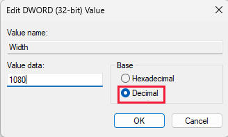
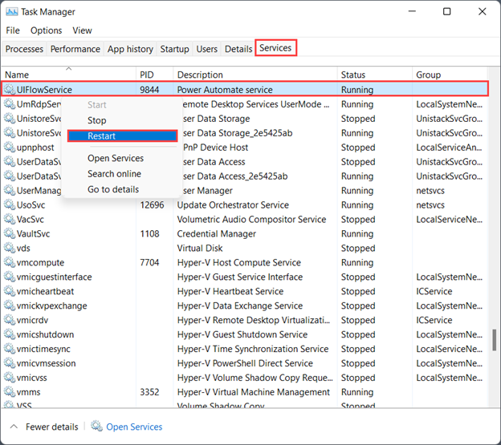

# Set screen resolution on unattended mode

In some scenarios, Power Automate runs unattended flows in a lower resolution than the one you used to develop the flows. As a result, some UI elements could be hidden from the screen, and any images you captured might not be identified at runtime under a different resolution. This mismatch might cause flows to fail. In such cases, follow one of the approaches explained in this article to adjust the screen resolution used for unattended flows.

> [!NOTE]
> You can set the screen resolution per target machine through the Windows registry or per flow through the flow properties. For unattended runs, the resolution defined in the flow properties takes precedence over the registry settings.

## From flow properties
Go to the flow whose unattended resolution you want to change and select the properties button from its menu. In the properties pane, turn on the **Display resolution for unattended runs** toggle. Choose a resolution from the drop‑down or enter a custom value. The resolution should match the machine on which you originally developed the flow to ensure that the flow works properly.

## From Windows registry

Set the screen resolution for unattended flows by using the Windows registry. This setting ensures that all flows running on that machine use the specified resolution unless you specify a resolution setting in the flow properties. Use this method with Power Automate flows starting with version 2.35.

> [!IMPORTANT]
> Setting the **:::no-loc text="ScreenResolutionEnabled":::** registry key to **1** overrides the settings in the *:::no-loc text="UIFlowService.exe.config":::* file. The registry settings for screen resolution persist after an upgrade of Power Automate Desktop, the *:::no-loc text="UIFlowService.exe.config":::* file is overwritten with default values during upgrades.

This task explains how to modify the Windows registry. Back up any registry keys you modify, such as the Power Automate Desktop key. For more information, see [How to back up and restore the registry in Windows](https://support.microsoft.com/en-us/topic/how-to-back-up-and-restore-the-registry-in-windows-855140ad-e318-2a13-2829-d428a2ab0692#ID0EBD=Windows_11).
1. Open the registry editor (**Windows key + R**, and type **regedit**) and expand the **`HKEY_LOCAL_MACHINE`** hive.
1. Locate the **Screen** key in *:::no-loc text="SOFTWARE\\WOW6432Node\\Microsoft\\Power Automate Desktop\\Global":::*. If it doesn't exist, create it: right-click the **Global** key, select **New** > **Key**, type **Screen**, and press *Enter*.
1. Locate the following values in :::no-loc text="SOFTWARE\\WOW6432Node\\Microsoft\\Power Automate Desktop\\Global\\Screen"::: and set the corresponding values. If the value names don't exist, create them. To create them, right-click the **Screen** key, select **New** > **:::no-loc text="DWORD (32-bit) Value":::**, type **:::no-loc text="ScreenResolutionEnabled":::**, and press *Enter*. Double-click **ScreenResolutionEnabled**, enter **1**, select **:::no-loc text="Decimal":::**, and then select **OK**. Repeat these steps for each value in the following table.

   When you edit *:::no-loc text="DWORD":::* values, select the **Decimal** base (hexadecimal is selected by default). If you don't, the registry might interpret your values as *hexadecimal*, which results in incorrect resolution settings.

   

> [!IMPORTANT]
> The Power Automate installer writes registry settings in the 32-bit registry. However, if you set the screen resolution keys in the 64-bit registry (for example, *:::no-loc text="SOFTWARE\\Microsoft\\Power Automate Desktop\\Global\\Screen":::*), they take precedence. If the settings don't work as expected, check both locations and use only one.

| Key | Name | Type | Value |
|---|---|---|---|
| :::no-loc text="SOFTWARE\\WOW6432Node\\Microsoft\\Power Automate Desktop\\Global\\Screen"::: | `ScreenResolutionEnabled` | :::no-loc text="DWORD"::: | Set to *1* to enable the custom resolution settings. |
| :::no-loc text="SOFTWARE\\WOW6432Node\\Microsoft\\Power Automate Desktop\\Global\\Screen"::: | `Width` | :::no-loc text="DWORD"::: | Set the screen resolution width, such as 1920. |
| :::no-loc text="SOFTWARE\\WOW6432Node\\Microsoft\\Power Automate Desktop\\Global\\Screen"::: | `Height` | :::no-loc text="DWORD"::: | Set the screen resolution height, such as 1080. |
| :::no-loc text="SOFTWARE\\WOW6432Node\\Microsoft\\Power Automate Desktop\\Global\\Screen"::: | `Scale` | :::no-loc text="DWORD"::: | Set the screen resolution scale, such as 100. |

## With UIFlowService.exe.config file (deprecated)

> [!IMPORTANT]
> The upgrade process overwrites the *:::no-loc text="UIFlowService.exe.config":::* file with default values and resets screen resolution settings. Set the resolution [by using Windows registry](#from-windows-registry) settings instead.

To change the resolution for running unattended flows, edit the *:::no-loc text="UIFlowService.exe.config":::* file:

1. Go to *:::no-loc text="C:\Program Files (x86)\Power Automate Desktop":::* and open the `UIFlowService.exe.config` file.

1. Set the value of the *:::no-loc text="Microsoft.Flow.RPA.UIFlowService.ScreenDefaultResolutionEnabled":::* element to `true`.

    ``` XML
    <add key="Microsoft.Flow.RPA.UIFlowService.ScreenDefaultResolutionEnabled" value="true" />
    ```

1. Change the values of the following elements to the proper screen resolution width, height, and scale, respectively. The following code sets the default resolution to *1920 x 1,080 pixels*.

    ``` XML
    <add key="Microsoft.Flow.RPA.UIFlowService.ScreenDefaultResolutionWidth" value="1920" />
    <add key="Microsoft.Flow.RPA.UIFlowService.ScreenDefaultResolutionHeight" value="1080" />
    <add key="Microsoft.Flow.RPA.UIFlowService.ScreenDefaultResolutionScale" value="100" />
    ```
   

1. Restart the **`UIFlowService`** service.

   To restart the service, start Windows Task Manager, select the **Services** tab, right-click the **UIFlowService** service, and then select **Restart**.

   

  > [!NOTE]
  > Instead of restarting the `UIFlowService`, you can restart your machine.

