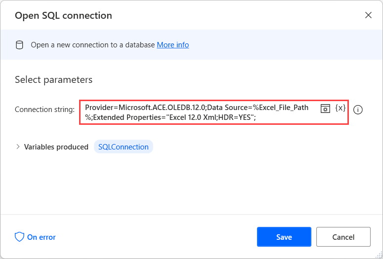
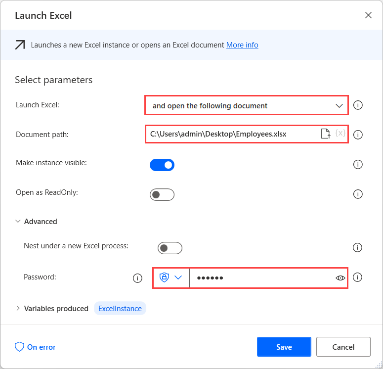
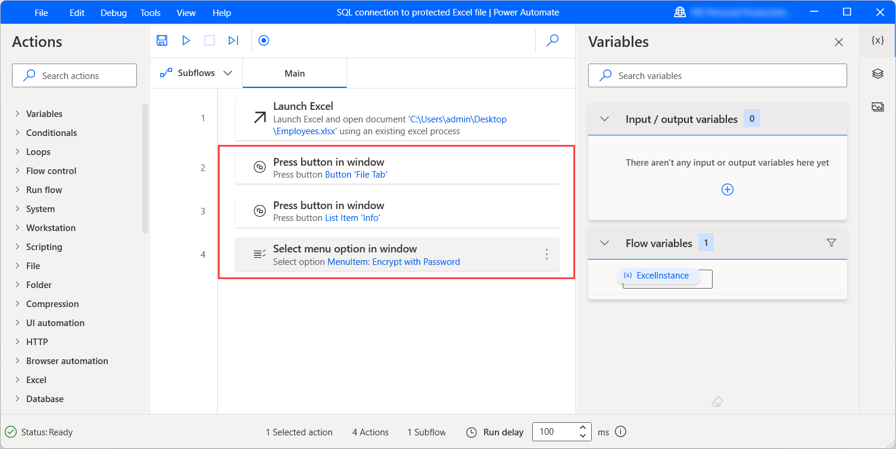
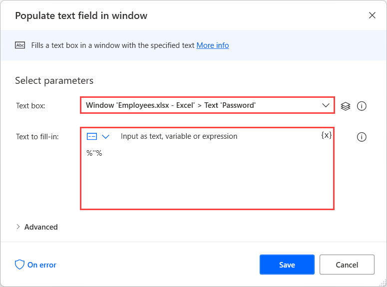
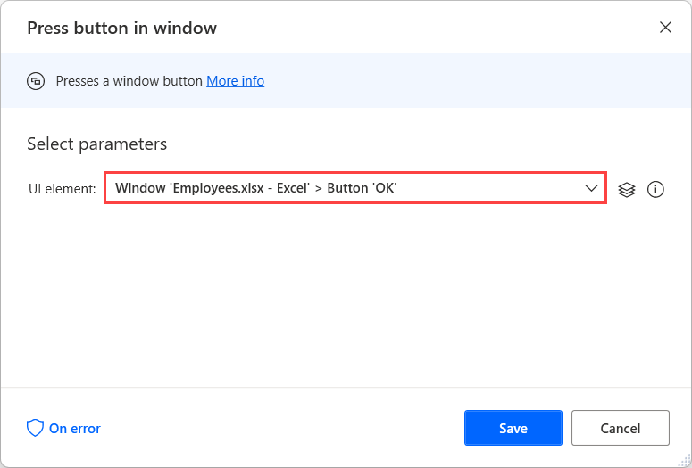
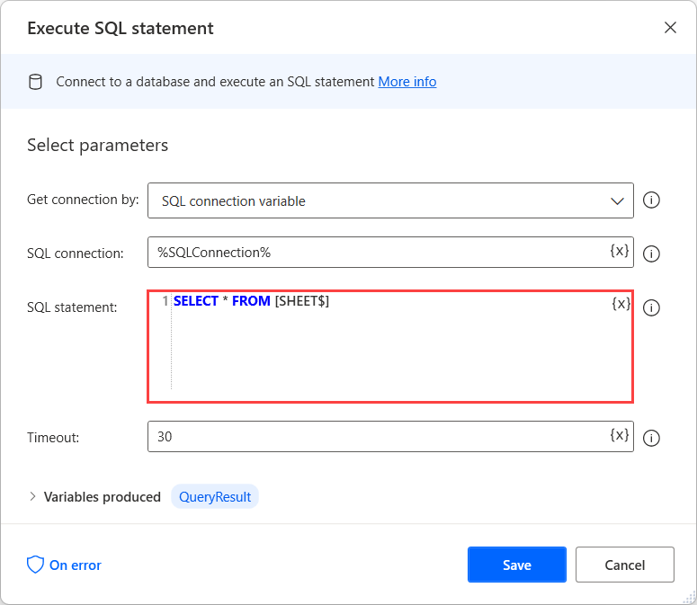

# Run SQL queries on Excel files

Although Excel actions can handle most Excel automation scenarios, SQL queries can retrieve and manipulate significant amounts of Excel data more efficiently.

Suppose a flow has to modify only the Excel registries that contain a particular value. To achieve this functionality without SQL queries, you need loops, conditionals, and multiple Excel actions.

Oppositely, you can implement this functionality with SQL queries using only two actions, the **Open SQL connection** action and the **Execute SQL statements** action.

## Open an SQL connection to an Excel file

Before running an SQL query, you have to open a connection with the Excel file you want to access. 

To establish the connection, create a new variable named **%Excel_File_Path%** and initialize it with the Excel file path. Optionally, you can skip this step and use the hardcoded path of the file later in the flow.


Now, deploy the **Open SQL connection** action and populate the following connection string in its properties.

**Provider=Microsoft.ACE.OLEDB.12.0;Data Source=%Excel_File_Path%;Extended Properties="Excel 12.0 Xml;HDR=YES";**

> [!NOTE]
> To use the presented connection string successfully, you have to download and install [Microsoft Access Database Engine 2010 Redistributable](https://www.microsoft.com/download/details.aspx?id=13255).



## Open an SQL connection to a password-protected Excel file

A different approach is required in scenarios where you run SQL queries on password-protected Excel files. The **Open SQL connection** action can't connect to password-protected Excel files, so you have to remove the protection.

To achieve that, launch the Excel file using the **Launch Excel** action. The file is password-protected, so populate the appropriate password in the **Password** field.



Next, deploy the appropriate UI automation actions and navigate to **File** > **Info** > **Protect Workbook** > **Encrypt with Password**. You can find more information about UI automation and how to use the respective actions in [Automate desktop flows](../desktop-automation.md).



After selecting **Encrypt with Password**, populate an empty string in the popup dialog using the **Populate text field in windows** action. To populate an empty string, use the following expression: **%""%**.



To press the **OK** button in the dialog and apply the changes, deploy the **Press button in window** action.



Lastly, deploy the **Close Excel** action to save the non-protected workbook as a new Excel file.


After saving the file, follow the instructions in [Open an SQL connection to Excel files](sql-queries-excel.md#open-an-sql-connection-to-an-excel-file) to open a connection to it.

When the manipulation of the Excel file is completed, use the **Delete file(s)** action to delete the non-protected copy of the Excel file.


## Read contents of an Excel spreadsheet

Although the **Read from Excel worksheet** action can read the contents of an Excel worksheet, loops can take a significant time to iterate through the retrieved data.

A more efficient way to retrieve specific values from spreadsheets is to treat Excel files as databases and execute SQL queries on them. This approach is faster and increases the performance of the flow.

To retrieve all the contents of a spreadsheet, you can use the following SQL query in the **Execute SQL statements** action.

``` SQL
SELECT * FROM [SHEET$]
```



> [!NOTE]
> To apply this SQL query in your flows, replace the **SHEET** placeholder with the name of the spreadsheet you want to access.

To retrieve the rows that contain a particular value in a specific column, use the following SQL query:

``` SQL
SELECT * FROM [SHEET$] WHERE [COLUMN NAME] = 'VALUE'
```

> [!NOTE] 
> To apply this SQL query in your flows, replace:
> - **SHEET** with the name of the spreadsheet you want to access
> - **COLUMN NAME** with the column that contains the value you want to find
> - **VALUE** with the value you want to find

## Delete data from an Excel row

Although Excel doesn't support the **DELETE** SQL query, you can use the **UPDATE** query to set all the cells of a specific row to null.

More precisely, you can use the following SQL query:

``` SQL
UPDATE [SHEET$] SET [COLUMN1]=NULL, [COLUMN2]=NULL WHERE [COLUMN1]='VALUE'
```


While developing your flow, you have to replace the **SHEET** placeholder with the name of the spreadsheet you want to access.

The **COLUMN1** and **COLUMN2** placeholders represent the names of all the existed columns. In this example, the columns are two, but in a real scenario, the number of the columns may be different.

The **\[COLUMN1\]='VALUE'** part of the query defines the row you want to update. In your flow, use the column name and the value based on which combination describes the rows uniquely.


## Retrieve Excel data except for a specific row

In some scenarios, you may need to retrieve all the contents of an Excel spreadsheet except for a specific row.

A convenient way to achieve this result is to set the values of the unwanted row to null and then retrieve all the values except for the null ones.

To change the values of a specific row in the spreadsheet, you can use an **UPDATE** SQL query, as presented in [Delete data from an Excel row](sql-queries-excel.md#delete-data-from-an-excel-row):

``` SQL
UPDATE [SHEET$] SET [COLUMN1]=NULL, [COLUMN2]=NULL WHERE [COLUMN1]='VALUE'
```


Next, run the following SQL query to retrieve all the rows of the spreadsheet that don't contain null values:

``` SQL
SELECT * FROM [SHEET$] WHERE [COLUMN1] IS NOT NULL OR [COLUMN2] IS NOT NULL
```

> [!NOTE]
> The COLUMN1 and COLUMN2 placeholders represent the names of all the existed columns. In this example, the columns are two, but in a real table, the number of the columns may be different.