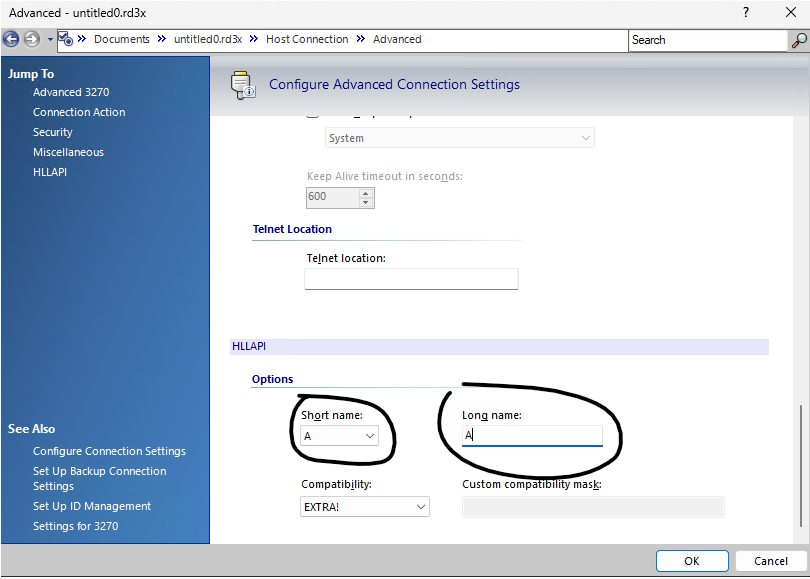

# Introduction
Terminal emulation actions offer two ways of interacting with a terminal emulation provider, Micro Focus reflection desktop and HLLAPI.

# Micro focus reflection
Micro Focus Reflection Desktop is a terminal emulation software by Micro Focus. To use this provider, select the corresponding option in the Provider parameter of the 'Open Terminal Session' action. This option integrates exclusively with this specific terminal emulation software, supporting versions 2011, 2014, 2016, and 2018.

## Prerequisites
When installing Micro Focus Reflection Desktop, the Application Programmer Interface (API) must also be installed.

### Configuration
The configuration allows for two distinct connection methods: Existing Profile and Specify Connection.

### Existing Profile
This option will launch a terminal session using a saved profile file that already has all its settings predefined. It is an efficient way to start a terminal session without needing to specify connection preferences.

### Specify Connection
This option requires you to add all the connection parameters in the action configuration, including the terminal host type (two types are supported: IBM3270 and IBM5250), the host address, and the port.

> [!NOTE]
> Launching a terminal emulation session using the Micro Focus Reflection provider also initiates the terminal emulation software itself.

# HLLAPI
HLLAPI is a terminal emulation communication protocol supported by nearly all terminal emulation software. PAD provides a mechanism to locate the terminal's HLLAPI implementation for use in flow execution. Since HLLAPI is widely implemented, PAD can theoretically integrate with virtually any terminal emulation software available on the market.

## Configuration
The HLLAPI DLL path refers to the location of the DLL file for the terminal emulation software. This DLL contains the HLLAPI implementation provided by each terminal emulation vendor and is typically located within the installation directory of the product. The most common DLL files are HLLAPI32.dll or ehlapi32.dll (Whlapi32.dll is not supported).

The session name is a letter which corresponds to the currently active session and can be configured by the terminal emulation software's option or preferences.

Both the short and long names must match the letter used as the session name in the action configuration.

> [!NOTE]
> Launching terminal emulation software using the HLLAPI provider does not automatically start the terminal emulation software. The software must be manually launched beforehand, for instance, by using an action like Run Application.

## Usage example
Since the terminal must be launched with specific long and short names and connection preferences, it is common practice to first manually launch the terminal with any desired connection preferences, save the configuration in an .rd3x file, and then use that file with a Run Application action to launch the application.
