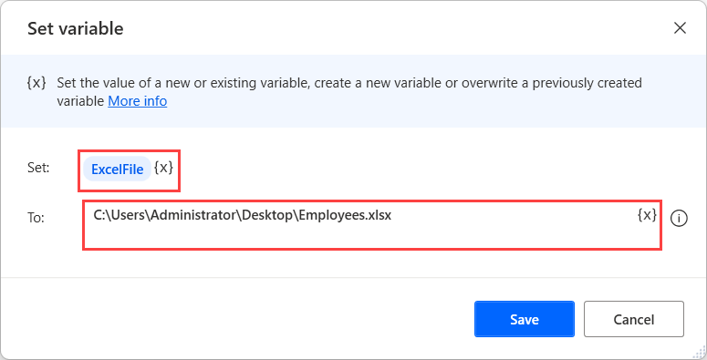
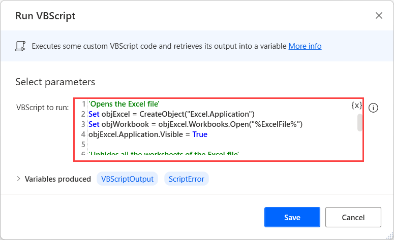

# Unhide worksheets in Excel using VBScript

If an Excel file contains hidden worksheets, replicate the following steps to make them visible:

1. Use the **Set variable** action to create a new variable containing the file path of the respective Excel file. In this example, the variable is named **ExcelFile**.

    

1. Deploy the **Run VBScript** action and populate the following code. 

    ``` VBScript
    'Opens the Excel file'
    Set objExcel = CreateObject("Excel.Application")
    Set objWorkbook = objExcel.Workbooks.Open("%ExcelFile%")
    objExcel.Application.Visible = True

    'Unhides all the worksheets of the Excel file'
    For i=1 To objWorkbook.Sheets.Count
    objWorkbook.Sheets(i).Visible = True
    Next

    'Saves and closes the Excel file'
    objWorkbook.Save
    objWorkbook.Close SaveChanges = True
    ```
    
