# Use inputs and outputs in Windows recorder (V1) flows

>[!IMPORTANT]
>This section covers topics to develop automations using legacy systems:
> - Selenium IDE: If you are just starting your RPA automation project, we recommend that you use Power Automate for desktop instead.
> - Windows recorder (V1): From November 30th, desktop flows will no longer be supported. Migrate your flows to Power Automate for desktop or delete them.

Use inputs to pass information from an external source such as a database or any supported connector to the legacy software that Windows recorder (V1) automates.

For example, you can use customer information from a SharePoint list as a source for input into your legacy accounting software. You can also pass sensitive input like a username or a password that are required to login to a legacy application using **Sensitive text inputs**.

## Define inputs in the Windows recorder (V1) flows

1. Select **Text** to define an input or select **Sensitive text** to define a sensitive text input. 

   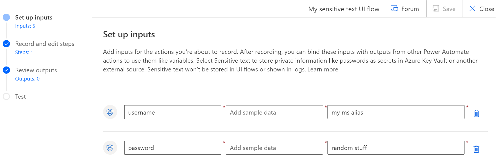

1. Add a name, a sample data, and a description to your input.

    - Sample data is used during the recording or test.

    - The description will be helpful to differentiate the inputs that you have created.

    - For sensitive text inputs, the sample value will be obscured and will not be persisted after saving

   

1.  Once your inputs are created, you can click on next to use them in a recording.

>[!TIP]
>You can use the **CTRL+ALT+L** key combination to insert text that you can pass to or from the application being used in the Windows recorder (V1) flow. This key combination works for sensitive, static, output, and input text. 

## Use inputs to pass information to the application

1. While recording, you can use an input in an app by selecting **Use Inputs**.

1. In the list, you can choose between three options:

    - Select one of the inputs that you defined in the **Set up inputs** step.

      >[!TIP]
      >You can identify sensitive text inputs easily because they have a different icon from text inputs.

    - Use a previously defined output (see Outputs section). This is useful to pass information between different applications within the same Windows recorder (V1) flow.

    - Create a new text or sensitive text input as you are recording using the **New input** option. You will find it back in the **Set up input** step.

   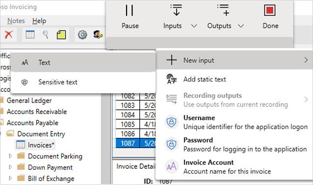

1. Select the location where you want to use the input. The sample value you defined is automatically used. In the below example “WingTip Toys” is the sample value for the input name “Invoice Account” and is added to the application.  
    
    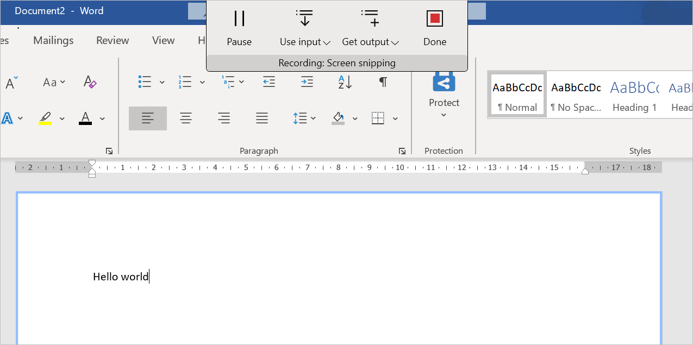

1. In Power Automate **Record and edit steps**, expand actions that use inputs to view which one is selected.

    In example that follows, you will see that “Invoice Account” is used as the value.

   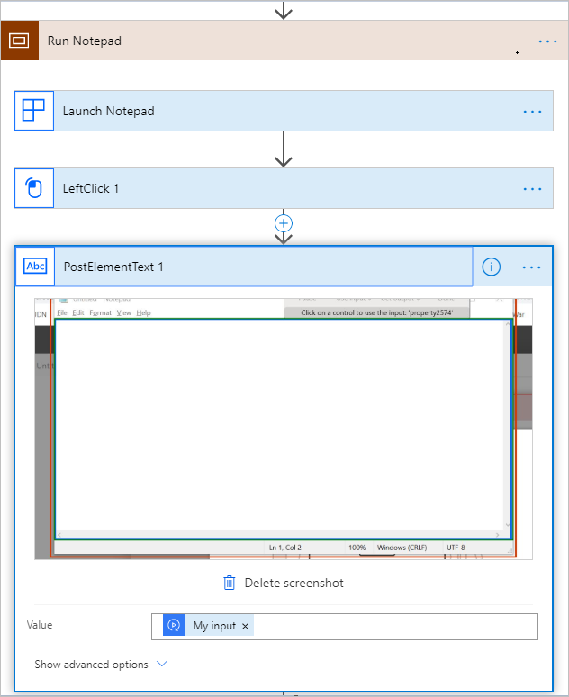

   >[!NOTE]
   >If you also used a sensitive text input, you would see an action with a lock icon on the top right to indicate that you used sensitive text input.

   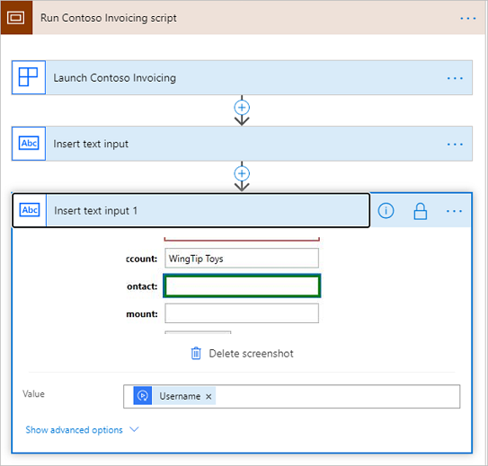

1. When triggering your UI flow, you can change the input value at will.

## Use outputs to extract information from the app

Outputs let you pass information from the legacy software that Windows recorder (V1) automates to an external destination such as a database or any [supported connector](https://flow.microsoft.com/connectors/).

For example, you can extract customer information your legacy accounting software and add it to a SharePoint list.

Outputs can only be created as you record your Windows recorder (V1) flow.

1. During a recording, select **Output**.

   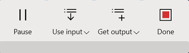

1. Select **Select text**.

   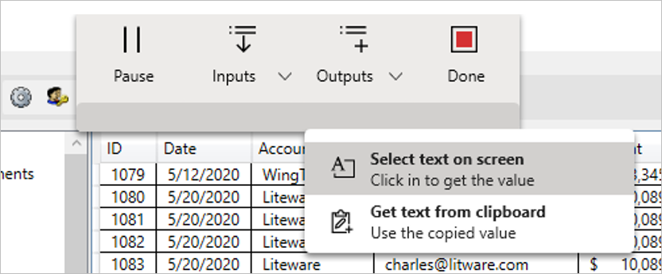

1. Select a user interface element to get its text for the output. The text value will be automatically captured. You can then provide a name and description for the output.

   

1. Provide a name and a description for the output.

1. Select **Save.** 

Your output is now available in the dedicated area of the wizard.

   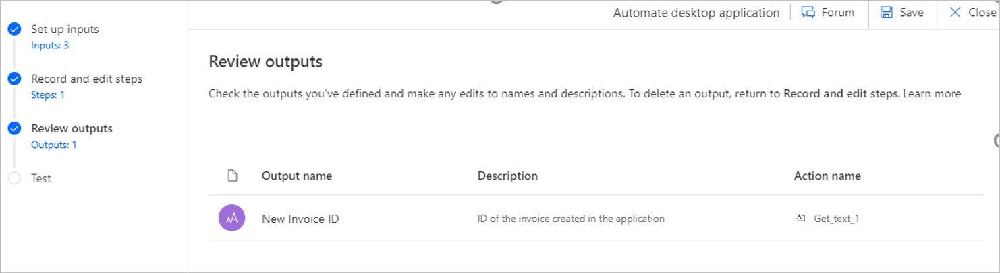

Each output has:

-  An output name as defined during the recording.
-  A description: This field can be very useful when you define many outputs during a recording and want to easily identify them later.
-  An action name: the action in which the output is defined in your Windows recorder (V1) flow.

## Use clipboard content to define outputs 

During a recording, it is possible to copy a text in the clipboard of your computer and to define it as output of your Windows recorder (V1) flow.

1. During your recording, copy a string value  

1. Select **Get text from Clipboard**. The content of your clipboard is displayed in the **Sample value** field 

   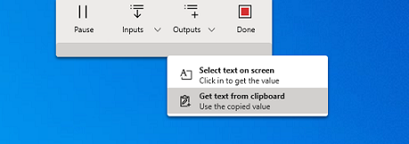

1. Define a name and a description for your output (as described above ) and select **Save.** 

    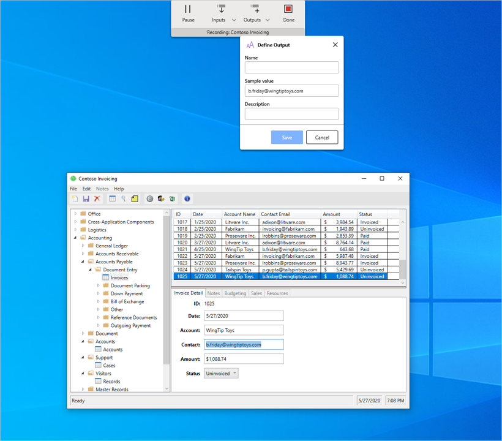

## Delete an output from a UI flow

If you do not need an output anymore, delete it by going to the associated action and removing the Output name in the dynamic value.

## Test your Windows recorder (V1) flow

Testing Windows recorder (V1) flow lets you validate your changes and the appropriate playback behavior.

1. (Optional) Enter a value in the input field. 

   >[!NOTE]
   >For any sensitive text inputs that are created in the recorder, the sample value will need to be specified again before testing.
    
    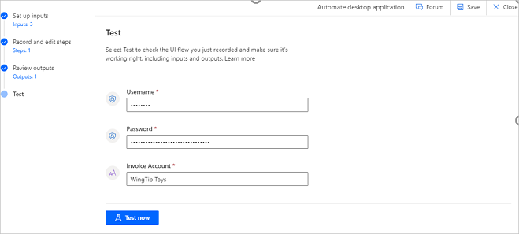

1. Select **Test now** to see the legacy software being automated. You will see UI flow automation playing back the steps you recorded. **Please do not interact with your device for the duration of playback.**

1. Once playback completes, you see the run status of your UI flow:

    - For each action, a status indicator that shows that the test worked well, along with the associated inputs.

      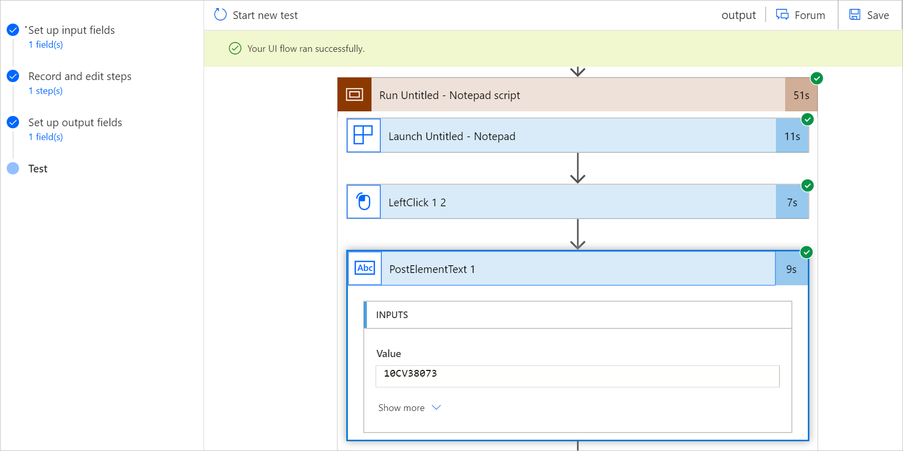

   - For each action that uses a **Sensitive text** input, the input value will not be displayed.

      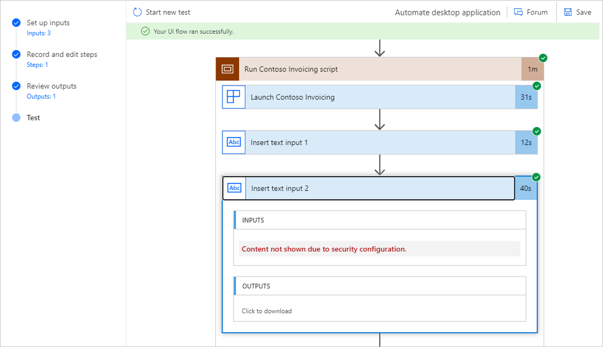

   - You will also see the value of the outputs obtained for this test at the bottom of the designer. 

      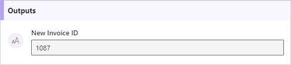

   - If an error occurs, you'll see which step caused the problem along with a screenshot at the moment the error occurred.

## Learn more

- Learn how to [trigger desktop flows](run-desktop-flow.md).

[!INCLUDE[footer-include](../includes/footer-banner.md)]