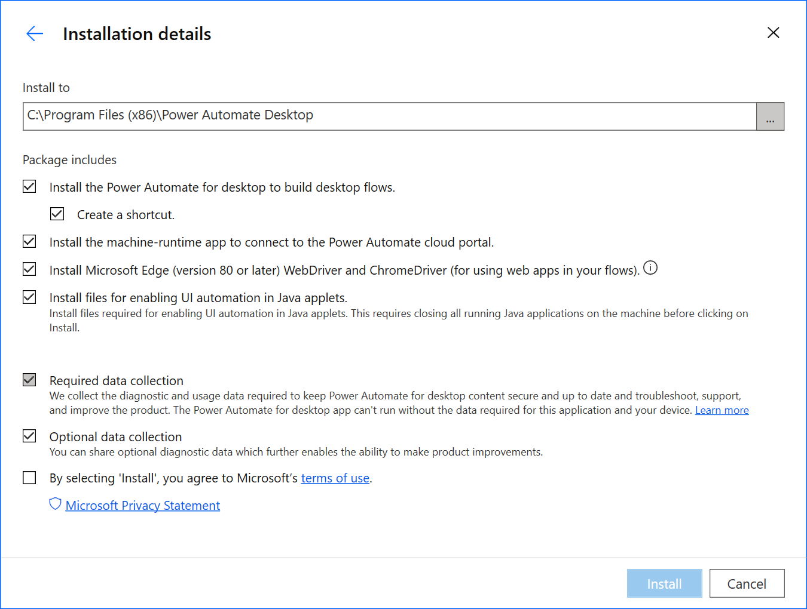
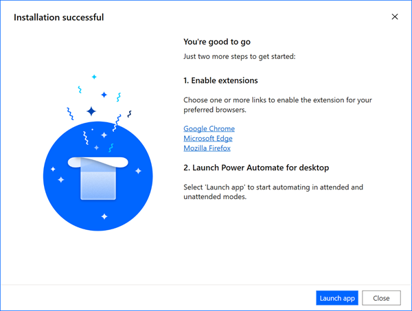
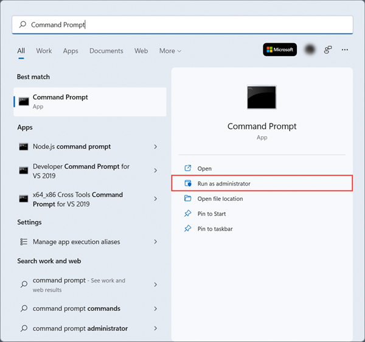

# Install Power Automate on your device

The installer contains all the components you need to record, edit, and test your automations as well as connect to the cloud.

## Install Power Automate

Follow these steps to install Power Automate for desktop:

1. [Download the Power Automate installer](https://go.microsoft.com/fwlink/?linkid=2102613).

1. Open the **Setup.Microsoft.PowerAutomate.exe** file.

   **Note**: This file is likely in your **Downloads** folder after you downloaded it in the previous step.

1. Follow the instructions in the **Power Automate for desktop setup** installer to complete the installation.
1. Make your selections for each feature for the installation to complete.

    The installer allows you to install two different applications on your device.

    - **Power Automate for desktop** is the app to build your desktop flows. With it, you can create, edit, and run your automations. To learn more about the desktop flows designer, go to [Power Automate desktop flow designer](./flow-designer.md).

    - **Power Automate machine runtime app** allows you to connect your machine to the Power Automate cloud. It allows you to harness the full power of your robotic process automation (RPA). To learn more about machine management, go to [Manage machines](./manage-machines.md).

    Additionally, there are option to:

    - Add the WebDriver and ChromeDriver components to run desktop flows created with Selenium IDE.
    - Install the required files for UI automation in Java applets.

>[!IMPORTANT]
>
>- Although deploying MSI and Microsoft Store installations on the same machine is possible, duplicate installations may cause issues and aren't recommended.
>- By default, Power Automate for desktop honors the proxy settings specified in Windows. To override this configuration, refer to [Power Automate for desktop using a proxy server](governance.md#configure-power-automate-for-desktop-to-interact-with-a-corporate-proxy-server).



## Install Power Automate desktop app from the Microsoft Store

There are a few ways to access the most recent version of Power Automate from the Microsoft Store.

1. Use one of the following options to open the Power Automate page of the Microsoft Store:

    - Open a browser and go directly to the [Power Automate page](https://aka.ms/pbidesktopstore) of the Microsoft Store.

    - Go to the [Power Automate product page](https://flow.microsoft.com/desktop/), and then select **Download Free**.

1. After you've landed on the Power Automate page of the Microsoft Store, select **Install**.

### Set data collection options

During installation, you can change the default settings if you don't want to send usage data to Microsoft. To do so, uncheck **Allow Microsoft to collect usage data to improve Power Automate**.

>[!IMPORTANT]
>Sharing usage data with Microsoft may help the support department solve Power Automate issues.

## Install the Power Automate browser extension

After the installation completes, you'll need to install and enable the browser extension for Power Automate. This extension will allow you to record and run web actions in your desktop flows.



Select one of the links displayed in the installer. For example, if you want to record your browser automations in Microsoft Edge, select the **Microsoft Edge** link.

The store for your browser opens directly to the public page for the extension.

> [!IMPORTANT]
> If you have already installed the Power Automate extension, you don't need to reinstall it.

### Microsoft Edge

1. [Install the Microsoft Edge extension](https://go.microsoft.com/fwlink/?linkid=2151411).
2. Select **Get**.
3. When prompted, select **Add extension**.

If you see the message, "This extension has been turned off in Microsoft Edge" at the top of the page, select **Turn on extension**.

### Google Chrome

1. [Install the Chrome extension](https://go.microsoft.com/fwlink/?linkid=2150929).
2. Select **Add to Chrome**.
3. When prompted, select **Enable extension**.

If you see the message, "This item has been disabled in Chrome" on top of the page, select **Enable this item**.

### Mozilla Firefox

1. [Install the Firefox extension](https://go.microsoft.com/fwlink/?linkid=2151511).
2. Select **Add to Firefox**.
3. When prompted, and select **Add**.

> [!TIP]
> If you're not able to activate the extension(s) in your browser(s), you must use [Microsoft Edge](https://www.microsoft.com/edge/) (version 80 or later), Google Chrome, or Firefox. Other browsers aren't supported.

## Install Power Automate for desktop silently

Follow these steps if you want to silently install Power Automate.

>[!NOTE]
>The same installer is used for both manual and silent installation of Power Automate for desktop.

### Install Power Automate for desktop using the command line

1. Download [Power Automate for desktop](https://go.microsoft.com/fwlink/?linkid=2102613).

1. Open **Start**.

1. Search for **Command Prompt**, and then run it as the administrator.

   

1. Change the directory to **Downloads** (or to the directory into which you downloaded Power Automate).

   For example, enter:

   ```CMD
    cd C:\Users\Nvarga\Downloads\
   ```

1. Enter:

   ```CMD
   Setup.Microsoft.PowerAutomate.exe -Silent -Install -ACCEPTEULA
   ```

   The installer runs and completes the setup of Power Automate.

   >[!IMPORTANT]
   > You must provide the `-ACCEPTEULA` argument to indicate that you accept the [terms and conditions](/dynamics365/legal/slt-power-automate-desktop) for Power Automate.

1. You can now launch Power Automate from the Start menu.

### Command line argument details

You can also retrieve the details of all the command line arguments from the help menu in the command prompt:

   ```CMD
   Setup.Microsoft.PowerAutomate.exe -HELP
   ```

|Command|Description|
|----|----|
|-INSTALLPATH:Value|The full path of the installation folder that will be created. Default: <br />is `%PROGRAMFILES(X86)%\Power Automate`.|
|-ALLOWOPTIONALDATACOLLECTION|Enables sending optional telemetry data to Microsoft.|
|-DISABLEPADSHORTCUT|Doesn't create a shortcut for Power Automate for desktop.|
|-DISABLETURNONRDP|Doesn't turn on Remote Desktop on the machine.|
|-ACCEPTEULA|Accepts the end user license agreement needed for the installation.|
|-RESTOREDEFAULTCONFIG|Restores to the default installation settings during an upgrade.|
|-DONOTINSTALLPAD|Skips installing Power Automate for desktop.|
|-DONOTINSTALLMACHINERUNTIME|Skips installing Power Automate machine-runtime app.|
|-SKIPINSTALLINGJAVAAUTOMATION|Skips installing files that are required for enabling UI automation in Java applets.|

Here's an example of a command line argument that installs Power Automate:

   ```CMD
   Setup.Microsoft.PowerAutomate.exe -SILENT -Install -ACCEPTEULA -INSTALLPATH: D:\My Programs\foo
   ```

### Uninstall Power Automate for desktop using the command line

Use the following command to silently uninstall Power Automate:

   ```CMD
   Setup.Microsoft.PowerAutomate.exe -Silent -Uninstall
   ```

### Update your version of Power Automate

To update Power Automate for desktop, use the same command line arguments that you use to install it.

>[!NOTE]
>All your data and configuration, including telemetry, shortcuts, and more are retained when you update Power Automate. If you want to enable parameters previously disabled, you'll need to first uninstall Power Automate for desktop, and then reinstall it.

### Install the gateway with PowerShell cmdlets

> [!IMPORTANT]
> Gateways for desktop flows are now deprecated except for China region. Switch to our machine-management capabilities. To learn more, go to [Switch from gateways to direct connectivity](manage-machines.md#switch-from-gateways-to-direct-connectivity).

Apart from direct connectivity, you can establish communication with a machine using on-premises data gateways. To install, configure, and manage a gateway, use [PowerShell cmdlets](/powershell/gateway/overview).

>[!IMPORTANT]
>To use PowerShell cmdlets, you will need to run them from PowerShell 7.0.0 or higher in an elevated access.

## Setup desktop flows connections and machine credentials

> [!IMPORTANT]
> Gateways for desktop flows are now deprecated except for China region. Switch to our machine-management capabilities. To learn more, go to [Switch from gateways to direct connectivity](manage-machines.md#switch-from-gateways-to-direct-connectivity).

> [!IMPORTANT]
> Before you use a machine to run desktop flows from the cloud, ensure that the machine is secured and the machine's admins are trusted.

1. Sign into [Power Automate](https://powerautomate.microsoft.com).
1. Expand **Data** on the left side of the screen.
1. Select **Connections** and then **New connection**.

   

1. Search for *Desktop flow*, and then select **Desktop flows**.

1. Provide the machine or gateway information and device credentials:

   - To connect to a machine or a machine group, select **Directly to machine** in the **Connect** field, and choose the respective machine or machine group in the **Machine or machine group** field.

      

   - To connect to a gateway, select **Using an on-premises data gateway** in the **Connect** field, and choose the respective gateway in the **Choose a gateway** field.

      

   - **Domain and Username**: Provide your device account. You can use a local account by using the name of the user (for example, "MACHINENAME\\User" or "local\\User") or an Active Directory account, such as "DOMAIN\\User".

   - **Password**: Your account’s password.

      

1. Select **Create**.

## Install Windows recorder (v1) extension (optional)

The Windows recorder (v1) is another option to record and play back your desktop automations. We recommend that you use Power Automate for desktop since it's the latest RPA solution.

Follow these steps to install the Windows recorder (v1) extension:

1. Install the extension on Microsoft Edge and/or Google Chrome from the store.
   **Note**: Firefox isn't supported for Windows recorder (v1)

### Microsoft Edge

1. [Install the Microsoft Edge extension](https://go.microsoft.com/fwlink/?linkid=2151412).
2. Select **Get**.
3. When prompted, select **Add extension**.

### Google Chrome

1. [Install the Chrome extension](https://go.microsoft.com/fwlink/?linkid=2150930).
2. Select **Add to Chrome**.
3. When prompted, select **Enable extension**.

## Install Selenium IDE to automate web applications with desktop flows (optional)

The Selenium IDE is an open source tool that lets you record and playback human interactions on websites.

With desktop flows, you can run Selenium IDE scripts from Power Automate and keep them stored securely (with appropriate IT governance) in Dataverse.

Follow these steps to install Selenium IDE:

1. Make sure you already installed and enabled Windows recorder (v1) extension. (Refer to previous section.)

1. [Download and install](https://go.microsoft.com/fwlink/?linkid=2107665) the Selenium IDE for [Microsoft Edge](https://www.microsoft.com/edge/) (version 80 or later) or Google Chrome.

1. On Microsoft Edge (version 80 or later), select **Allow extensions from other stores**, and then select **Add to Chrome**.

## Install the on-premises data gateway to run your desktop flows from the cloud

> [!IMPORTANT]
> Gateways for desktop flows are now deprecated except for China region. Switch to our machine-management capabilities. To learn more, go to [Switch from gateways to direct connectivity](manage-machines.md#switch-from-gateways-to-direct-connectivity).

You'll need the gateway to trigger your desktop from an [event, schedule, or button flow.](..\flow-types.md) on a remote device.

>[!TIP]
>The gateway isn't required if you only want to create, edit, and test your flows on your device.

[Install the on-premises data gateway](/data-integration/gateway/service-gateway-install), if you need it.

>[!IMPORTANT]
>You must install the on-premises gateway on each device from which you automate desktop flows.

>When you install the gateway, it defaults to the region that Power Automate uses.

## Troubleshoot missing gateway

> [!IMPORTANT]
> Gateways for desktop flows are now deprecated except for China region. Switch to our machine-management capabilities. To learn more, go to [Switch from gateways to direct connectivity](manage-machines.md#switch-from-gateways-to-direct-connectivity).

You might not find the gateway in the list while creating the connection for the following reasons:

- The gateway may be installed in a different region than your Power Automate region. To resolve this issue, uninstall the gateway from the device, and then reinstall it, selecting [the correct Power Automate region](../regions-overview.md#region-mappings-for-power-automate-and-gateways).
- The gateway was deleted by its owner.

## Uninstall Power Automate

1. Open the **Start** menu > **Settings** > **Apps**.
1. Search for **Power Automate**, and then select it.
1. Select **Uninstall**.

## Learn more

- Learn to [create Power Automate desktop flows](create-flow.md).
- Learn how to run [desktop flows](run-desktop-flow.md).
- Learn to [manage desktop flows](manage.md).

[!INCLUDE[footer-include](../includes/footer-banner.md)]
