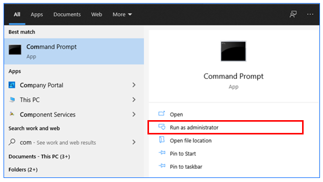
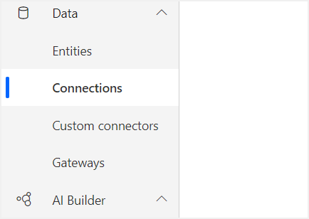
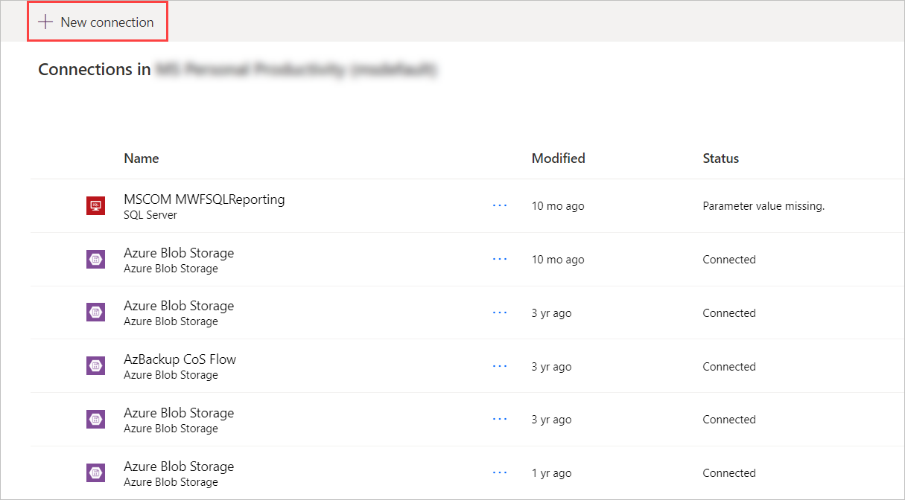
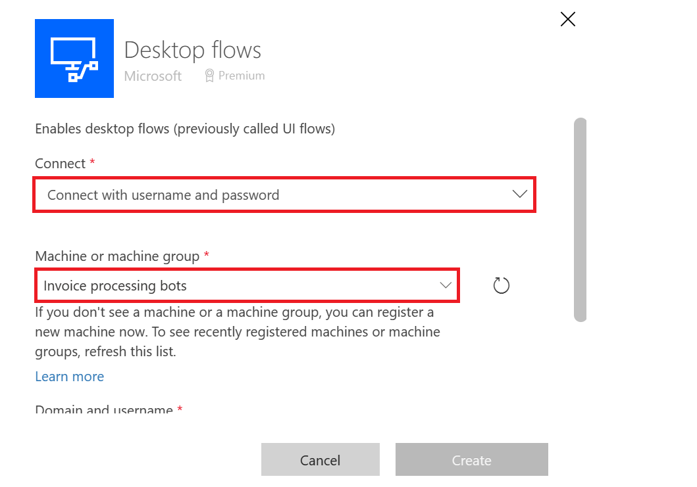
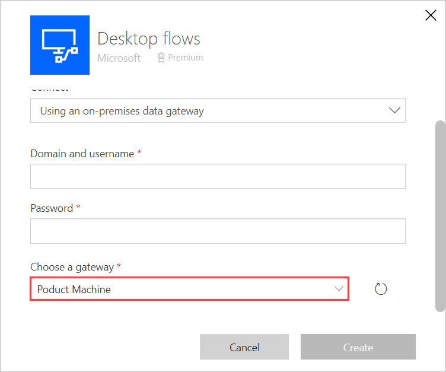
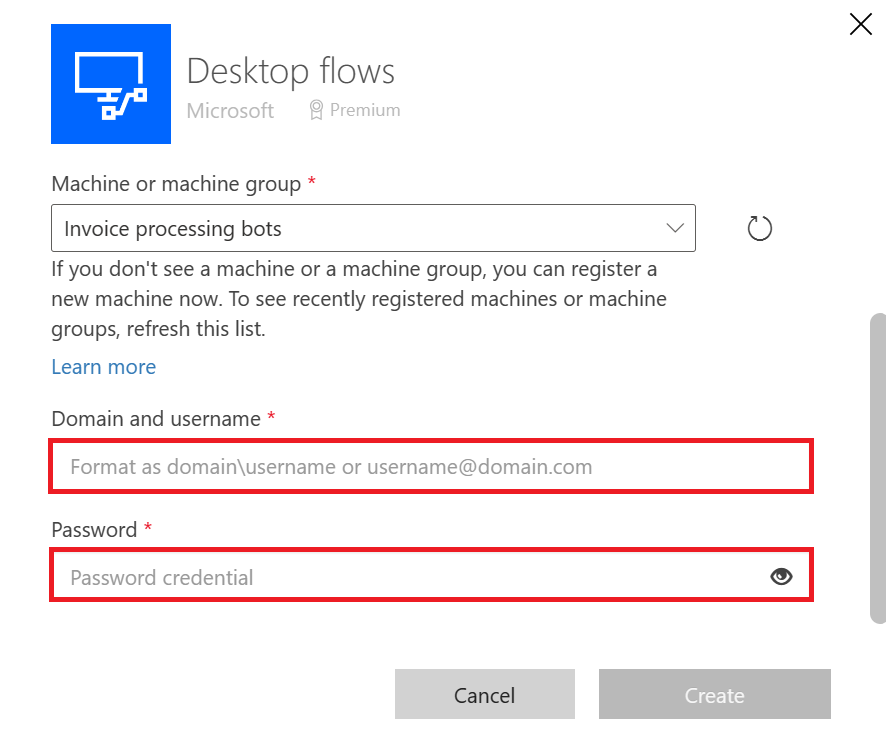

# Install Power Automate Desktop on your device

The installer contains all the components you need to record, edit, and test your automations, as well as connect to the cloud.

## Install Power Automate Desktop

Follow these steps to install the Power Automate Desktop app:

1. [Download the Power Automate Desktop installer](https://go.microsoft.com/fwlink/?linkid=2102613).
1. Open the **Setup.Microsoft.PowerAutomateDesktop.exe** file. 

   This file is likely in your **Downloads** folder after you downloaded it in the previous step.

1. Follow the instructions in the **Power Automate Desktop setup** installer to complete the installation. 
1. Make your selections for each feature for the installation to complete. 

>[!IMPORTANT]
>The installer installs the Webdriver component. You need it to run desktop flows created with Selenium IDE.
>It will also install the Power Automate Desktop app and third-party components.


### Set data collection options

During installation, you can change the default settings if you do not want to send usage data to Microsoft. To do so, uncheck **Allow Microsoft to collect usage data to improve Power Automate**.

>[!IMPORTANT]
>Sharing usage data to Microsoft, will help the support department to solve a Power Automate Desktop issue.

## Install the Power Automate browser extension 

After the installation completes, you will need to install and enable the extension for Power Automate Desktop. This extension will allow you to record and run web actions in your desktop flows.


Select one of the links displayed in the installer. For example, if you want to record your web automations on Microsoft Edge, select the **Microsoft Edge** link.

   The store for your browser opens directly to the public page for the extension.

> [!IMPORTANT]
> If you have already installed the Power Automate extension in the past, you don't need to reinstall it

#### Microsoft Edge: 
- [Install Edge extension](https://go.microsoft.com/fwlink/?linkid=2151411): select **Get**, and then select **Add extension** when prompted. 
- If you see the message: *This extension has been turned off in Microsoft Edge*, at the top of the page, select **Turn on extension**.

#### Google Chrome: 
- [Install Chrome extension](https://go.microsoft.com/fwlink/?linkid=2150929): select **Add to Chrome**, and then select **Enable extension** when prompted. 
- If you see the message: *This item has been disabled in Chrome* on top of the page, select **Enable this item**.

#### Mozilla Firefox:
- [Install Firefox extension](https://go.microsoft.com/fwlink/?linkid=2151511): select **Add to Firefox**, and then select **Add** when prompted. 


> [!TIP]
> If you are not able to activate the extension(s) in your browser, you must use [Microsoft Edge](https://www.microsoft.com/edge/) (version 80 or later) or Google Chrome or Firefox. Other browsers are not supported. 

## Install Power Automate Desktop silently

Follow these steps if you want to silently install Power Automate Desktop.

>[!NOTE]
>The same installer is used for both manual and silent installation of Power Automate Desktop.

### Install Power Automate Desktop using the command line

1. Download [Download Power Automate Desktop](https://go.microsoft.com/fwlink/?linkid=2102613).

1. Open **Start**.

1. Search for **command prompt**, and then run it as the administrator.

   

1. Change the directory to **Downloads** (or to the directory into which you downloaded Power Automate Desktop):

   For example, enter:
   
   ```
    cd C:\Users\Nvarga\Downloads\
   ```

1. Enter:

   ```
   Setup.Microsoft.PowerAutomateDesktop.exe -Silent -Install -ACCEPTEULA
   ```
   
   The installer runs and completes the setup of Power Automate Desktop.

   >[!IMPORTANT]
   > You must provide the `-ACCEPTEULA` argument to indicate that you accept the [terms and conditions](/dynamics365/legal/slt-power-automate-desktop) for Power Automate Desktop.

1.  You can now launch Power Automate Desktop from the Start menu.

### Command line argument details

You can also retrieve the details of all the command line arguments from the help menu in the command prompt:

   ```
   Setup.Microsoft.PowerAutomateDesktop.exe -HELP
   ```

| Command              | Description                                                                                                                                                                        |
|----------------------|------------------------------------------------------------------------------------------------------------------------------------------------------------------------------------|
| -INSTALLPATH:Value  | The full path of the installation folder that will be created. The default is `%PROGRAMFILES(X86)%\Power Automate Desktop`.                                                             |
| -DISABLEPADSHORTCUT | By default, a shortcut of Power Automate Desktop app is created on the desktop, use this argument to indicate that you do not want to be created.                                                                 |
| -DISABLETURNONRD   | Use the argument if you do not want the installer to turn on Remote Desktop on the device. You must turn on Remote Desktop if you want support for unattended runs. |
| -ACCEPTEULA  | Use this argument to indicate that you accept the terms of use for Power Automate Desktop                                                                                                                     |
| -HELP               | This argument displays all details about the arguments for the installer prompt                                                                                                                   |

Here's an example of a command line argument that installs Power Automate Desktop: 

   ```
   Setup.Microsoft.PowerAutomateDesktop.exe -SILENT -Install -ACCEPTEULA -INSTALLPATH: D:\My Programs\foo
   ```

### Uninstall Power Automate Desktop using the command line

Use the following command to silently uninstall Power Automate Desktop:
   
   ```
   Setup.Microsoft.PowerAutomateDesktop.exe -Silent -Uninstall
   ```

### Update your version of Power Automate Desktop

To update Power Automate Desktop, use the same command line arguments that you use to install it. 

>[!NOTE]
>All your data and configuration, including telemetry, shortcuts, etc. are retained when you update Power Automate Desktop. If you want to enable parameters previously disabled, you will need to first uninstall Power Automate Desktop, and then reinstall it. 

### Install the gateway with PowerShell Cmdlets

> [!NOTE]
> Power Automate Desktop now offers direct connectivity to the cloud without the use of on-premises data gateways. You can find more information in [Manage machines](manage-machines.md).

You will need the on-premises data gateway to trigger your desktop flows from a cloud flow.

You can use [PowerShell Cmdlets](/powershell/gateway/overview?view=datagateway-ps) to install, configure, and manage your gateway.

>[!IMPORTANT]
>To use PowerShell cmdlets, you will need to run them from PowerShell 7.0.0 or higher in an elevated access.


## Setup desktop flows connections and machine credentials

1. Sign into [Power Automate](https://powerautomate.microsoft.com).
1. Expand **Data** on the left side of the screen.
1. Select **Connections**.

   

1. Select New connection.

   

1. Search for *Desktop flow*, and then select **Desktop flows**.

   <!--  -->

1. Provide the machine or gateway information and device credentials: 
 
   - To connect to a machine or a machine group, select **Directly to machine** in the **Connect** field, and choose the respective machine or machine group in the **Machine or machine group** field.

      

   - To connect to a gateway, select **Using an on-premises data gateway** in the **Connect** field, and choose the respective gateway in the **Choose a gateway** field.

      

   - **Domain and Username**: Provide your device account. You can use a local account by using the name of the user (for example, “MACHINENAME\\User” or “local\\User”), or an Active Directory account such as “DOMAIN\\User”.

   - **Password**: Your account’s password.

      

1. Select **Create**.

## Install Windows recorder (v1) extension (optional)

The Windows recorder (v1) is another option to record and playback your desktop automations. We recommand you to use Power Automate Desktop since this is the latest RPA solution.

Follow these steps to install Windows recorder (v1) extension:

1. Install the extension on Microsoft Edge and/or Google Chrome from the store (Firefox is not supported for Windows recorder (v1))

#### Microsoft Edge: 
- [Install Edge extension](https://go.microsoft.com/fwlink/?linkid=2151412): select **Get**, and then select **Add extension** when prompted.

#### Google Chrome: 
- [Install Chrome extension](https://go.microsoft.com/fwlink/?linkid=2150930): select **Add to Chrome**, and then select **Enable extension** when prompted. 

## Install Selenium IDE to automate Web applications with desktop flows (optional)

The Selenium IDE is an open source tool that lets you record and playback human interactions on websites.

With desktop flows, you can run Selenium IDE scripts from Power Automate and keep them stored securely (with appropriate IT governance) in Dataverse.

Follow these steps to install Selenium IDE:

1. Make sure you already installed and enabled Windows recorder (v1) extension (see previous section)

1. [Download and install](https://go.microsoft.com/fwlink/?linkid=2107665) the Selenium IDE for [Microsoft Edge](https://www.microsoft.com/edge/) (version 80 or later) or Google Chrome.

1. On Microsoft Edge (version 80 or later), select **Allow extensions from other stores**, and then select **Add to Chrome**.

## Install the on-premises data gateway to run your desktop flows from the cloud

> [!NOTE]
> Power Automate Desktop now offers direct connectivity to the cloud without the use of on-premises data gateways. You can find more information in [Manage machines](manage-machines.md).

You will need the gateway to trigger your desktop from an [event, schedule, or button flow.](..\flow-types.md) on a remote device.

>[!TIP]
>The gateway isn't required if you only want to create, edit, and test your flows on your device.

[Install the on-premises data gateway](/data-integration/gateway/service-gateway-install), if you need it.


>[!IMPORTANT]
>You must install the on-premises gateway on each device from which you automate desktop flows.

>When you install the gateway, it defaults to the region that Power Automate uses.

## Troubleshoot missing gateway

> [!NOTE]
> Power Automate Desktop now offers direct connectivity to the cloud without the use of on-premises data gateways. You can find more information in [Manage machines](manage-machines.md).

You might not find the gateway in the list while creating the connection for the following reasons:

- The gateway may be installed in a different region than your Power Automate region. To resolve this issue, uninstall the gateway from the device, and then reinstall it, selecting [the correct Power Automate region](../regions-overview.md#region-mappings-for-power-automate-and-gateways).
- The gateway was deleted by its owner.

## Uninstall Power Automate Desktop

1. Open the **start** menu > **Settings** > **Apps**.
1. Search for **Power Automate Desktop**, and then select it.
1. Select **Uninstall**.

## Learn more

- Learn to [create Power Automate Desktop flows](create-flow.md).
- Learn how to run [desktop flows](run-desktop-flow.md).
- Learn to [manage desktop flows](manage.md).


[!INCLUDE[footer-include](../includes/footer-banner.md)]
