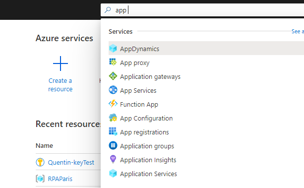
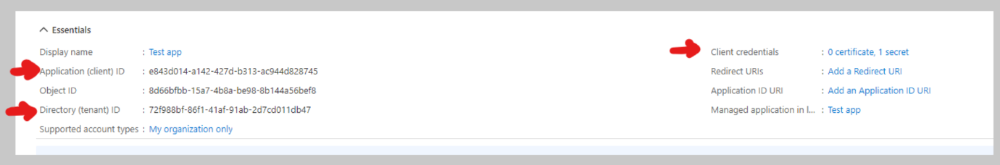
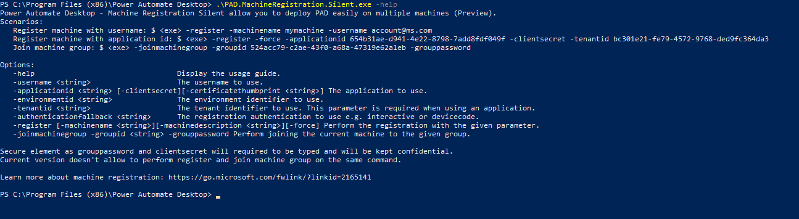
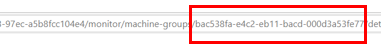

# Silent registration for machines 

This article describes how to use our mass deployment tool that allows you to easily install Power Automate on multiple machines.
You can both register your machines to Power Automate and add them to machine groups. 


## Pre-requisites
To silently register your machine(s), Power Automate for desktop needs to be downloaded and installed on the targeted devices. Visit this page to understand how to [install Power Automate silently](/power-automate/desktop-flows/install#install-power-automate-desktop-silently)

To silently register your machine and join a group, we recommend you to use a service principal account. You can also use your Azure Active Directory account.

## Using a service principal account

>[!NOTE]
>To create the application user, you need to have admin rights    on the Dataverse environment of your tenant.

1.	Create an Azure app:

    a.	Go to Azure portal: [https://portal.azure.com/](https://portal.azure.com/)

    b.	Search **app registrations**
    
    

    c.	Select **new registration**
     

    d.	Define a name and select **Single tenant** (or multi-tenant) then select **register**
1.	Give your app the following permissions

    a.	Select **Add a permission**

    b.	Select **Flow Service**

    c.	Select **Flow.Read.All**

1.	[Create an application user](/power-platform/admin/manage-application-users#create-an-application-user).

>[!NOTE]
>Regarding their security roles, the user need to grant at least Environment Maker (or Desktop Flows Machine Owner) to be able to register a machine and join a group.

1.	Get the following information that will be used in the Machine Registration app:
    a.	Applicationid
    b.	Directory (tenant) Id
    c.	Client credentials (certificate or thumbprint)
 
    

## How to use the Machine registration App?
1.	Open **Start** menu
1.	Search for command prompt (or PowerShell) and then run it as the administrator
1.	Change the directory to the Power Automate install folder (by default: C:\Program Files (x86)\Power Automate)

    ```
    cd C:\Program Files (x86)\Power Automate
    ```
1.	You can use the help menu to have an overview of what you can do with the silent app.
    ```
    .\PAD.MachineRegistration.Silent.exe -help
    ```
    

    
## Silently register a new machine

To register silently your machine in Power Automate with the service principal account, use the register operation **-register** with the following arguments:
Connection arguments (for service principal account):

   1.	Applicationid: The application to use. 

   1.	Clientsecret: The secret of the applicationid (you can also use the certificateThumbprint). This input isn’t expected to be specified as an input to the command line. See “Secure input” section to see options you can choose to provide it.

   1.	Tenantid: The tenant identifier to use.  

Machine registration arguments:

   1.	Environmentid (optional): The environment where the machine will be registered. If not provided, the machine is registered in the default environment. You can retrieve it in the URL of Power Automate.
 
   1.	Machine name (optional): The name of the registered machine. 

   1.	Machine description (optional): The description of the registered machine
        ```
        .\PAD.MachineRegistration.Silent.exe -register -applicationid appid -clientsecret (or -certificatethumbprint thumbprint) -tenantid tenantid -environmentid envid 
        ```
>[!NOTE]
>If you decide to use AAD account, you can specify the username: -username [UPN] instead of service principal account arguments

## Join silently a machine group

>[!NOTE]
>You cannot create machine group silently. You will need to create them from the portal before adding machines silently.

To join a group silently with the service principal account, use the join group operation -joinmachinegroup  with the following arguments:
1.	Environmentid: The environment where the machine group is registered. You can retrieve it in the URL of Power Automate. 
1.	Groupid: the id of the machine group you want to join. You can retrieve it in the URL of Power Automate when you are in the machine group details page.
1.	Grouppassword: the password of your machine. If this is the first machine of the group, you need to define it. If not, you need to provide the defined password of the group. This input isn’t expected to be specified as an input of the command line. See “Secure input” section to see options you can choose to provide it
 


```
.\PAD.MachineRegistration.Silent.exe -joinmachinegroup -groupid groupid -grouppassword
```

## Secure input 
In the machine registration tool, you will have to provide secure inputs for registration and joining group.
You have two options to provide a secure input:

1. type when asked: you will be prompted to enter this data when needed. This is an interactive action that is not adapted if you need to do mass deployment

2. redirect string/file to the silent registration application
  
    a. redirect string (if you need to input multiple strings, you can do it easily in PowerShell):
  
    ```
        echo mypassword | .\PAD.MachineRegistration.Silent.exe -joinmachinegroup -groupid groupid -grouppassword
    ```
  
    b. redirect file: 
  
      i. create a txt file that contains your password and save it in Power Automate folder (you will need to have admin privileges

      ii. use the following:
  
      1. For cmd prompt:
  
          ```
           grouppassword < pwd.txt
          ```
      2. For Powershell:

          ```
          Get-Content password.txt | .\PAD.MachineRegistration.Silent.exe -joinmachinegroup -groupid groupid -grouppassword
          ```
