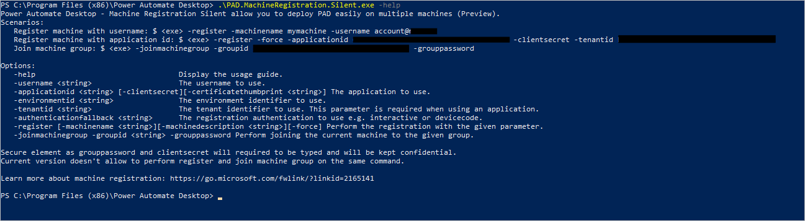

# Silent registration for machines

This article describes how to use our mass deployment tool that allows you to easily install Power Automate on multiple machines. You can both register your machines to Power Automate and add them to machine groups.

## Prerequisites

To silently register your machines, you need to download and install Power Automate for desktop on the targeted devices. Visit this page to understand how to [install Power Automate silently](install-silently.md).

To silently register your machine and join a group, we recommend that you use a service principal account. You can also use your Microsoft Entra account.

## Using a service principal account

>[!NOTE]
>To create the application user, you need to have admin rights on the Dataverse environment of your tenant.

1. Create an Azure app:

   1. Go to the Azure portal: [https://portal.azure.com/](https://portal.azure.com/)

   1. Search **App registrations**.

      

   1. Select **New registration**.

      

   1. Define a name and select **Single tenant** (or multitenant) and then select **Register**.

1. Give your app the following permissions:

   - Select **Add a permission**.
   - Select **Flow Service**.
   - Select **Flow.Read.All**.

1. [Create an application user.](/power-platform/admin/manage-application-users#create-an-application-user)

   >[!NOTE]
   >Administrators must set users at least as Environment Makers (or Desktop Flows Machine Owners) to allow them to register machines and join groups.

1. Get the following information that will be used in the Machine Registration app:

   - Application ID
   - Directory (tenant) ID
   - Client credentials (certificate or thumbprint)

   

## Use the machine registration app

1. Open the **Start** menu.
1. Search for "command prompt" (or "PowerShell"), and then run it.
1. Change the directory to the Power Automate installation folder (by default: C:\Program Files (x86)\Power Automate Desktop).

    ```CMD
    cd C:\Program Files (x86)\Power Automate Desktop
    ```

1. You can use the help menu to have an overview of what you can do with the silent app.

    ```CMD
    .\PAD.MachineRegistration.Silent.exe -help
    ```

    

## Silently register a new machine

To silently register your machine in Power Automate with the service principal account, use the register operation **-register** with the following arguments:

Connection arguments (for service principal account):

   1. `Applicationid`: The application to use.

   1. `Clientsecret`: The secret of the `applicationid` (you can also use the certificateThumbprint). You shouldn't use this input as an input to the command line. See the “Secure input” section to see options you can choose to provide it.

   1. `Tenantid`: The tenant identifier to use.  

Machine registration arguments:

   1. `Environmentid` (optional): The environment where the machine will be registered. If not provided, the machine is registered in the default environment. You can retrieve it in the URL of Power Automate.

   1. Machine name (optional): The name of the registered machine.

   1. Machine description (optional): The description of the registered machine.
     
   1. `force` (optional): The force flag used to override an existing registration. Overriding a registration will break existing connections to the machine.

      >[!NOTE]
      > "force" argument can be really useful in case your existing machine is in a bad state with no other available environment to unregister/re-register your machine.

      ```CMD
      .\PAD.MachineRegistration.Silent.exe -register -applicationid appid -clientsecret (or -certificatethumbprint thumbprint) -tenantid tenantid -environmentid envid 
      ```

>[!NOTE]
>If you decide to use an Microsoft Entra account, you can specify the username: -username [UPN] instead of service principal account arguments

## Silently join a machine group

> [!NOTE]
> You can't create a machine group silently. You'll need to create it from the portal (and share it with your application user if you're using a service principal) before adding machines silently.

To join a group silently with the service principal account, use the join group operation -`joinmachinegroup`  with the following arguments:

1. `Environmentid`: The environment where the machine group is registered. You can retrieve it in the URL of Power Automate.
1. `Groupid`: The ID of the machine group you want to join. You can retrieve it in the URL of Power Automate when you are in the machine group details page.
1. `Grouppassword`: The password of your machine. If this machine is the first machine of the group, you need to define it. If not, you need to provide the defined password of the group. You shouldn't use this input as an input to the command line. Go to the “Secure input” section to see options you can choose to provide it.


```CMD
.\PAD.MachineRegistration.Silent.exe -joinmachinegroup -groupid groupid -grouppassword -applicationid appid -clientsecret (or -certificatethumbprint thumbprint) -tenantid tenantid -environmentid envid
```
> [!NOTE]
> To use an Microsoft Entra account, specify the username: -username [UPN] instead of service principal account arguments.

## Secure input

In the machine registration tool, you'll have to provide secure inputs for registration and joining the group.

You have two options to provide a secure input:

1. Type when asked: You'll be prompted to enter this data when needed. This option is an interactive action that isn't adapted if you need to do mass deployment.

2. Redirect string/file to the silent registration application:
  
   - Redirect string (if you need to input multiple strings, you can do it easily in PowerShell):
  
     ```PowerShell
         echo clientsecret mypassword | .\PAD.MachineRegistration.Silent.exe -joinmachinegroup -applicationid appid -clientsecret -groupid groupid -grouppassword -tenantid tenantid
     ```
  
   - Redirect file:
  
     1. Create a TXT file that contains your password and save it in a Power Automate folder (you'll need admin privileges).

     1. Use the following command:
  
        For cmd prompt:
  
        ```CMD
         grouppassword < pwd.txt
        ```

        For PowerShell:

        ```CMD
        Get-Content password.txt | .\PAD.MachineRegistration.Silent.exe -joinmachinegroup -groupid groupid -grouppassword
        ```

[!INCLUDE[footer-include](../includes/footer-banner.md)]