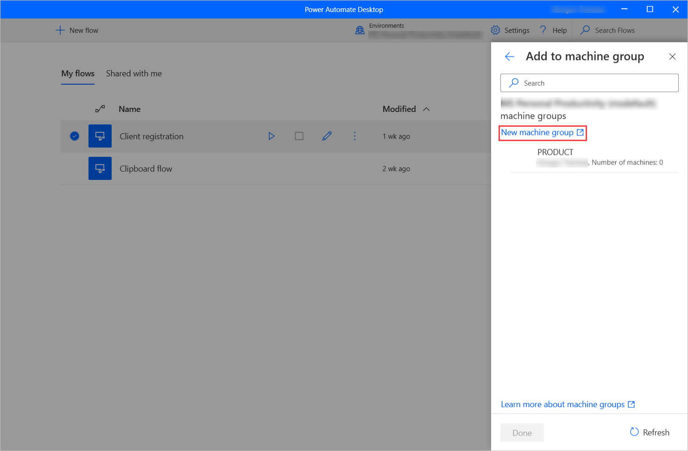

# Manage machine groups (preview)

[!INCLUDE [cc-beta-prerelease-disclaimer](../includes/cc-beta-prerelease-disclaimer.md)]

Power Automate allows you to create groups of machines that can be accessed all together by a name reference. This feature is essential for organizations that want to trigger desktop flows to multiple machines simultaneously.

## Add machines to a machine group

While creating or updating a machine, Power Automate Desktop provides an option to add the machine to a machine group.

To add the current machine to a machine group:

1. Select the **Add to machine group** button on the **Machine** settings tab.

    

1. In the displayed list, you can find all the available machine groups. To add the machine to a machine group, select the desired group and fill in the required credentials.

    > [!NOTE]
    > If the machine is deployed in a different environment than the machine group, you have to change its environment.

    

1. To create a new machine group, select the **New machine group** option and follow the instructions presented in [Create new machine group]().

    

## Change the machine group of a machine

If you want to change the machine group that contains your machine, select the **dots icon** next to the machine group and pick **Change machine group**.

If you want to remove the machine from a group without adding it to a new one, select **Remove from group**.

## Change machine group's password

To change the password of the currently used machine group, select the **dots icon** next to the machine group and pick **Edit group password**.

Next, populate the **New password** and **Confirm password** fields, and select the **Save** button to save the changes.

