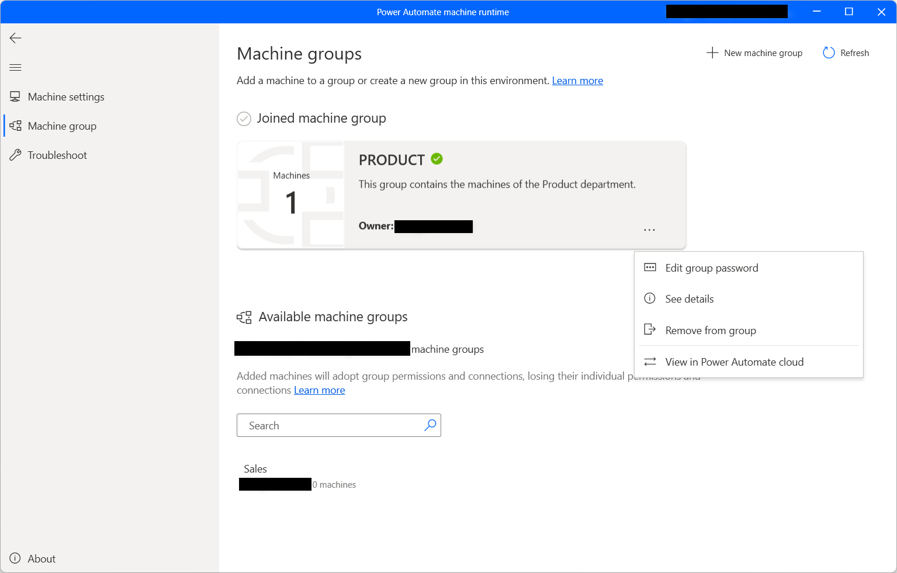
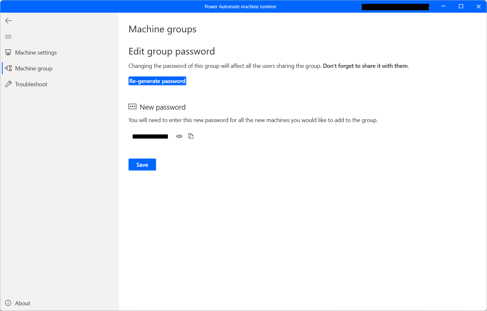

# Manage machine groups

## Create a machine group 

Machine groups allow you to organize multiple machines together to help distribute your automation workload and optimize productivity. 

1. Sign into **Power Automate machine runtime**

1. Select **Machine group**

1. Select **Create a new group** 

1. Enter a name for your machine group, then optionally enter a description.

1. Click **Create** 

 

You can also create a machine group directly from Power Automate:

1.	Sign into Power Automate.
1.	Select **Monitor**, then select **Machines**.
1.	Select **New machine**, then select **Group**.
1.	Enter a name for your machine group, then optionally enter a description.
1.	Click **Create**.

## Add your machine to a group 

You will need at least one machine in your group to run desktop flows. 

1.	In the Power Automate machine runtime, select **Machine group**
1.	In the displayed list, you can find all the available machine groups. To add the machine to a machine group, select the desired group and fill in the required credentials.

    

1.	If this is the first time adding a machine to your group, you will need to create a password for your group. This password is used to limit access for those who can add machines to the group. Make sure you do not lose the password, as you will be unable to recover it. If you have already added a machine before, enter the password for the group.

1.	Select **Add machine**.

When you add your machine to a group, any connections currently targeting your machine will break. You will need to update those connections to target the machine group.

>[!NOTE]
>In case of a virtual machine, make sure not to clone the virtual machine after installing the Power Automate machine runtime.

>[!IMPORTANT]
>In order to register your machine, you need to have an Organization premium account.

## Trigger a desktop flow to run on your machine group 

1. Edit your cloud flow or [create a new cloud flow](../overview-cloud.md). 

1. Select **+New step**. 

1. Select the **Run a flow built with Power Automate for desktop** action. 

1. If you’ve already created a connection with desktop flows, click the three dots in the top right and under **My connections** select **+Add new connection**. 

1. Next to Connect, select **Direct to machine**. 

1. Select the name of your machine group. 

1. Enter the username and password you would use to sign into your machines. 

1. Click **Create**. 
    
   

1. Select the desktop flow you want to run and the desired run mode. 

1. Save your cloud flow. 

1. You can now trigger your desktop flow to run on your machine group from the cloud. 

 >[!IMPORTANT]
>If you are using local Windows accounts, all machines in the group must have the same local account with the same password. Use these credentials when you create the desktop flows connection.
>If you are using Active Directory or Azure AD joined machines, confirm that the user account you will be using in the desktop flows connection can access all machines in the cluster.

## View list of machine groups 

Once a machine group is created in an environment, you can view its details at any time in Power Automate. You can also view all other machine groups that you have access to. 

1. Sign into Power Automate. 

1. Select **Monitor > Machines**. 

1. Select **Machine groups**. 

Within the list, for each machine you can view: 

- The name of the machine group. 

- The description of the machine group. 

- The number of the machines in the group. 

- The number of flows running in the machine group. 

- The number of flows queued in the machine group. 

- The type of access you have to the machine group. 

- The owner of the machine group. 

## Share a machine group 

You can share a machine group with other users in your organization, giving those users specific permissions to access your machine group. 

1. Sign into Power Automate. 

1. Select **Monitor**, then select **Machines**. 

1. Select **Machine groups**. 

1. Select your machine group from the list. 

1. Select **Manage access**. 

1. Select the **Add people** field, then enter the name of the person in your organization with whom you’d like to share the machine group. 

1. Select the name of the person to choose with which permissions they can access the machine group. 

1. Click **Save**. 

   

There are two levels of permissions that you can use when managing access to your machine group: 

1. **Co-owner**. This access level gives full permissions to that machine. Co-owners can run desktop flows on the machine group, share it with others, edit its details, and add or delete machines. 

1. **User**. This access level only gives permission to run desktop flows on the machine group. No edit, share, or delete permissions are possible with this access. 

|Actions|Co-owner|User|
|---|---|---|
|Run a desktop flow on the group|X|X|
|Share the machine group|X||
|Add machines to group|X||
|Remove machines from group|X||
|Edit details|X||
|Delete machine group|X||

You can only delete a machine group if you have sufficient permissions and there are no machines in the machine group. Remove any machines from the group before deleting the machine group. 

Access for machine groups is managed at the group level. All machines in the group will use the same permissions and connections. 

If the permissions of a machine and its group fall out of sync, for example if you modify the permissions of the group directly in Microsoft Dataverse, certain actions for that machine may no longer be available and your machine and machine group may not behave as expected. Ensure the permissions between the machine and machine group are consistent to avoid any such issues. 

Power Automate allows you to create groups of machines that can be accessed all together by a name reference. This feature is essential for organizations that want to trigger desktop flows to multiple machines simultaneously.

## Change the machine group of a machine

If you want to change the machine group that contains your machine, select another group in the list of available machine groups and fill in the required credentials

If you want to remove the machine from a group without adding it to a new one, select **Leave group**.

## Change machine group's password

To change the password of the currently used machine group, click on the ellipses next to the machine group and select **Edit group password**.

Next, populate the **New password** and **Confirm password** fields, and select the **Change** button to confirm the changes.

## Update permissions based on security role 

By default, all users with an Environment Maker role can register their machines in an environment. You can restrict actions on machines and machine groups by modifying the **Flow Machine** and **Flow Machine Group** permissions for a particular security role. 

  

Environment admins can also restrict machine registration to a specific set of users by using the three security roles that come with machine management. 

|Actions|Desktop Flows Machine Owner|Desktop Flows Machine User|Desktop Flows Machine User Can Share|
|---|---|---|---|
|Register a machine|X|||
|Run a desktop flow|X|X|X|
|Share a machine|X||X|
|Share a machine group|X||X|
|Add machine to group|X|||
|Edit machine details|X|||
|Edit machine group details|X|||
|Delete machine|X|||
|Delete machine group|X|||

## Machine and machine group limitations 

|Name|Limit|
|---|---| 
|Maximum number of machines in a group |50| 
|Maximum amount of time a desktop flow can run |24 hours| 
|Maximum amount of time a desktop flow can be queued |3 hours| 

## Other known limitations 

- Machines and machine groups are not available in the Government Community Cloud (GCC), Government Community Cloud - High (GCC High), Department of Defense (DoD), or China regions. You can still run desktop flows from the cloud using an on-premises data gateway.
- When triggering multiple desktop flows in parallel on a machine group, there are cases where machine selection will take up to 50 seconds before assigning the desktop flow to machine that is available. In these rare cases, desktop flow runs might seem to be running sequentially if they have very short run durations.
