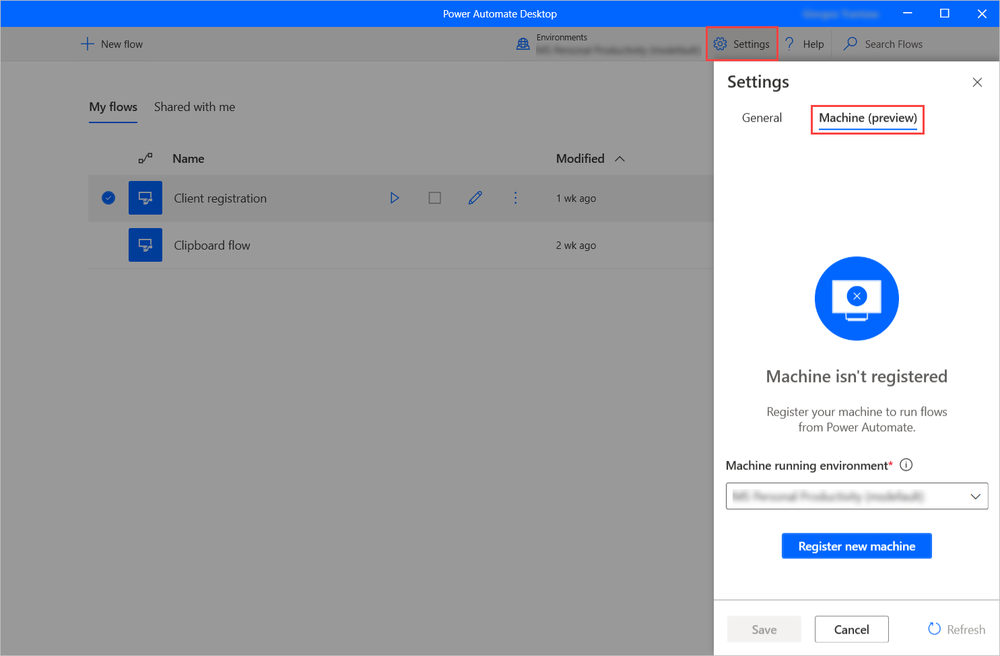
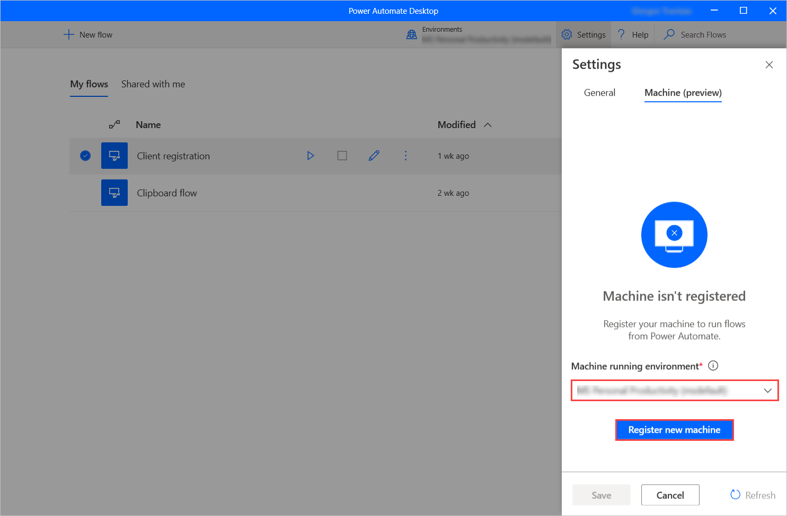
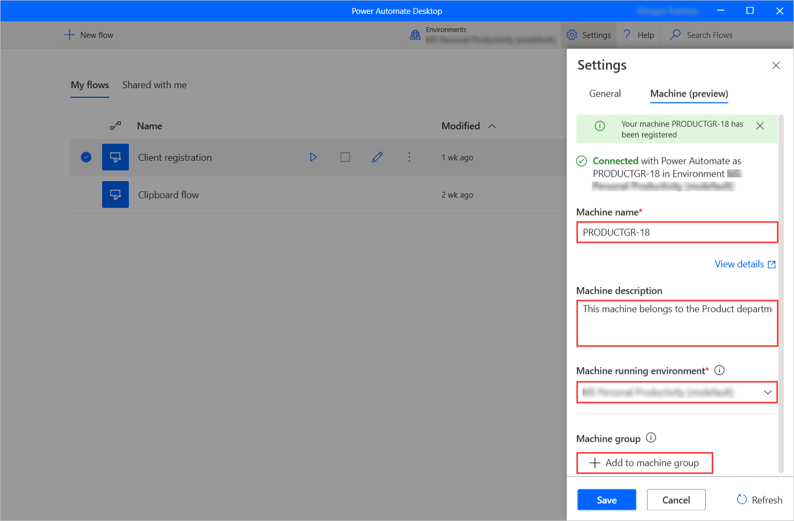

# Register and manage machines (preview)

[!INCLUDE [cc-beta-prerelease-disclaimer](../includes/cc-beta-prerelease-disclaimer.md)]

Power Automate enables you to trigger desktop flows from cloud flows using events, schedules, and buttons. 

> [!NOTE]
> To apply this functionality, you have to own a [premium per-user plan with attended RPA](). 

## Register a new machine

To trigger desktop flows to a machine, you have to register the machine to Power Automate. 

> [!NOTE]
> Before registering a machine, make sure that you have the required
permissions, and there is an available environment to register the new machine.

To register a machine:

1. Launch Power Automate Desktop, select **Settings**, and navigate to the **Machine** tab on the displayed pane. 

    

1. If the machine hasn't been registered yet, a message will prompt you to select a **Machine running environment**. Power Automate will use this environment to run all the triggered desktop flows.

    

1. When the connection is established successfully, the pane will display the following fields regarding the machine:
    - **Machine name:** A unique name to identify the machine.
    - **Machine description:** An optional description of the machine.
    - **Machine running environment:** The running environment of the machine.
    - **Machine group:** Through this option, you can add the machine to a machine group. You can find information about machine groups in [Manage machine groups](manage-machine-groups.md)

    

1. To save or discard any performed changes, select the **Save** or **Cancel** button, respectively.

## Update a registered machine

If a machine is already registered, you can update its configuration through the **Machine** settings tab.

Through this tab, you can change the name and the description of the machine, select a different machine running environment and add the machine to a machine group.

> [!NOTE]
> Keep in mind that changing the running environment of a machine removes all its current connections.
