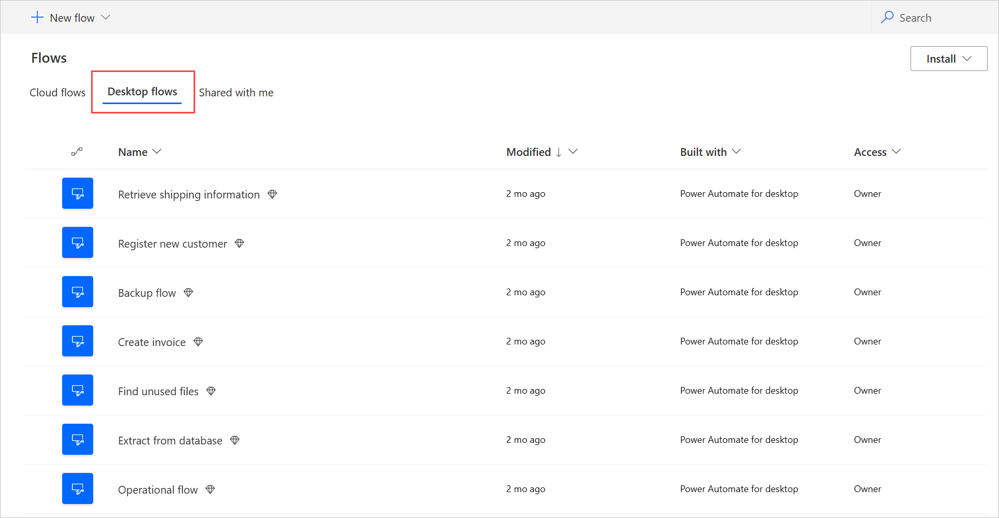
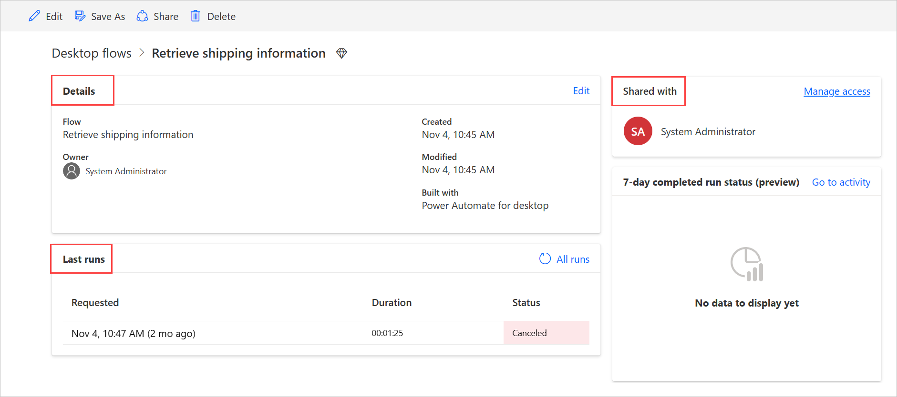
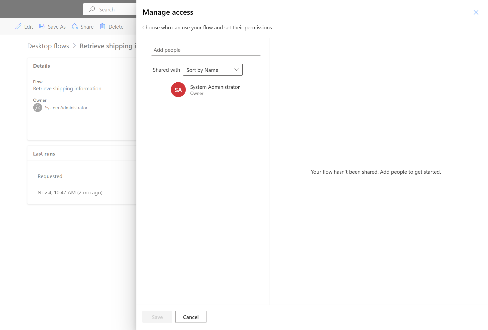
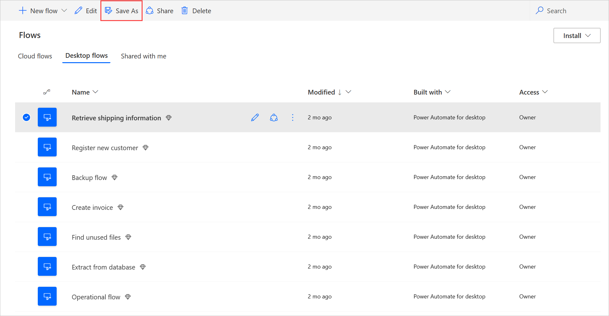
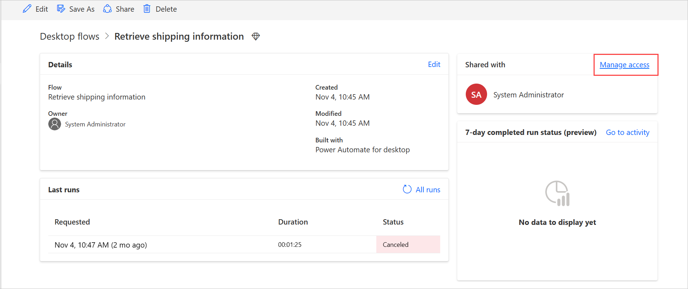

# Manage desktop flows

After you've created desktop flows, you might need to view, edit, or just check on their status. To do this, go to the **Desktop flows** tab.

## List of desktop flows

1. Sign into Power Automate.
1. Select **My flows** > **Desktop flows**.

   

From this section, you can create a new desktop flow and then edit or delete your existing desktop flows.

> [!NOTE]
> If you choose to delete or rename a desktop flow, press the refresh button in Power Automate to reflect the changes in the flows list.

## Details page

For each of your desktop flows, you can see its details by selecting its name from the list of desktop flows. You then see details including:

-   The run history with details of each run.
-   The applications or Websites used in the desktop flow.

Follow these steps to see the details for a desktop flow:

1. Sign into Power Automate.
1. Select **My flows** > **Desktop flows**.
1. Select any of your desktop flows.

   

## Share desktop flows

You can share a desktop flow with other users in your organization, giving those users specific permissions to access your flows.

Follow these steps to share a desktop flow.

1. Sign into [Power Automate](https://powerautomate.com).
1. Select **My flows** from the left side of the screen.
1. Select **Desktop flows**.
1. Select any flow that you own.

   

1. Select **Share**.
1. Select the **Add people** field, and then enter the name of the person in your organization with whom you'd like to share the flow.
1. Select **Give access**, and then select either **User** or **Co-owner** as the permission for the person with whom you share the flow.
1. Select the **Share** button.

   

These are the two permission levels you can use when you share desktop flows: 

1. **Co-owner**: This access level gives the co-owner full permissions to that desktop flow. They can edit, share, and delete the flow.

1. **User**: Has permission to only use that desktop flow in a cloud flow. No edit, rename, delete or share permissions are possible with this access. Alternatively, those users can create a copy of that desktop flow by using ‘Save as’, and work independently.

Once a desktop flow has been shared, owners and co-owners can change the access of each user by selecting the **Manage access** link on the desktop flow details page.

> [!NOTE]
> If someone shares a desktop flow with you, press the refresh button in Power Automate to see it in the **Shared with me** flows list.

## Copy desktop flows

To duplicate an existing flow:

1. Sign into [Power Automate](https://powerautomate.com).
1. Select **My flows** from the left side of the screen.
1. Select **Desktop flows**.
1. Select the flow that you want to copy.
1. Select **Save As**.

   

1. Populate a name for the new flow.
1. Select **Save**.

   

## Manage desktop flows access

For each of your desktop flows, you can manage its access by selecting manage access in the desktop flows details page.
   

In this panel, you can:
- Share the desktop flow with another user
- Edit users' permissions
- Remove users' permissions for this flow

>[!NOTE]
> Administrators of an environment are co-owners of all dekstop flows created in this environment and can't be removed.

## More information

- Create [desktop flows](create-flow.md).
- Run [desktop flows](run-desktop-flow.md).
- Create [Windows recorder (V1) flows](create-desktop.md).
- Create [Selenium IDE flows](create-web.md).

[!INCLUDE[footer-include](../includes/footer-banner.md)]