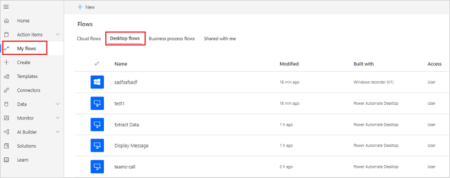
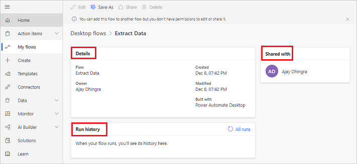
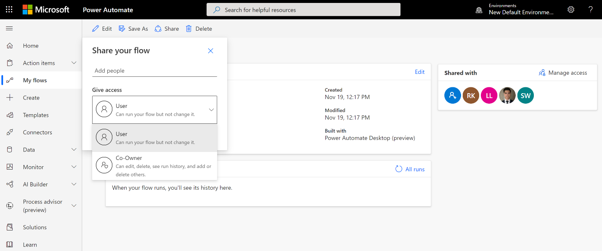

# Manage desktop flows

After you've created desktop flows, you might need to view, edit, or just check on their status. To do this, go to the **Desktop flows** tab.

## List of desktop flows

1. Sign into Power Automate.
1. Select **My flows** > **Desktop flows**.

   

From this section, you can create a new UI flow and edit or delete your existing desktop flows.

## Details page

For each of your desktop flows, you can see its details by selecting its name from the list of desktop flows. You then see details including:

-   The run history with details of each run.
-   The applications or Websites used in the UI flow.

Follow these steps to see the details for a UI flow:

1. Sign into Power Automate.
1. Select **My flows** > **Desktop flows**.
1. Select any of your desktop flows.

   

## Share desktop flows

You can share a desktop flow with other users in your organization, giving those users specific permissions to access your flows. 

   

These are the two permission levels you can use when you share desktop flows: 

1. **Co-owner**: This access level gives the co-owner full permissions to that desktop flow. They can edit, share, and delete the flow.

1. **User**: Has permission to only use that desktop flow in a cloud flow. No edit, delete or share permissions are possible with this access. Alternatively, those users can create a copy of that desktop flow by using ‘Save as’, and work independently.

Once a desktop flow has been shared, owners and co-owners can change the access of each user by clicking on the **Manage access** link on the desktop flow details page.

**Known issues and limitations:**

- Currently, you can only view your own flow runs. In the future, we will have the capability for co-owners to view the runs of all users.

- Currently, you can view the list of co-owned and user flows only on Power Automate portal. Soon, you will be able to view them from Power Automate Desktop.

- The Desktop flow sharing functionality is currently available on recently created environments only.

## Learn more

- Learn to [create Windows recorder (V1) flows](create-desktop.md).
- Learn to [create Selenium IDE flows](create-web.md).
- Learn how to run [desktop flows](run-desktop-flow.md).
