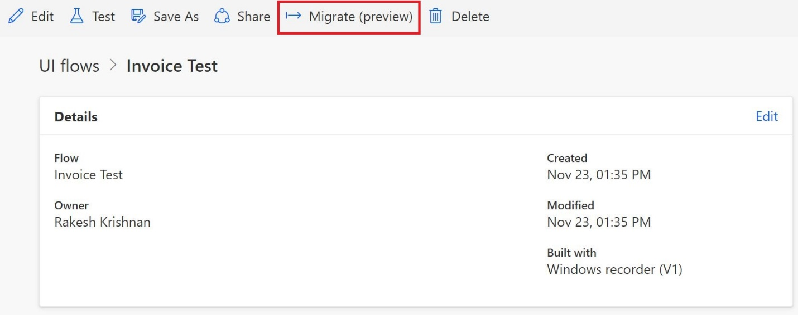
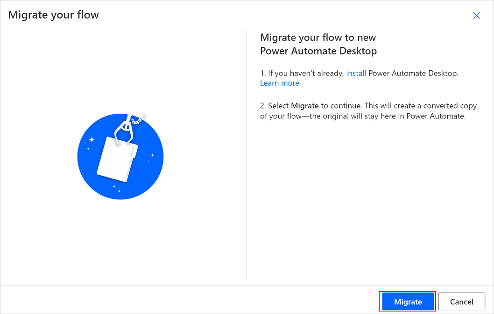

# Migrate from Windows recorder (V1) to Power Automate desktop flows

>[!IMPORTANT]
>From November 30th, Windows recorder (V1) desktop flows will no longer be supported. **Migrate** your flows to Power Automate or **delete** them.  

You can migrate desktop flows you've created with the legacy Windows recorder
(V1) into Power Automate desktop flows in just a few steps.

Follow these steps to migrate a legacy desktop flow.

1. Sign into Power Automate.
1. Select **My flows** > **Desktop flows**.
1. Select the flow you'd like to migrate.
1. Select **Migrate (preview)** on the desktop flow details page.

   

   The migration wizard launches.

1. Select **Migrate**.

   
   
   When the process completes, a copy of the desktop flow is saved in the current environment. The resulting desktop flow can then be edited using the Power Automate designer. The original Windows recorder desktop flow remains unchanged.

   

   >[!NOTE]
   >Migration is available only for desktop flows that were built with Windows recorder (V1). It's not supported for desktop flows built with Selenium IDE.

Once you test your new desktop flow, you may go to your existing cloud flows and
replace the UI automation action. You need to use the **Run a desktop flow built with Power Automate** action and use the newly created desktop flow.

## Known issues and limitations

- Windows recorder (V1) flows that contain the **Run a WinAutomation** or **Remote Desktop Protocol (RDP)** actions are not supported for migration.

- Flows with array inputs are not supported.

- Windows recorder (V1) desktop flows with native SAP recordings are not supported. For example, desktop flows that contain **Set Property** or **Call Method** actions aren't supported. 

>[!TIP]
>If your Windows recorder (V1) desktop flow contains a step to close an application, add an error handling step for the **close application** step on the converted desktop flow. You can configure the **On Error** condition of that action to **Continue flow run** > **Go to next action**.

>[!TIP]
>Update the duration of different **Wait** actions to change the playback speed of your converted desktop flow. Ensure you provide adequate wait time for the UI automation run to be successful.

[!INCLUDE[footer-include](../includes/footer-banner.md)]