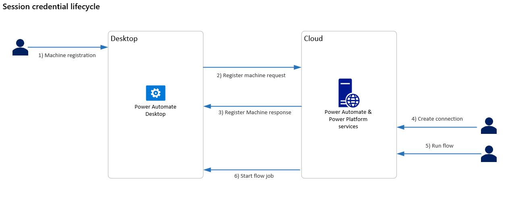

# Power Automate Desktop architecture

There are two different methods that Power Automate Desktop can use to connect to the cloud services in order to receive flow execution jobs. The first option is direct connectivity, while the second option requires the on-premises data gateway to be installed.

The data flow between the desktop and the cloud is the same in both options, only the application and user account that initiates the web requests are different. 

## Attended/Unattended desktop direct connectivity to the cloud service 

The **UIFlowService** is a Windows service that is installed with Power Automate Desktop on the desktop machine. By default, it's set to start automatically and runs as the new user **NT SERVICE\UIFlowService**. This user is created during installation. 

Azure Relay is a service that facilitates communication channels that are established entirely by making outgoing requests to the service. It achieves this functionality either by establishing a WebSocket connection or using HTTP long-polling, if necessary. 

> [!NOTE]
> The Azure Relay and Power Automate cloud services are both cloud resources in Azure. You can find more information about Azure Relays in [What is Azure Relay](https://docs.microsoft.com/azure/azure-relay/relay-what-is-it).

The outgoing web requests from the **UIFlowService** on the desktop machine to the Azure Relay in the cloud use HTTPS to make requests to FQDN **\*.servicebus.windows.net** over ports 443, 5671-5672, and 9350-9354. 

Destination IP addresses for the Azure Relay can be found [here](https://www.microsoft.com/download/details.aspx?id=56519) for the Public Cloud under the name **ServiceBus**. Similar documents are available for the other Azure national clouds. No inbound ports are required to be open on the desktop machine. 

##  Attended/Unattended desktop connectivity to the cloud service using the on-premises data gateway 

The **UIFlowService** is a Windows service that is installed with Power Automate Desktop on the desktop machine. The [on-premises data gateway](https://docs.microsoft.com/data-integration/gateway/service-gateway-onprem) Windows service is a separately installed component that acts as a communications gateway between the **UIFlowService** and the Azure Relay. 

By default, the data gateway service is set to start automatically and runs as the new user **NT SERVICE\PBIEgwService**. This user is created during installation. 

Azure Relay is a service that facilitates communication channels that are established entirely by making outgoing requests to the service. It achieves this functionality either by establishing a WebSocket connection or using HTTP long-polling, if necessary. 

> [!NOTE]
> The Azure Relay and Power Automate cloud services are both cloud resources in Azure. You can find more information about Azure Relays in [What is Azure Relay](https://docs.microsoft.com/azure/azure-relay/relay-what-is-it).

The details about this data flow are documented in [Adjust communication settings](https://docs.microsoft.com/data-integration/gateway/service-gateway-communication). The firewall requirements for execution are exactly the same as the direct connectivity option, but a different service and user account will be making the outgoing requests.

## Other Power Automate Desktop outgoing web requests 

Power Automate Desktop makes some additional outgoing web requests at runtime, which are documented in [Desktop flows services required for runtime](https://docs.microsoft.com/power-automate/ip-address-configuration#desktop-flows-services-required-for-runtime). 

The CRL endpoints use HTTP over port 80 and are initiated by the **UIFlowService**. 

The WebDriver endpoints are only required if you use Selenium IDE desktop flows and have an automatically updating browser. These endpoints use HTTPS over port 443 and are initiated by the **Microsoft.Flow.RPA.Agent.exe** process using the user account that is running the desktop flow. 

## Session credential lifecycle

1. A desktop machine is registered by signing in to the on-premises data gateway or registering inside Power Automate Desktop using the direct connectivity feature. This process generates a public and private key to be used for secure communication with this machine. 

1. The machine registration request is sent by the desktop application to the Power Automate cloud services. The request contains the newly generated machine's public key. This key is stored along with the machine registration in the cloud. 

1. When the request completes, the machine is successfully registered and appears in the Power Automate web portal as a resource that can be managed. However, the machine cannot be used by a flow until a connection to it is established. 

1. To establish a Power Automate Desktop connection in the web portal, users must select an available machine and provide the username and password credentials of the account to use to run the desktop flow. 

    Users can select any previously registered machine, including machines that have been shared with them. When a connection is saved, the credentials are encrypted using the public key associated with the machine and stored in this encrypted form. 

   The cloud service is storing the encrypted user credentials for the machine. However, it can't decrypt the credentials because the private key only exists on the desktop machine. The user can delete this connection at any point, and the stored encrypted credentials will also be deleted. 

1. When a desktop flow is run from the cloud, it uses a previously established connection selected in the **Run a flow built with Power Automate Desktop**  action. 

1. When the desktop flow job is sent from the cloud to the desktop, it includes the encrypted credentials stored in the connection. These credentials are then decrypted on the desktop using the secret private key, and they're used to sign in as the given user account.  

Although the logical data flow is from the cloud to the desktop, the connection is established from the desktop to the cloud. It uses an Azure Relay to connect to the cloud using an outgoing web request.

If a gateway cluster is created using the on-premises data gateway, the private key used to decrypt credentials is generated on all machines in the cluster. The private key is generated using the recovery key that is requested during machine registration. The recovery key is never sent to the cloud. 

If a machine group is created using direct connectivity, the group's private key is encrypted using a user-defined group password. Then, it's sent to the cloud for storage as part of the register machine request. 

The encrypted private key is shared with other machines that join the group. However, as the user must first provide the password to decrypt this private key, the service can't read any stored credentials in the connection.