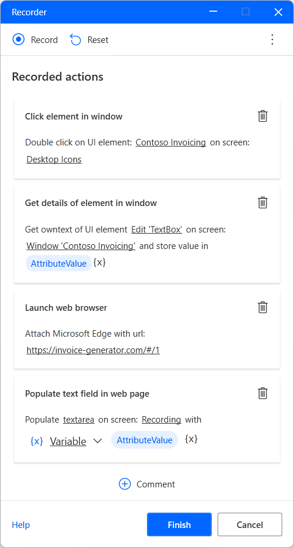
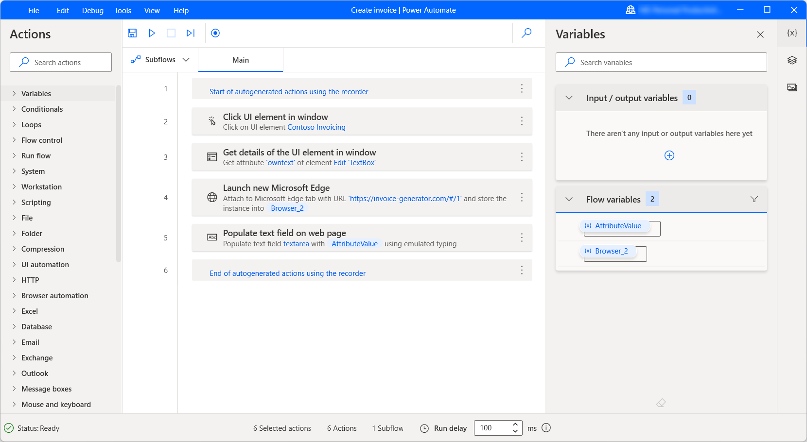
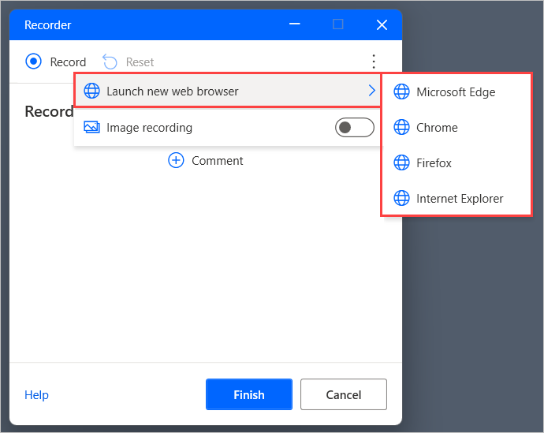
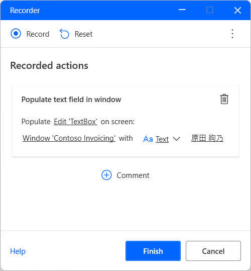
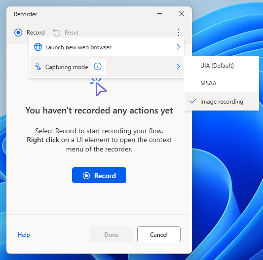
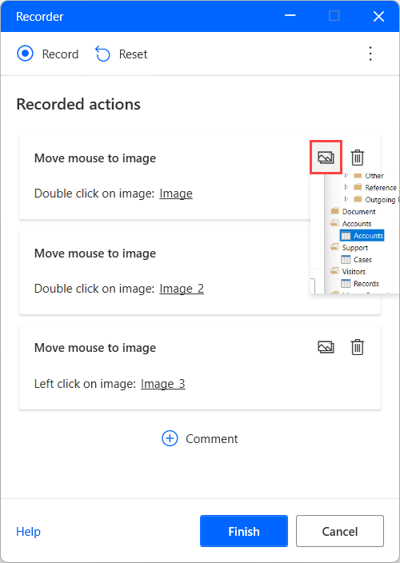

# Record flows in Power Automate Desktop

Power Automate for desktop enables you to design flows automatically by replicating the task you wish to automate. 

## Record desktop and web flows

To record a flow that automates desktop or/and web applications:

1. Create a new desktop flow and select **Recorder** in the toolbar of the flow designer.

    

1. Select **Record** in the recorder window and start performing the desired actions in the appropriate application or web page.

    

    The recorder keeps track of mouse and keyboard activity in relation to UI elements, and records each action separately. During each recording session, the recorder can generate both UI and browser automation actions.

    > [!NOTE]
    > When the browser extension fails to communicate with Power Automate, the browser window is identified as a desktop application. As a result, the recorder tries to grab UI elements for a desktop application and not a web page.

    

1. When the recording process is completed, select **Finish** to convert the recorded steps to Power Automate for desktop actions.

    All the UI elements used in the generated UI and web automation actions are added automatically to the UI elements pane.

    > [!NOTE]
    > The UI elements captured from web applications using the recorder are custom and can't be edited through the Visual editor. You can find more information regarding editing UI elements and creating custom selectors in [Build a custom selector](build-custom-selectors.md).

    

To pause the recording process temporarily, select **Pause**. To add a comment to the recorded actions, select **+ Comment**.

### Launch a web browser

To launch a web browser instance while recording web flows, you can use three different approaches based on the automation scenario. 

The first method is to select the dots icon on the right side of the recorder dialog and then **Launch new web browser**. You can choose between Microsoft Edge, Google Chrome, Mozilla Firefox, and Microsoft Internet Explorer. 

After selecting the proper browser, the recorder will detect the loaded webpage automatically and configure the launching browsing step accordingly. 

An alternative way to launch a browser is to start recording in an already open web browser. The recorder will automatically detect the loaded page and will create a launching browser action.

The last method to launch a browser is to manually launch it through its shortcut on the desktop, the start menu, the taskbar, or a folder. If you implement this approach, the recorder will generate UI automation actions that click the browser shortcut and launch it. 

### Add text using Input Method Editors (IMEs)

Input Method Editors (IMEs) are software components that enable users to input text in languages that can't be represented easily on a standard QWERTY keyboard. Users can type combinations of keys, and IMEs will generate a character or a list of candidate characters that match the set of keystrokes.

Power Automate for desktop supports the use of IMEs during the flow recording procedure. To populate a text field using an IME:

1. Right-click on the text field and select **Add text with IME** on the displayed menu.

    

1. Populate the popup dialog with the desired text using an IME.

    

1. Select **Add text** to generate the respective step in the **Recorder** window.

    

## Image-based recording

In some cases, the recorder may not record actions in specific applications that don't meet the appropriate technical requirements. These applications may not expose their accessibility API, run on virtual desktop environments, or have other technical limitations that block the recording process.

As an alternative way to record flows, Power Automate for desktop provides image-based recording. The image-based recording uses image recognition and OCR to locate specific elements on the screen and extract text.

> [!NOTE]
> The recorder switches automatically to image recording mode when a Citrix or Remote Desktop Protocol (RDP) window is detected.

To record flows using images:

1. Create a new desktop flow and select **Recorder** in the toolbar of the flow designer.

    

1. Select the dots icon on the right side of the recorder dialog, and then enable **Image recording**. After enabling this option, select **Record** to start recording actions using image recognition.

    

     Upon clicking on an element, an image is captured automatically and saved with a default editable name. To preview the captured image, hover or select the **preview icon**. 

    

### Extract text with image-based recording

To extract a text value while using image recording:

1. Perform a **right-click** on the screen and select **Extract text from image**.

    

1. Wait for a popup message that will prompt you to select a text area.

    

1. Select the **text area** from which text will be extracted using the Tesseract OCR engine.

    

1. Wait for a popup message that will prompt you to select an anchor area.

    

1. Select an **anchor area** that isn't expected to change, such as the label next to a field.

    

 ## Recording vs building a desktop flow

You can edit manually any actions created through the recorder once the recording is finished. Use the recorder in a desktop flow that is already under development to add the recorded steps to it.

> [!NOTE]
> Use the recorder to create the backbone of your flow. Certain simple tasks may require no further editing, however most recorded tasks should be modified to achieve optimal results. Certain types of actions, like conditionals and loops, cannot be recorded. Also, there may be redundant actions in a recording that should be removed.

## Known issues and limitations

- **Issue**: The recorder may not record all steps from the Windows Start menu or system tray.

- **Workarounds**: None.

- **Issue**: While running a flow created through image-based recording, the click may be sent to the wrong place. 

- **Workarounds**: Edit the auto-generated action “Move mouse to image” through the flow designer and decrease the Tolerance parameter in the Advanced settings.

- **Issue**: The “Extract text from image” popup that appears after sending a right-click using the recorder, may hide behind the popup of the application.

- **Workarounds**: Send the right-click to another place on the screen.

- **Issue**: Any keystrokes sent to a maximized RDP window through an image-based recording are not being recorded.

- **Workarounds**: Resize the RDP window so that it doesn't cover the full screen.

[!INCLUDE[footer-include](../includes/footer-banner.md)]