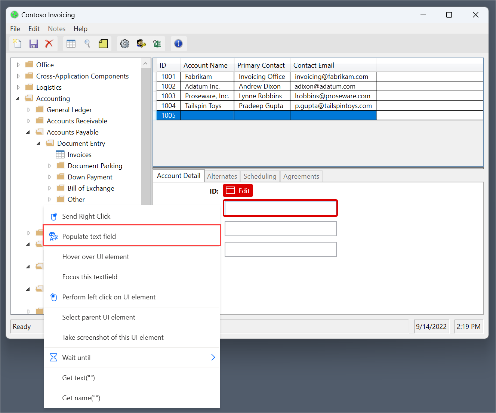
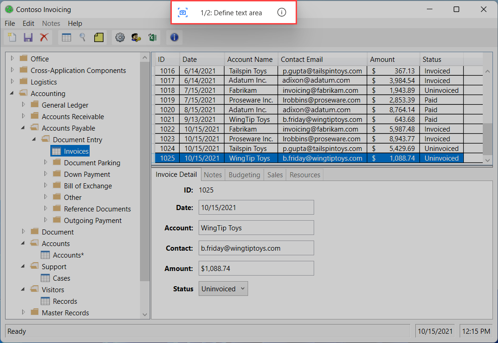

# Record flows in Power Automate Desktop

Power Automate Desktop enables you to design flows automatically by replicating the task you wish to automate. 

## Desktop recorder

To record a desktop flow:

1. Create a new desktop flow and select **Desktop recorder** in the toolbar of the flow designer.

    

1. Select **Record** in the desktop recorder window and start performing the desired actions.

    

    The desktop recorder keeps track of mouse and keyboard activity in relation to UI elements, and records each action separately.

    

1. When the recording process is completed, select **Finish** to convert the recorded steps to Power Automate Desktop actions.

    

To pause the recording process temporarily, select **Pause**.
 

 
 If you want to add a comment to the recorded actions, select **+ Comment**.

### Add text using Input Method Editors (IMEs)

Input Method Editors (IMEs) are software components that enable users to input text in languages that can't be represented easily on a standard QWERTY keyboard. 

Users can type combinations of keys, and IMEs will generate a character or a list of candidate characters that match the set of keystrokes.

Power Automate Desktop supports the use of IMEs during the flow recording procedure. To populate a text field using an IME:

1. Right-click on the text field and select **Add text with IME** on the displayed menu.

    

1. Populate the popup dialog with the desired text using an IME.

    

1. Select **Add text** to generate the respective step in the **Desktop recorder** window.

    

## Image-based recording

In some cases, the desktop recorder may not record actions in specific applications that don't meet the appropriate technical requirements. These applications may not expose their accessibility API, run on virtual desktop environments, or have other technical limitations that block the recording process.

As an alternative way to record flows, Power Automate Desktop provides image-based recording. The image-based recording uses image recognition and OCR to locate specific elements on the screen and extract text.
<!--
> [!NOTE]
> The desktop recorder switches automatically to image recording mode when a Citrix or Remote Desktop Protocol (RDP) window is detected.
-->
To record desktop flows using images:

1. Create a new desktop flow and select **Desktop recorder** in the toolbar of the flow designer.

    

1. Select **Image recording** and then **Record** to start recording actions using image recognition.

    

     Upon clicking on an element, an image is captured automatically and saved with a default editable name. To preview the captured image, hover or select the **preview icon**. 

    

### Extract text with image-based recording

To extract a text value while using image recording:

1. Perform a **right-click** on the screen and select **Extract text from image**.

    

1. Wait for a popup message that will prompt you to select a text area.

    

1. Select the **text area** from which text will be extracted using the Tesseract OCR engine.

    

1. Wait for a popup message that will prompt you to select an anchor area.

    

1. Select an **anchor area** that isn't expected to change, such as the label next to a field.

    

### Known issues and limitations

- **Issue**: The Desktop recorder may not record all steps from the Start Menu or system tray.

- **Workarounds**: None.

- **Issue**: While running a flow created through an Image-based recording, the click may be sent to the wrong place. 

- **Workarounds**: Edit the auto-generated action “Move mouse to image” through the Designer and decrease the Tolerance parameter in the Advanced settings.

- **Issue**: Image recorder does not support double-click.

- **Workarounds**: Edit the flow and manually add a “Send mouse click” action with parameter “Mouse event to send: Double click” right after the respective “Move mouse to image” action.

- **Issue**: The “Extract text from image” popup that appears after sending a right-click using the Image recorder, may hide behind the popup of the application.

- **Workarounds**: Send the right-click to another place on the screen.

 ## Web recorder

 To record a flow that automates web applications:

1. Create a new desktop flow and select **Web recorder** in the toolbar of the flow designer.

    

1. Select a web browser on which you'll record your activity. Optionally, you can attach to an already open browser instance.

    

The web recorder keeps track of your activity within the web browser, generating a series of web actions.

Like the desktop recorder, you can add comments through the **+ Comment** button, while you can pause, resume, and reset the recording using the buttons on the top section of the web recorder.

### Known issues and limitations

- **Issue**: When adding elements or capturing images, the console and the designer are visible, and they might obstruct the user.

- **Workarounds**: None.

 ## Recording vs building a desktop flow

You can edit manually any actions created through the recorder once the recording is finished. Use the recorder in a desktop flow that is already under development to add the recorded steps to it.

> [!NOTE]
> Use the recorder to create the backbone of your flow. Certain simple tasks may require no further editing, however most recorded tasks should be modified to achieve optimal results. Certain types of actions, like conditionals or loops, cannot be recorded. Also, there may be redundant actions in a recording that should be removed.

[!INCLUDE[footer-include](../includes/footer-banner.md)]