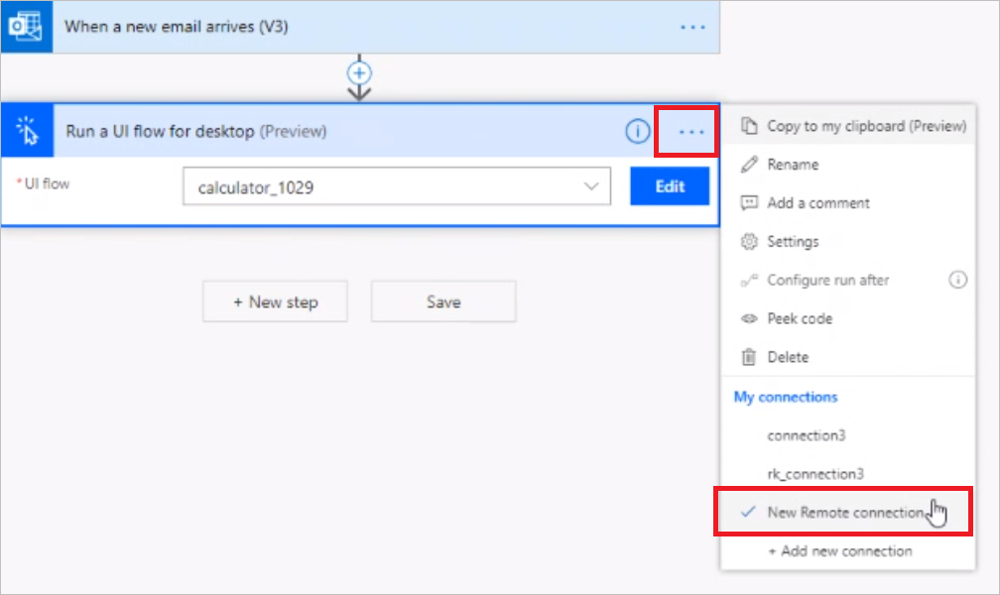
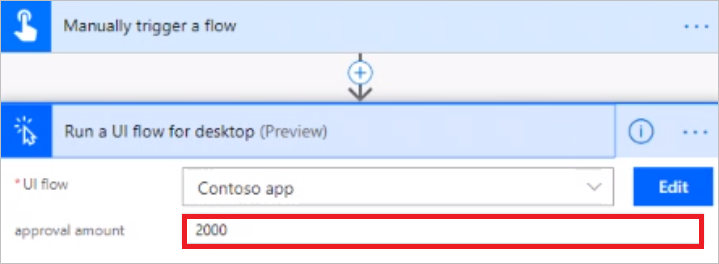
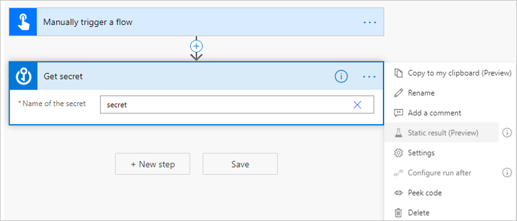
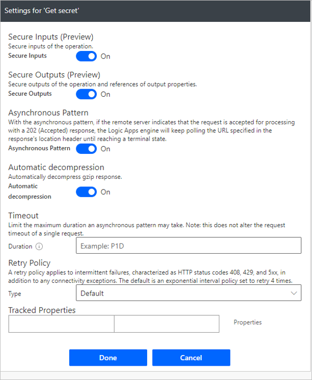

# Run attended and unattended UI flows

After you've created and tested a Windows recorder (V1) flow, you can run it from an event, schedule, or button. To make this possible, add your Windows recorder (V1) flow to an [Automated flow](../get-started-logic-flow.md), a [Button flow](../introduction-to-button-flows.md), a [Scheduled flow](../run-scheduled-tasks.md), or a [business process flow](../business-process-flows-overview.md).

## Prerequisites

- You need the [on-premises data gateway](https://go.microsoft.com/fwlink/?LinkID=820580&clcid=0x409) for your device to have the UI flow triggered by Power Automate.
   
   The gateway is an enterprise-grade secure connection between Power Automate and your device (where your UI flow runs). Power Automate uses the gateway to access your on-premises device so that it can trigger your UI flows from an event, schedule, or button.
- A work or school account. 

   >[!IMPORTANT]
   >You must use the same work or school account to set up the gateway, to sign into Power Automate, and to log into your Windows device.
   

## Run your desktop flow from an event, button, schedule, or business process flow

In this example we will use an automated flow to trigger a UI flow when a new email arrives.

1. Sign in to [Power Automate](https://flow.microsoft.com/).
1. Select **My flows** in the left navigation pane.
1. Select **New**, and then select **Automated-from blank**.

   >[!TIP]
   >You can choose any other type of flow to suit your needs.

1. Give your flow a name in the **Flow name** box.
1. Search for "new email", and then select **When a new email arrives (V3)** from the list of triggers. 

   
1. Select **Create**, and then select **New step**.
1. Search for **UI flows**, and then select **Run a UI flow for desktop** from the list of **Actions**. 

   

1. Provide the gateway information and device credentials. 

   You'll have to do this once per device:

    - **Gateway**: Select the gateway that you created earlier or use **New gateway** to create a new gateway.   
    - **Domain and Username**: Displays the work or school account from the device.
       >[!Important]
        >Make sure you can login to the device using these credentials.  
    - **Password**: Provide your work or school account’s password.

      

      >[!TIP]
      >If you don't see your gateway, you might be in an environment whose region is different from the gateway region. Select **Troubleshoot a missing gateway** in the gateway name list to learn more. You can also confirm your gateway and Power Automate regions are [mapped correctly](../regions-overview.md).

      >[!TIP]
      >If you don't see your gateway, you might need to select a different connection. To do this, select **...** from the top right side of the **Run a UI flow for desktop** or **Run a UI flow for Web** card, and then select the connection from **My connections**.

      

1. Select the UI flow that you previously created.

   

1. Select **Save** to save your automated flow.
 
    >[!TIP]
    >Before testing, confirm that your gateway is online. Go to **Data** > **Gateways** on the navigation pane, select the gateway name, click on **...** go to **Details** and verify if the **gateway status** is **online**.If the **gateway status** is **offline**, confirm that the device is turned on and connected to the Internet. 

1. Test your flow by sending an email to trigger it. You will see your UI flow playing back the steps you recorded. 

   

   >[!TIP]
   >Do not interact with your device while the flow runs.

## Use inputs and outputs

When you define inputs and outputs within a UI flow, you can pass information from and to those inputs.

1. When you add a UI flow to a cloud flow, you can see the list of inputs that were defined in the Windows recorder (V1) flow.

   

1. You can populate each input field in the UI flow with values from previous steps in the flow. To do this, select the input field, and then select an input from the token picker.

1. You can also use outputs from your UI flow as inputs for actions that appear later in the flow. To do this, select the input field, and then select an input from the token picker.

## Use sensitive text inputs

Some inputs like passwords need to be obfuscated and omitted from logging while being used in the application. UI flows supports inputs called **Sensitive text inputs** for storing these "private" values. 

For more information on how to create these types of inputs, click here.

To retrieve sensitive content from another connector, turn on **Secure Inputs** and **Secure Outputs** by following these steps:
1.	Select **…** on the top right corner of the action.
1.	Select **Settings**.

    

1. Turn on the **Secure Inputs** and **Secure Outputs** properties to prevent these settings from being shown in the logs.

   

1.	Select **Done**.
   
    You will notice that the action now has a lock icon on the top right, indicating special handling for input and output values.

      

   
      >[!TIP]
      >Follow the same steps to configure inputs as given earlier in this article to pass the output from this connector to a UI flow, and then turn on **Secure Text** in the **Settings**.

      

## Run UI flows unattended or attended

When you create UI flows, you run them either in **attended** or **unattended** mode. Unattended is best for applications that do not need human supervision.

When running unattended, UI flows automatically signs into the target devices that run Windows 10, Windows Server 2016, or Windows Server 2019. Once the automation completes, UI flows signs out from the device and reports its activity in Power Automate.

When running attended, UI flows will use an existing Windows user session.

When you add a UI flow to a cloud flow, you can choose whether you want your UI flow to run attended or unattended. Here are some key differences between attended and unattended runs:

### Unattended mode

To run unattended UI flows, the target machine needs to be available with all users signed out. 

>[!IMPORTANT]
>Locked Windows user sessions will prevent UI flows from running.

UI flows perform the following:
1. UI flow creates, manages, and then releases the Windows user session on the target devices.

1. Unattended UI flows run on devices with the screen locked so that no one can see the flow while it runs.

1. Windows 10 devices cannot run unattended if there are any active Windows user sessions present (even a locked one). You will receive this error: *Cannot execute UI flow. There is a locked or an inactive Windows user session on the target device*.

1. On Windows Server, if you have a locked Windows user session open with the same user as the UI flow is supposed to run as, you will receive the same error: *Cannot execute UI flow. There is a locked or inactive Windows user session on the target device*.

### Attended mode
To run an attended UI flow, you need to have an active Windows user session that matches the name of the user configured for your connection. The session must not be locked.

When an attended UI flow starts on the target machine, we recommend that you avoid interacting with your device until the run completes.

## Run multiple UI flows on the same device sequentially 

You can schedule multiple UI flows to run on one or more devices. If more than one UI flow is triggered to run on the same device, Power Automate follows these rules:

1.  The first UI flow runs on the target device.

1.  Queues other UI flows and then displays them as **Waiting** in the UI flows and gateway details page.

1.  Picks the next **Waiting** UI flow when each run completes.

>[!NOTE]
>These orchestration rules apply to UI flows runs that are scheduled by any user on the same device.

>[!IMPORTANT]
>If there are too many UI flows in the execution queue a timeout might occur. 
>UI flows runs will fail if they don’t run within 30 minutes after being triggered.

## Run UI flows concurrently on Windows Server devices
Multiple users can be signed in simultaneously on Windows Server 2016 and Windows Server 2019. Power Automate leverages this OS capability to simultaneously run multiple UI flows on such devices. With this feature, your organization can save on its infrastructure costs.

Perform the following steps to benefit from multiple UI flows on a single device:
1. Setup a Windows Server 2016 or 2019 device with the on-premises gateway and the latest version of UI flows installed.
1. Use two or more user accounts to create UI flows connections targeting the gateway on this device. 

Power Automate automatically scales the number of concurrent UI flows runs to the maximum supported by the device. If the capacity of the device is exceeded, the additional runs  *wait* as [described here](./run-desktop-flow.md#run-multiple-ui-flows-on-the-same-device-sequentially).

>[!IMPORTANT]
If you want to use more than two parallel user sessions on Windows Server, you must turn on Remote Desktop Services. Learn more about [RDS](https://docs.microsoft.com/windows-server/remote/remote-desktop-services/rds-client-access-license).

>[!NOTE]
>Running multiple concurrent UI flows by the **same user** is not supported. You will need to have different users running UI flows at the same time to benefit from this feature.

## Load balance requests across gateways in a cluster

You can choose to distribute UI flow runs evenly across gateways in a cluster. By default, the selection of a gateway during load balancing is random.

Follow [these steps to add a gateway to create a cluster](https://docs.microsoft.com/data-integration/gateway/service-gateway-install#add-another-gateway-to-create-a-cluster)

>[!NOTE]
>Offline gateway members within a cluster will negatively impact performance. Disable or remove these members.

To provide load balancing from the Power Automate gateway details page, navigate to **Data** -> **Gateways**, and then select your gateway cluster. 

In the gateway details page, toggle Run on all gateways in cluster. This will distribute the UI flows runs on all the gateways within that cluster.

   
   
>[!IMPORTANT]
>If you are using local Windows accounts, all machines in the cluster must have the same local account with the same password. Use these credentials when you create the UI flow connection.
>If you are using Active Directory or Azure AD joined machines, confirm that the user account you will be use in the UI flow connection can access all machines in the cluster.
   
## Best practices to avoid timeouts and distribute load across machines

If you plan to run multiple UI flows, there are a set of strategies you can adopt to distribute load and ensure that all your UI flows run successfully without overloading the target machine(s) or running into timeouts because multiple UI flows are running at the same time. You can either:

1. Plan your UI flows to run at different times of the day, spreading your load over time. This works best if you have a single or a limited set of machines that can run workloads, and you can control the triggers (for example, scheduled flows) that start your UI flows.
1. Create clusters of machines that can run UI flows with identical configurations in parallel. 
1. Create multiple flows that each use a separate connection to target different machines.

By following these strategies, you can avoid having UI flows competing to run on the same device and in some cases failing due to timeouts. 

>[!NOTE]
>If you are running UI flows in unattended mode, you will need to anticipate the number of UI flows your organization plans to run in parallel, and then purchase an adequate amount of Unattended Add-ons. 

## Rerun failed UI flows

If a UI flow run fails, correct the issue, and then try the following steps to rerun it: 

   1. Go to the details page and identify the failed run.

   1. Select the **Resubmit** button from the action menu.

## Troubleshoot failures

1. If your unattended UI flow fails with the **cannot create new session** message, follow these steps to resolve the issue:

    - On Windows 10, confirm that you don’t have an active user session locked or unlocked on your target device.
    - On Windows Server 2016 or Windows Server 2019, confirm you haven’t reached the maximum number of active user sessions that's configured for your device. UI flows won’t be able to run if it cannot create new sessions.

1. If you are running UI flows on a non-English language operating system and you receive a *502 - Bad request* message, confirm you have followed the [steps to upgrade your UI flows from preview](upgrade.md).

1. If the **gateway status** is **offline**, confirm that the device is turned on and connected to the Internet. You may also [troubleshoot the gateway](https://docs.microsoft.com/data-integration/gateway/service-gateway-tshoot).

1. If the **gateway status** is **online**, try the following actions:

   - Confirm the UI flows app and services are running on your device.

   - Restart the UI flow service on your device.

## Learn more

 - Install the [on-premises data gateway](https://docs.microsoft.com/data-integration/gateway/service-gateway-app).
 - [Use the on-premises data gateway app](https://docs.microsoft.com/flow/gateway-manage) documentation.
 - [Troubleshoot](https://docs.microsoft.com/data-integration/gateway/service-gateway-tshoot) the on-premises data gateway.

[!INCLUDE[footer-include](../includes/footer-banner.md)]