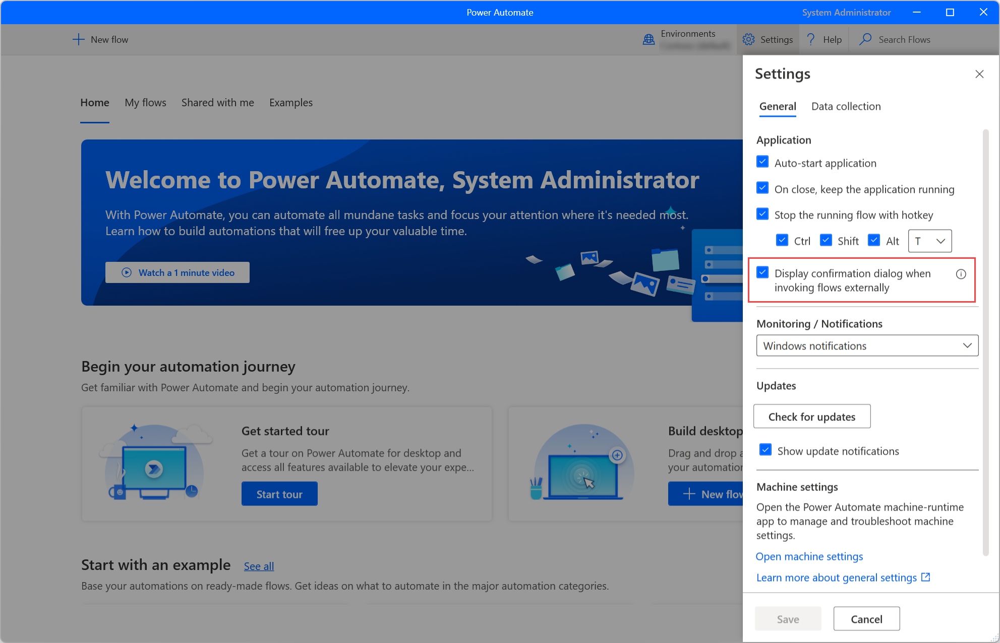
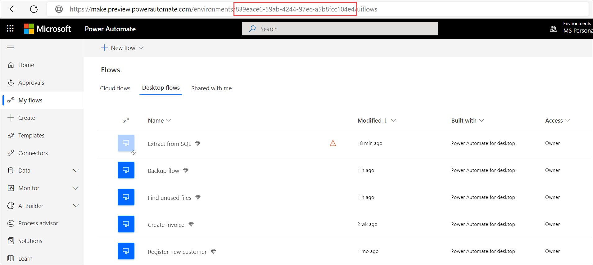
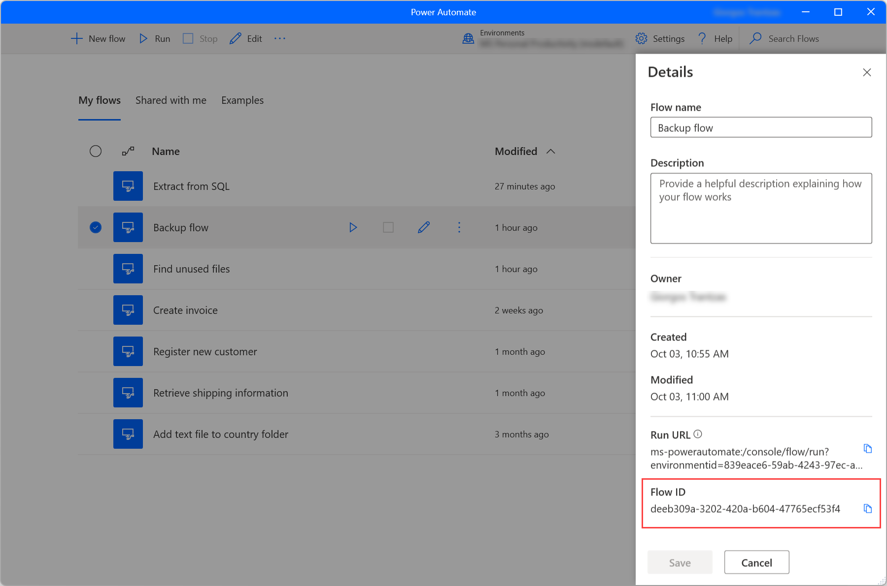

# Run attended and unattended desktop flows

After you've created and tested a desktop flow, you can run it from an event, schedule, or button. To make this functionality possible, add your desktop flow to an [automated flow](../get-started-logic-flow.md), a [instant flow](../introduction-to-button-flows.md), a [scheduled flow](../run-scheduled-tasks.md), or a [business process flow](../business-process-flows-overview.md).

## Prerequisites

> [!IMPORTANT]
> Gateways for desktop flows are now deprecated except for China region. Switch to our machine-management capabilities. [Learn more](manage-machines.md#switch-from-gateways-to-direct-connectivity)

- To trigger desktop flows through Power Automate, you have to use [machines](manage-machines.md) or [machine groups](manage-machine-groups.md). Machines are physical or virtual devices that are used to automate desktop processes. Machine groups allow you to organize multiple machines together to help distribute your automation workload.

   As an alternative to the machines, you can use the [on-premises data gateway](https://go.microsoft.com/fwlink/?LinkID=820580&clcid=0x409). The gateway is an enterprise-grade secure connection between Power Automate and your device. 

- If you use the on-premises data gateway to trigger desktop flows, you also need to [setup a desktop flow connection](install.md#setup-desktop-flows-connections-and-machine-credentials).

- A work or school account. 

   >[!IMPORTANT]
   >You must use the same work or school account to set up the gateway, to sign into Power Automate, and to log into your Windows device.
   

## Run desktop flows unattended or attended

When you create desktop flows, you run them either in **attended** or **unattended** mode. Unattended is best for applications that don't need human supervision.

When Power Automate runs in unattended mode, it automatically signs into the target devices that run Windows 10, Windows Server 2016, or Windows Server 2019. Once the automation completes, Power Automate signs out from the device and reports its activity.

When Power Automate runs in attended mode, it uses an existing Windows user session.

When you add a desktop flow to a cloud flow, you can choose whether you want your desktop flow to run attended or unattended. Here are some key differences between attended and unattended runs:

### Unattended mode

To run unattended desktop flows, the target machine needs to be available with all users signed out. 

>[!IMPORTANT]
> - Locked Windows user sessions will prevent desktop flows from running.
> - Flows run in unattended mode can't be launched with elevated privileges

Power Automate performs the following steps:
1. Power Automate creates, manages, and then releases the Windows user session on the target devices.

1. Unattended desktop flows run on devices with the screen locked so that no one can see the flow while it runs.

1. Windows 10 devices can't run unattended if there are any active Windows user sessions present (even a locked one). You'll receive this error: *Cannot execute desktop flow. There is a locked or an inactive Windows user session on the target device*.

1. On Windows Server, if you have a locked Windows user session open with the same user as the desktop flow is supposed to run as, you'll receive the same error: *Cannot execute desktop flow. There is a locked or inactive Windows user session on the target device*.

#### Reuse a Windows session in unattended mode

Desktop flows can run on a Windows session as long as it exists and isn't unlocked for unattended runs.

A new session is created on the machine for each unattended run using the credentials provided in the connection. The flow runs on this session, and the session is signed-off at the end of the flow.

The **reuse Windows session** functionality allows desktop flows to run on an existing session. At the end of the flow run, the session is locked and can be reused for another desktop flow run.  

##### Allow reusing Windows session 

1. Sign into Power Automate 
1. Select Machines then select a machine or a machine group 
1. Select Edit details 
1. Select “Yes” 

>[!NOTE]
>When adding a machine in a group, the machine will use the same settings as defined in the group. When removing from a machine group, the machine keeps the setting defined at the group level.

###### Known issues and limitations

"Reuse sessions" isn't supported on machines that a user can have multiple sessions (user isn't restricted to a single session). 

### Attended mode
To run an attended desktop flow, you need to have an active Windows user session that matches the name of the user configured for your connection. The session must not be locked.

When an attended desktop flow starts on the target machine, we recommend that you avoid interacting with your device until the run completes.


## Run multiple desktop flows on the same device sequentially 

You can schedule multiple desktop flows to run on one or more devices. If more than one desktop flow is triggered to run on the same device, Power Automate follows these rules:

1.  The first desktop flow runs on the target device based on [priority](monitor-desktop-flow-queues.md#setting-a-priority) and time requested.

1.  Queues other desktop flows and then displays them as **Queued**.

1.  Picks the next desktop flow when each run completes based on priority and time requested, shown as **Next to run**.


You can [view the real-time execution order](monitor-desktop-flow-queues.md#view-run-queue-for-a-machine-or-machine-group) of a device by its run queue. You can also manually [change the order](monitor-desktop-flow-queues.md#actions-on-a-run) of the desktop flows in the run queue at run-time, either by changing the priority or moving them to the top of the queue.

>[!NOTE]
>These orchestration rules apply to desktop flows runs that are scheduled by any user on the same device.

>[!IMPORTANT]
>A timeout will occur if desktop flows don’t run within three hours after being requested.

## Run desktop flows concurrently on Windows Server devices

> [!IMPORTANT]
> Gateways for desktop flows are now deprecated except for China region. Switch to our machine-management capabilities. [Learn more](manage-machines.md#switch-from-gateways-to-direct-connectivity)

Multiple users can be signed in simultaneously on Windows Server 2016 and Windows Server 2019. Power Automate uses this OS capability to simultaneously run multiple desktop flows on such devices. With this feature, your organization can save on its infrastructure costs.

Perform the following steps to benefit from multiple desktop flows on a single device:
1. Set up a Windows Server 2016 or 2019 device with the on-premises gateway and the latest version of desktop flows installed.
1. Use two or more user accounts to create desktop flows connections targeting the gateway on this device. 

Power Automate automatically scales the number of concurrent desktop flows runs to the maximum supported by the device. If the capacity of the device is exceeded, the remaining runs *wait* as [described here](#run-multiple-desktop-flows-on-the-same-device-sequentially).

>[!IMPORTANT]
>If you want to use more than two parallel user sessions on Windows Server, you must turn on Remote Desktop Services. Learn more about [RDS](/windows-server/remote/remote-desktop-services/rds-client-access-license).

>[!NOTE]
>Running multiple concurrent desktop flows by the **same user** is not supported. You will need to have different users running desktop flows at the same time to benefit from this feature.

## Load balance requests across gateways in a cluster

> [!IMPORTANT]
> Gateways for desktop flows are now deprecated except for China region. Switch to our machine-management capabilities. [Learn more](manage-machines.md#switch-from-gateways-to-direct-connectivity)

You can choose to distribute desktop flows runs evenly across gateways in a cluster. By default, the selection of a gateway during load balancing is random.

Follow [these steps to add a gateway to create a cluster](/data-integration/gateway/service-gateway-install#add-another-gateway-to-create-a-cluster)

>[!NOTE]
>Offline gateway members within a cluster will negatively impact performance. Disable or remove these members.

To provide load balancing from the Power Automate gateway details page, navigate to **Data** -> **Gateways**, and then select your gateway cluster. 

In the gateway details page, toggle **Run on all gateways in cluster**. This option will distribute the desktop flows runs on all the gateways within that cluster.

   
   
>[!NOTE]
>In rare cases, it can take up to 10 minutes for this setting to be effective and for load balancing runs to begin accross cluster members.

>[!IMPORTANT]
>If you are using local Windows accounts, all machines in the cluster must have the same local account with the same password. Use these credentials when you create the desktop flows connection.
>If you are using Active Directory or Azure AD joined machines, confirm that the user account you will be using in the desktop flows connection can access all machines in the cluster.
   
## Best practices to avoid timeouts and distribute load across machines

> [!IMPORTANT]
> Gateways for desktop flows are now deprecated except for China region. Switch to our machine-management capabilities. [Learn more](manage-machines.md#switch-from-gateways-to-direct-connectivity)

If you plan to run multiple desktop flows, you can adopt either one of the following strategies. These strategies distribute the load and ensure that all desktop flows run successfully without overloading the target machine(s) and running into timeouts because multiple desktop flows are running simultaneously.

1. Spread the load over time by planning your desktop flows to run at different times of the day. This practice works best if you've a limited set of machines that run workloads, and you can control the triggers that start your desktop flows.
1. Create clusters of machines that can run desktop flows with identical configurations in parallel. 
1. Create multiple flows that each use a separate connection to target different machines.

By following these strategies, you can avoid having desktop flows competing to run on the same device and in some cases failing due to timeouts. 

>[!NOTE]
>If you are running desktop flows in unattended mode, you will need to anticipate the number of desktop flows your organization plans to run in parallel, and then purchase an adequate amount of Unattended Add-ons. 

>[!NOTE]
>If a target device or gateway becomes offline due to either a restart or connectivity issues, desktop flows will wait for up to three hours before it fails. This wait time allows for transient machine states and allows you to successfully run automation even even if the devices go through restart or update cycles. 

## Rerun failed desktop flows

If a desktop flow run fails, correct the issue, and then try the following steps to rerun it: 

   1. Go to the details page and identify the failed run.

   1. Select the **Resubmit** button from the action menu.

## Support long running desktop flows
Some of your desktop flows might run for long durations, for example more than 24 hours. To ensure that those flows run successfully and don't fail due to the default timeout values, perform the following steps:

1.	Select the ellipsis (…) on the top right corner of the desktop flows action. And select Settings.

    

1.  Select the **Timeout** property and update the duration to correctly handle your desktop flow run. 
1.	Select **Done**.

## Troubleshoot failures

> [!IMPORTANT]
> Gateways for desktop flows are now deprecated except for China region. Switch to our machine-management capabilities. [Learn more](manage-machines.md#switch-from-gateways-to-direct-connectivity)

1. If your unattended desktop flow fails with the **cannot create new session** message, follow these steps to resolve the issue:

    - On Windows 10, confirm that you don’t have an active user session locked or unlocked on your target device.
    - On Windows Server 2016 or Windows Server 2019, confirm you haven’t reached the maximum number of active user sessions that's configured for your device. Desktop flows won’t be able to run if it can't create new sessions.

1. If the **gateway status** is **offline**, confirm that the device is turned on and connected to the Internet. You may also [troubleshoot the gateway](/data-integration/gateway/service-gateway-tshoot).

1. If the **gateway status** is **online**, try the following actions:

   - Confirm the desktop flows app and services are running on your device.

   - Restart the service on your device.

## Run desktop flows via URL

Power Automate, apart from triggering flows through the console, flow designer and cloud flows, enables you to run desktop flows using console run URLs.

You can use URLs to trigger desktop flows through many different sources, such as browsers, the Windows Run application, and the Command Prompt. If a triggered flow requires input variables, the console will ask you to populate the appropriate values.

By default, Power Automate always prompts you to confirm the triggering of a desktop flow via URL. To disable this functionality, navigate to the console settings and disable the option **Display confirmation dialog when invoking flows via URL** or modify the [appropriate Windows registry entry](governance.md#disable-confirmation-dialog-when-invoking-power-automate-desktop-flows-via-url).



### Prerequisites 

- Power Automate for desktop needs to be installed on the machine. 
- The user must be signed in.
- The user needs a trial or paid organization subscription or a pay-as-you-go environment.

### Create a console run URL 

To generate a URL that triggers a desktop flow, use one of the following formats:

```
"ms-powerautomate:/console/flow/run?workflowName=[workflowName]"
```

```
"ms-powerautomate:/console/flow/run?workflowId=[workflowId]"
```
 
```
"ms-powerautomate:/console/flow/run?environmentId=[environmentId]&workflowId=[workflowId]"
``` 

```
"ms-powerautomate:/console/flow/run?environmentId=[environmentId]&workflowName=[workflowIName]"
``` 

>[!Important]
> If a flow is already running, it won't run again when the URL is invoked.

The first two formats don't define a specific environment, so Power Automate automatically uses the currently selected console environment. The command will be neglected if both flow ID and flow name aren't specified.

If the console is set to another environment than the one specified in the URL, the console environment will automatically change.

### Find environment and desktop flow IDs

To find the ID of an environment, navigate to the [Power Automate portal](https://flow.microsoft.com/) and select the desired environment. Then, navigate to the **My flows** tab and copy the environment ID from the address line. 



To find the ID of a desktop flow, navigate to the **My flows** tab of the [Power Automate portal](https://flow.microsoft.com/), select the desired flow, and copy its ID from the address line. 



### Use a console run URL in the Command Prompt 

To trigger a flow using the Command Prompt, use a command with the following syntax:

>[!NOTE]
> You can replace the second part of the command with any of the previously presented external URL formats.

```
"C:\Program Files (x86)\Power Automate Desktop\PAD.Console.Host.exe" "ms-powerautomate:/console/flow/run?workflowName=[workflowName]"
```   

## Runtime notifications

Power Automate provides two different types of notifications while running a desktop flow, depending on the user's preferences. 

> [!NOTE]
> Runtime notifications are displayed when a flow is run directly from the console. When a flow is run from the portal, Power Automate doesn't display notifications.

Through the **Monitoring/Notifications** option of the console settings, you can choose between the integrated Windows notifications, the flow monitoring window, or disabling the notifications.

The **Windows notifications** option displays a Windows notification pop-up when a desktop flow is running, paused, stopped, finished running successfully, or encountered an error. Additionally, the notification pop-up enables users to pause or stop the flow through the respective buttons. 


The **Flow monitoring window** option provides the same functionality as the windows notifications, while it offers some extra functionality.

Instead of displaying separate notifications for each desktop flow, the monitoring window displays the state of all running flows in a single window. Further, it shows which subflow and action are running at any given time for each desktop flow. If an error occurs, you can copy the error details directly through the monitoring window for easier debugging.

> [!NOTE]
> When Power Automate pop-up dialogs appear, like input variable dialogs or update notifications, users can't interact with the flow monitoring window until they close the displayed dialog.


## Learn more

 - Install the [on-premises data gateway](/data-integration/gateway/service-gateway-app).
 - [Use the on-premises data gateway app](../gateway-manage.md) documentation.
 - [Troubleshoot](/data-integration/gateway/service-gateway-tshoot) the on-premises data gateway.

[!INCLUDE[footer-include](../includes/footer-banner.md)]