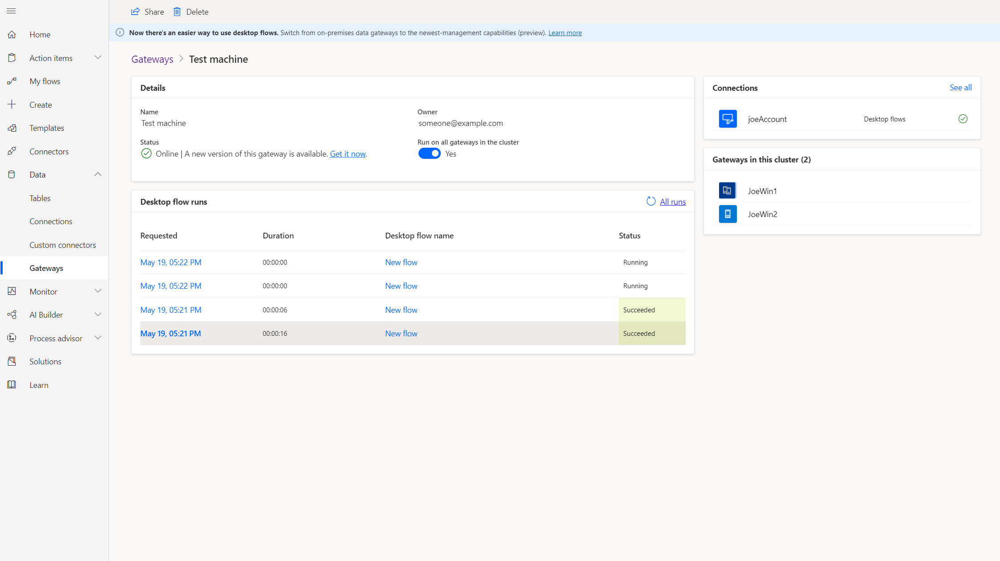

# Run attended and unattended desktop flows

After you've created and tested a desktop flow, you can run it from an event, schedule, or button. To make this possible, add your desktop flow to an [automated flow](../get-started-logic-flow.md), a [instant flow](../introduction-to-button-flows.md), a [scheduled flow](../run-scheduled-tasks.md), or a [business process flow](../business-process-flows-overview.md).

## Prerequisites

- To trigger desktop flows through Power Automate, you have to use [machines](manage-machines.md) or [machine groups](manage-machine-groups.md). Machines are physical or virtual devices that are used to automate desktop processes. Machine groups allow you to organize multiple machines together to help distribute your automation workload.

   As an alternative to the machines, you can use the [on-premises data gateway](https://go.microsoft.com/fwlink/?LinkID=820580&clcid=0x409). The gateway is an enterprise-grade secure connection between Power Automate and your device. 

- If you use the on-premises data gateway to trigger desktop flows, you also need to [setup a desktop flow connection](install.md#setup-desktop-flows-connections-and-machine-credentials).

- A work or school account. 

   >[!IMPORTANT]
   >You must use the same work or school account to set up the gateway, to sign into Power Automate, and to log into your Windows device.
   

## Run desktop flows unattended or attended

When you create desktop flows, you run them either in **attended** or **unattended** mode. Unattended is best for applications that do not need human supervision.

When running unattended, Power Automate automatically signs into the target devices that run Windows 10, Windows Server 2016, or Windows Server 2019. Once the automation completes, Power Automate signs out from the device and reports its activity.

When running attended, Power Automate uses an existing Windows user session.

When you add a desktop flow to a cloud flow, you can choose whether you want your desktop flow to run attended or unattended. Here are some key differences between attended and unattended runs:

### Unattended mode

To run unattended desktop flows, the target machine needs to be available with all users signed out. 

>[!IMPORTANT]
>Locked Windows user sessions will prevent desktop flows from running.

Power Automate performs the following:
1. Power Automate creates, manages, and then releases the Windows user session on the target devices.

1. Unattended desktop flows run on devices with the screen locked so that no one can see the flow while it runs.

1. Windows 10 devices cannot run unattended if there are any active Windows user sessions present (even a locked one). You will receive this error: *Cannot execute desktop flow. There is a locked or an inactive Windows user session on the target device*.

1. On Windows Server, if you have a locked Windows user session open with the same user as the desktop flow is supposed to run as, you will receive the same error: *Cannot execute desktop flow. There is a locked or inactive Windows user session on the target device*.

### Attended mode
To run an attended desktop flow, you need to have an active Windows user session that matches the name of the user configured for your connection. The session must not be locked.

When an attended desktop flow starts on the target machine, we recommend that you avoid interacting with your device until the run completes.

## Run multiple desktop flows on the same device sequentially 

You can schedule multiple desktop flows to run on one or more devices. If more than one desktop flow is triggered to run on the same device, Power Automate follows these rules:

1.  The first desktop flow runs on the target device based on [priority](monitor-desktop-flow-queues.md#setting-a-priority) and time requested.

1.  Queues other desktop flows and then displays them as **Queued**.

1.  Picks the next desktop flow when each run completes based on priority and time requested, shown as **Next to run**.

You can [view the real-time execution order](monitor-desktop-flow-queues.md#view-run-queue-for-a-machine-or-machine-group) of a device by its run queue. You can also manually [change the order](monitor-desktop-flow-queues.md#actions-on-a-run) of the desktop flows in the run queue at run-time, either by changing the priority or moving them to the top of the queue.

>[!NOTE]
>These orchestration rules apply to desktop flows runs that are scheduled by any user on the same device.

>[!IMPORTANT]
>A timeout will occur if desktop flows don’t run within three hours after being requested.

## Run desktop flows concurrently on Windows Server devices
Multiple users can be signed in simultaneously on Windows Server 2016 and Windows Server 2019. Power Automate leverages this OS capability to simultaneously run multiple desktop flows on such devices. With this feature, your organization can save on its infrastructure costs.

Perform the following steps to benefit from multiple desktop flows on a single device:
1. Setup a Windows Server 2016 or 2019 device with the on-premises gateway and the latest version of desktop flows installed.
1. Use two or more user accounts to create desktop flows connections targeting the gateway on this device. 

Power Automate automatically scales the number of concurrent desktop flows runs to the maximum supported by the device. If the capacity of the device is exceeded, the additional runs  *wait* as [described here](#run-multiple-desktop-flows-on-the-same-device-sequentially).

>[!IMPORTANT]
>If you want to use more than two parallel user sessions on Windows Server, you must turn on Remote Desktop Services. Learn more about [RDS](/windows-server/remote/remote-desktop-services/rds-client-access-license).

>[!NOTE]
>Running multiple concurrent desktop flows by the **same user** is not supported. You will need to have different users running desktop flows at the same time to benefit from this feature.

## Load balance requests across gateways in a cluster

You can choose to distribute desktop flows runs evenly across gateways in a cluster. By default, the selection of a gateway during load balancing is random.

Follow [these steps to add a gateway to create a cluster](/data-integration/gateway/service-gateway-install#add-another-gateway-to-create-a-cluster)

>[!NOTE]
>Offline gateway members within a cluster will negatively impact performance. Disable or remove these members.

To provide load balancing from the Power Automate gateway details page, navigate to **Data** -> **Gateways**, and then select your gateway cluster. 

In the gateway details page, toggle Run on all gateways in cluster. This will distribute the desktop flows runs on all the gateways within that cluster.

   
   
>[!IMPORTANT]
>If you are using local Windows accounts, all machines in the cluster must have the same local account with the same password. Use these credentials when you create the desktop flows connection.
>If you are using Active Directory or Azure AD joined machines, confirm that the user account you will be using in the desktop flows connection can access all machines in the cluster.
   
## Best practices to avoid timeouts and distribute load across machines

If you plan to run multiple desktop flows, there are a set of strategies you can adopt to distribute load and ensure that all your desktop flows run successfully without overloading the target machine(s) or running into timeouts because multiple desktop flows are running at the same time. You can either:

1. Plan your desktop flows to run at different times of the day, spreading your load over time. This works best if you have a single or a limited set of machines that can run workloads, and you can control the triggers (for example, scheduled flows) that start your desktop flows.
1. Create clusters of machines that can run desktop flows with identical configurations in parallel. 
1. Create multiple flows that each use a separate connection to target different machines.

By following these strategies, you can avoid having desktop flows competing to run on the same device and in some cases failing due to timeouts. 

>[!NOTE]
>If you are running desktop flows in unattended mode, you will need to anticipate the number of desktop flows your organization plans to run in parallel, and then purchase an adequate amount of Unattended Add-ons. 

>[!NOTE]
>If a target device or gateway becomes offline due to either a restart or connectivity issues, desktop flows will wait for up to three hours before it fails. This wait time allows for transient machine states and allows you to successfully run automation even even if the devices go through restart or update cycles. 

## Rerun failed desktop flows

If a desktop flow run fails, correct the issue, and then try the following steps to rerun it: 

   1. Go to the details page and identify the failed run.

   1. Select the **Resubmit** button from the action menu.

## Support long running desktop flows
Some of your desktop flows might run for long durations (e.g. more than 24 hours). To ensure that those flows run successfully and don't fail due to the default timeout values:

1.	Select the ellipsis (…) on the top right corner of the desktop flows action. And select Settings.

    

1.  Select the **Timeout** property and update the duration to correctly handle your dekstop flow run. 
1.	Select **Done**.

## Troubleshoot failures

1. If your unattended desktop flow fails with the **cannot create new session** message, follow these steps to resolve the issue:

    - On Windows 10, confirm that you don’t have an active user session locked or unlocked on your target device.
    - On Windows Server 2016 or Windows Server 2019, confirm you haven’t reached the maximum number of active user sessions that's configured for your device. Desktop flows won’t be able to run if it cannot create new sessions.

1. If the **gateway status** is **offline**, confirm that the device is turned on and connected to the Internet. You may also [troubleshoot the gateway](/data-integration/gateway/service-gateway-tshoot).

1. If the **gateway status** is **online**, try the following actions:

   - Confirm the desktop flows app and services are running on your device.

   - Restart the service on your device.

## Learn more

 - Install the [on-premises data gateway](/data-integration/gateway/service-gateway-app).
 - [Use the on-premises data gateway app](/power-automate/gateway-manage) documentation.
 - [Troubleshoot](/data-integration/gateway/service-gateway-tshoot) the on-premises data gateway.

## Runtime notifications

A notification popup appears by default when a desktop flow is downloading or running, when it is cancelled, when it finishes running successfully, or when it encounters an error.

> [!NOTE]
> Runtime notifications are displayed when a flow is run directly from the console. When a flow is run from the portal, Power Automate doesn't display notifications.

[!INCLUDE[footer-include](../includes/footer-banner.md)]
