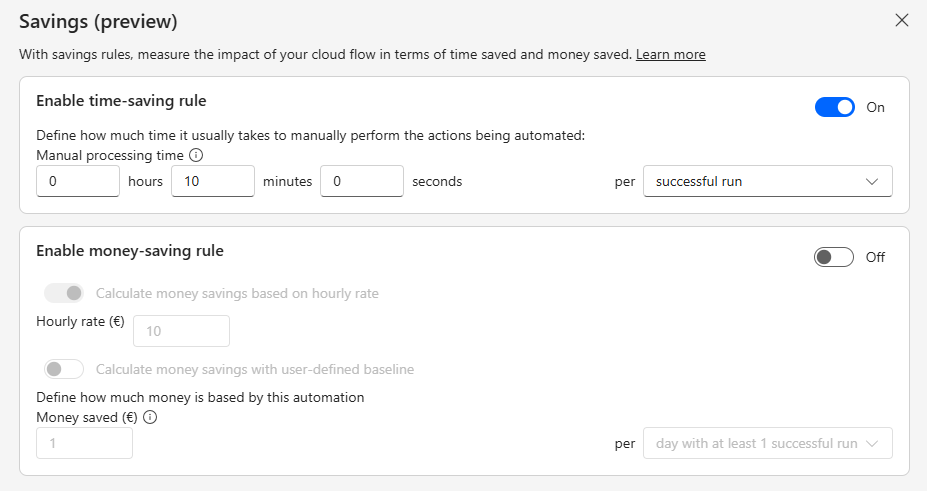
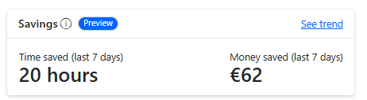
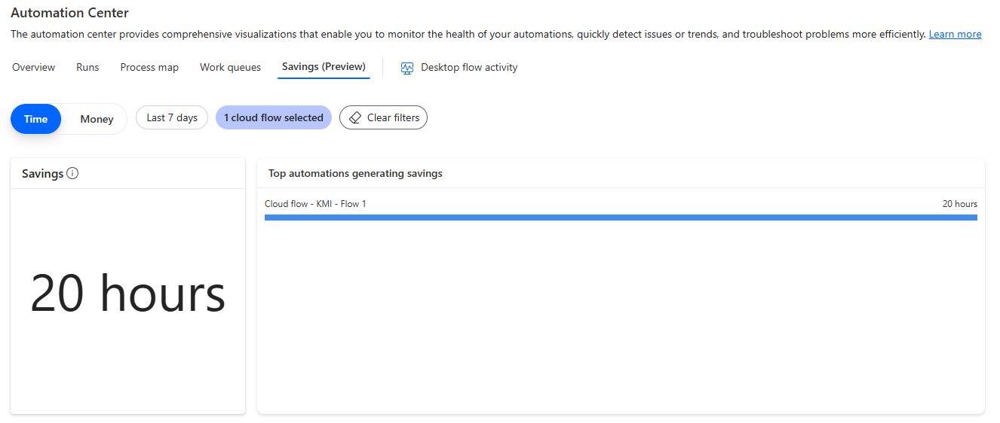

# Savings in Power Automate (Preview)

[!INCLUDE [preview-banner](~/../shared-content/shared/preview-includes/preview-banner.md)]

The savings feature provides a way to calculate how much time and/or money a cloud flow is saving to its organization. Each cloud flow can now be added a user-defined saving-rule which generates savings at successful cloud flow runs.

> [!IMPORTANT]
> - Preview features aren’t meant for production use and have restricted functionality. These features are available before an official release so that customers can get early access and provide feedback.
> - For more information, go to our [preview terms](https://go.microsoft.com/fwlink/?linkid=2189520).
> - This feature is rolling out and might not be available in your area yet. To try it out today, you can either use an existing preview environment or create a new one. Learn more about how to create a preview environment in [Early release cycle environments](/power-platform/admin/early-release).

With the savings feature, two new concepts are added to Power Automate:

|Concept|Definition|
|----|-------------------------------------------|
|Saving rule|The artifact attached to the cloud flow which bears the user-define saving baselines.|
|Savings|The amount of time/money saved generated by the saving rule for the cloud flow.|

> [!NOTE]
>
> - Only solution-based cloud flows can bear saving-rules
> - Only successful runs generate savings (successful test runs don't)
> - Environment with Dataverse for Teams can't use the savings feature

## How to set up a saving rule

The saving rule can be defined on the cloud flow details page by clicking on the **savings icon** in the page action bar which opens the saving-rule edition dialog:

|Saving-rule|Definition|
|----|-------------------------------------------|
|Time saving rule|Define the manual processing time it usually takes to manually perform the actions being automated. The saving can be generated either on every successful run or once every hour/day/week if a successful run happened in that period.|
|Money-saving rule based on hourly rate|The money-saving rule can be based on an hourly rate converting time-savings in money-savings. This mode is only available if the time-saving rule is enabled.|
|Money-saving rule with user-defined baseline|Define the amount of money saved by the actions being automated. The saving can also be generated either on every successful run or once every hour/day/week if a successful run happened in that period.|

> [!NOTE]
>
> - Money-saving rule based on hourly rate: the money-savings generated are rounded and don't save decimals.
> - For example:
>   - the user defines a time-saving baseline of 1 hour and 15 minutes per successful run
>   - the user defines a money-saving rule with an hourly rate of 1$/hour
>   - the money-saving associated should be 1.25$ on a successful run but it is rounded to 1$.

## When are savings generated

Once a saving-rule is saved on a cloud flow, every successful run of this flow contributes to generate savings. But the saving isn't immediately generated after the successful run: a periodic update of the saving amount for the cloud flow is automatically performed. It can take up to one hour for a run to be accounted for in the savings amount of its cloud flow.

## How can you track the savings generated by your cloud flow

You can visualize the saving generated by a cloud flow on the flow details page: 

And if you click on the savings-card **See trend** link, you access the Automation Center savings pane where you'll be able to track the saving trend of this flow and all other flows: 

## Frequently asked questions

### Why is the hourly rate mode disabled in the money-rule section?

The money-rule can only use the hourly rate mode if the time-saving rule is enabled.

### Why is the money rule entirely disabled?

Your environment administrator blocked the usage of money rule in the environment. Any money-saving generated before the administrator decision remains unchanged but no new money-savings will be generated.

## Permissions required to view and edit saving-rules

To view and edit a saving-rule, you need a security role with privileges to the **Saving Rule** and the **Flow Aggregation** tables. For example, the Environment Maker role can view and edit saving-rules on its cloud flows.

