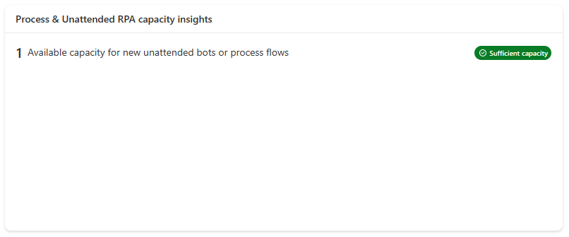
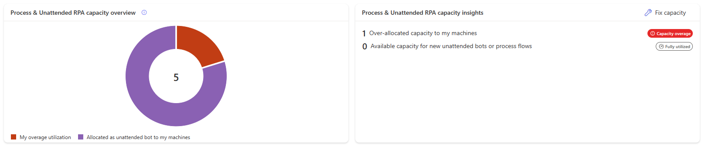
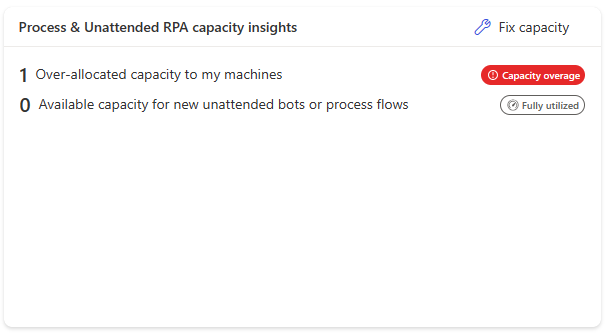

# Savings in Power Automate (Preview)

The savings feature provides a way to calculate how much time and/or money a cloud flow is saving to its organization. Each cloud flow can now be added a user-defined saving-rule which will be generate savings on successfull cloud flow runs.

|Concept|Definition|
|----|-------------------------------------------|
|Saving rule|The artifact attached to the cloud flow which bears the user-define saving baselines.|
|Savings|The amount of time/money saved generated by the saving rule for the cloud flow.|

> [!NOTE]
>
> Savings is only supported by solution-based cloud flows

## How to set-up a saving rule

The saving rule can be defined on the cloud flow details page by clicking on the **savings icon** in the page action bar : 

|-|Legend|Description|
|----|--------------------|----|
||Allocated as unattended bots to my machines|Compliant capacity allocated to machines, which the user owns or which are shared with them.|
||Allocated to my cloud flows|Compliant capacity allocated to cloud flows, which the user owns or which are shared with them.|
||Utilized by other makers|Compliant capacity allocated to objects, which the user doesn't own and which weren't shared with them.|
||Available capacity|Available capacity for new unattended bots on machines and new process plan on cloud flows.|
||My overage utilization|Sum of capacities over-allocated to machines or/and to cloud flows, which the user owns or which are shared with them.|
||Overage by other makers|Sum of capacities over-allocated to objects, which the user doesn't own and which weren't shared with them.|

## Process and Unattended RPA capacity insights

The **Process and Unattended RPA capacity insights** card informs you of operation health and gives recommendations when there are compliance issues.

|Badge|Message|Insight|
|----|--------------------|----|
|**Sufficient capacity**|There's available capacity for new unattended machines or for new process plans on cloud flows.|Scale-up possible in the future.|
|**Fully utilized**|There's no more capacity for new unattended bots or for new process plans on cloud flows.|The capacity utilization rate is optimal at 100% but there's no room for scaling-up.|
|**Capacity overage**|User has over-allocated capacity to their machines or/and to their cloud flows.|Uncompliant capacity usage exceeding environment capacity.|

## Process and Unattended RPA utilization details

In this section, you learn how to oversee and manage all machines you have access to (as owner or through sharing).

> [!NOTE]
>
> By selecting a machine, you can edit its unattended bots setting and its auto-allocation setting.
> Machines can be, when necessary (in case of overage), prioritized based on their unattended runs.
> Cloud flows using process capacity will be added to the page in a future release

## Capacity overage

Capacity overage in an environment occurs when the capacity utilized by the unattended bots on machines and the process plans on cloud flows surpasses the assigned capacity of the environment. In such instances, specific machines and/or cloud flows might be identified as exceeding capacity. To return to compliance, it's important to promptly rectify the situation.

> [!NOTE]
>
> - Process capacity overage is only possible in an environment where some Process capacity or Unattended RPA capacity has been allocated
> - Process capacity overage is also possible in an environment where some Hosted RPA capacity has been allocated

### Machine in overage

Machines identified in overage aren't compliant.

> [!NOTE]
>
> A machine can have a subset of its unattended bots identified as in overage (= uncompliant)

### How to fix Process and Unattended RPA capacity overage

When some unattended machines are in overage, the **Fix capacity** button appears in the **Process & Unattended RPA capacity insights** card.

The card provides potential corrective actions.

The **Request capacity** action submits a request to the tenant administrator for the consideration of assigning capacity to the environment.

> [!NOTE]
>
> - The preset value in the request capacity modal dialog is equal to the total overage value in the environment (the user's overage and the other users' overage).
> - This preset value ensures that when the additional capacity is assigned to the environment, the user who made the request have their machines or returned back to compliance.
> - If the user submits a smaller request, when the additional requested capacity is provisioned to the environment, there’s no guarantee that their own machines will return to compliance. The extra capacity might be allocated to other in-overage machines owned by different users.

### What are the rules governing which objects are identified as in overage?

When the total Process capacity assigned to an environment is inferior to the combined capacity allocated to machines and cloud flows: the overage is identified, on machines and cloud flows indistinctively, starting from the most recently created allocation to the oldest.

## Permissions required to view and edit capacity allocation

To view and edit capacity allocation, you need a security role with privileges to the **Flow Capacity Assignment** table. For example, the Environment Maker role can view and edit allocation of hosted capacity.

## Related information

[Capacity utilization within Power Automate](capacity-utilization.md)
