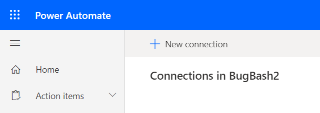
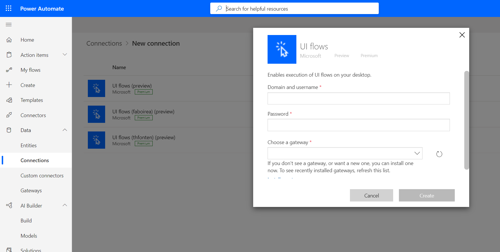

# Set up Power Automate Desktop

Before you can use your device to create desktop flows, you'll need to ensure it meets the requirements outlined here.

> [!TIP]
> Before you create a desktop flow, check the [list of connectors](https://flow.microsoft.com/connectors/) to see if the application you want to automate already has a connector. If it does, consider creating a cloud flow instead of a desktop flow. You might also build your [own connector](/connectors/custom-connectors/).

## Prerequisites

- A work or school account to sign into your Windows device with administrator privileges and Power Automate.

- System requirements:

   - A device that runs Windows 10 Home, Windows 10 Pro, Windows 10 Enterprise, Windows Server 2016, or Windows Server 2019. ARM devices are not supported.
      
      - Minimum hardware
         - Storage: 1GB
	      - RAM: 2GB
     - Recommended hardware
        - Storage: 2GB
	     - RAM: 4GB
     - .NET Framework 4.7.2 or later 
     
> [!TIP]
> If your device runs Windows 10 Home, you can use Power Automate Desktop to create your desktop flows and monitor them on [Power Automate](https://powerautomate.com). You can't trigger desktop flows to run from the cloud on Windows 10 Home devices. Other types of desktop flows (Windows recorder V1 and Selenium IDE) are not supported.

| Activity |  Description |Windows Home |  Windows Enterprise / Pro / Server  | 
|---------|------|----------|-----------|
| Authoring | Create with Power Automate Desktop |  Yes |  Yes  | 
| Authoring | Create with Windows Recorder V1 |  No |  Yes  |
| Authoring | Create with Selenium IDE |  No |  Yes  |
| Runtime | Local runtime (Attended) |  Yes |  Yes  |
| Runtime | Cloud runtime (Attended / Unattended) |  No |  Yes  |
| Monitoring | Manage desktop flows |  Yes |  Yes  |
| Monitoring | View run logs |  Yes |  Yes  |

- Access as described in the [IP Address configuration](../ip-address-configuration.md)

- The [Microsoft Edge](https://www.microsoft.com/edge/) (version 80 or later)
    or Google Chrome browser.

- An [environment](/power-platform/admin/environments-overview) with a [Microsoft Dataverse database](/power-platform/admin/create-database). (Applicable only for work or school accounts)

- A supported keyboard attached.

- An active connection to the Internet.

> [!IMPORTANT]
> You must have the latest versions of each component to record, test, or run desktop flows.

## Install Power Automate Desktop on your device

The installer contains all the components you need to record, edit, and test your automations.

Follow these steps to install the Power Automate Desktop app:

1. [Download the Power Automate Desktop installer](https://go.microsoft.com/fwlink/?linkid=2102613).
1. Open the **Setup.Microsoft.PowerAutomateDesktop.exe** file. 

   This file is likely in your **Downloads** folder after you downloaded it in the previous step.

1. Follow the instructions in the **Power Automate Desktop setup** installer to complete the installation. 
1. Make your selections for each feature for the installation to complete.

>[!IMPORTANT]
>The installer installs the Webdriver component. You need it to run desktop flows created with Selenium IDE.
>It will also installs the Power Automate Desktop app and third-party components.


### Set data collection options

During installation, you can change the default settings if you do not want to send usage data to Microsoft. To do so, uncheck **Allow Microsoft to collect usage data to improve Power Automate**.

>[!IMPORTANT]
>Sharing usage data to Microsoft, will help the support department to solve a Power Automate Desktop issue.

## Set the display language for Power Automate Desktop

The language used in the Power Automate Desktop is the display language selected on your Windows OS. Get more details on how to [manage display language settings in Windows 10](https://support.microsoft.com/windows/manage-display-language-settings-in-windows-10-219f28b0-9881-cd4c-75ca-dba919c52321).

## Install the Power Automate browser extension 

After the installation completes, you will need to install and enable the extension for Power Automate Desktop. This extension will allow you to record and run web actions in your desktop flows.


Select one of the links displayed in the installer. For example, if you want to record your web automations on Microsoft Edge, select the **Microsoft Edge** link.

   The store for your browser opens directly to the public page for the extension.

> [!IMPORTANT]
> If you already install the Power Automate extension in the past, you don't need to reinstall it

### Microsoft Edge

- [Install Edge extension](https://go.microsoft.com/fwlink/?linkid=2151411): select **Get**, and then select **Add extension** when prompted. 
- If you see the message: *This extension has been turned off in Microsoft Edge*, at the top of the page, select **Turn on extension**.

### Google Chrome

- [Install Chrome extension](https://go.microsoft.com/fwlink/?linkid=2150929): select **Add to Chrome**, and then select **Enable extension** when prompted. 
- If you see the message: *This item has been disabled in Chrome* on top of the page, select **Enable this item**.

### Mozilla Firefox

- [Install Firefox extension](https://go.microsoft.com/fwlink/?linkid=2151511): select **Add to Firefox**, and then select **Add** when prompted.

> [!TIP]
> If you are not able to activate the extension(s) in your browser, you must use [Microsoft Edge](https://www.microsoft.com/edge/) (version 80 or later) or Google Chrome or Firefox. Other browsers are not supported.

## Install the on-premises data gateway to run your desktop flows from the cloud

You will need the gateway to trigger your desktop from an [event, schedule, or button flow.](..\flow-types.md) on a remote device.

>[!TIP]
>The gateway isn't required if you only want to create, edit, and test your flows on your device.

[Install the on-premises data gateway](/data-integration/gateway/service-gateway-install), if you need it.


>[!IMPORTANT]
>You must install the on-premises gateway on each device from which you automate desktop flows.

>When you install the gateway, it defaults to the region that Power Automate uses.

## Setup desktop flows connections and machine credentials

1. Sign into [Power Automate](https://powerautomate.microsoft.com).
1. Expand **Data** on the left side of the screen.
1. Select **Connections**.

   

1. Select New connection.

   

1. Search for *Desktop flow*, and then select **Desktop flows**.

   <!--  -->

1. Provide the gateway information and device credentials:

    - **Domain and Username**: Provide your device account. You can use a local account by using the name of the user (for example, “MACHINENAME\\User” or “local\\User”), or an Active Directory account such as “DOMAIN\\User”.
    - **Password**: Your account’s password.
    - **Choose a gateway**: Select the gateway you want to use.

      

1. Select **Create**.

## Install Power Automate Desktop silently

Follow these steps if you want to silently install Power Automate Desktop.

>[!NOTE]
>The same installer is used for manual and silent installation of Power Automate Desktop.

### Install Power Automate Desktop using the command line

1. Download [Download Power Automate Desktop](https://go.microsoft.com/fwlink/?linkid=2102613).

1. Open **Start**.

1. Search for **command prompt**, and then run it as the administrator.

   

1. Change the directory to downloads (or to the directory into which you downloaded Power Automate Desktop):

   For example, enter:
   
   ```
    cd C:\Users\JohnDoe\Downloads\
   ```

1. Enter:

   ```
   Setup.Microsoft.PowerAutomateDesktop.exe -Silent -Install -ACCEPTEULA
   ```
   
   The installer runs and completes the setup of Power Automate Desktop.

   >[!IMPORTANT]
   > You must provide the `-ACCEPTEULA` argument to indicate that you accept the [terms and conditions](/dynamics365/legal/slt-power-automate-desktop) for Power Automate Desktop.

1.  You can now launch Power Automate Desktop from the Start menu.

### Command line argument details

You can also retrieve the details of all the command line arguments from the help menu in the command prompt:

   ```
   Setup.Microsoft.PowerAutomateDesktop.exe -HELP
   ```

| Command              | Description                                                                                                                                                                        |
|----------------------|------------------------------------------------------------------------------------------------------------------------------------------------------------------------------------|
| -INSTALLPATH:Value  | The full path of the installation folder that will be created. The default is `%PROGRAMFILES(X86)%\Power Automate Desktop`.                                                             |
| -DISABLEPADSHORTCUT | By default, a shortcut of Power Automate Desktop app is created on the desktop, use this argument to indicate that you do not want to create it.                                                                 |
| -DISABLETURNONRD   | Use the argument if you do not want the installer to turn on Remote Desktop on the device. You must turn on Remote Desktop if you want support for unattended runs. |
| -ACCEPTEULA  | Use this argument to indicate that you accept the terms of use for Power Automate Desktop                                                                                                                     |
| -HELP               | This argument displays all details about the arguments for the installer. prompt                                                                                                                   |

Here's an example of a command line that installs Power Automate Desktop.

   ```
   Setup.Microsoft.PowerAutomateDesktop.exe -SILENT -Install -ACCEPTEULA -INSTALLPATH: D:\My Programs\foo
   ```

### Uninstall Power Automate Desktop using the command line

Use the following command to silently uninstall Power Automate Desktop:
   
   ```
   Setup.Microsoft.PowerAutomateDesktop.exe -Silent -Uninstall
   ```

### Update your version of Power Automate Desktop

To update Power Automate Desktop, use the same command line arguments that you use to install it. 

>[!NOTE]
>All your data and configuration, including telemetry, shortcuts, etc. are retained when you update Power Automate Desktop. If you want to enable parameters previously disabled, you will need to first uninstall Power Automate Desktop, and then reinstall it. 

### Install the gateway with PowerShell Cmdlets

You will need the on-premises data gateway to trigger your desktop flows from a cloud flow.

You can use [PowerShell Cmdlets](/powershell/gateway/overview?view=datagateway-ps) to install, configure, and manage your gateway.

>[!IMPORTANT]
>To use PowerShell cmdlets, you will need to run them from PowerShell 7.0.0 or higher in an elevated session.

## Troubleshoot missing gateway

You might not find the gateway in the list while creating the connection for the following reasons:

- The gateway may be installed in a different region than your Power Automate region. To resolve this issue, uninstall the gateway from the device, and then reinstall it, selecting [the correct Power Automate region](../regions-overview.md#region-mappings-for-power-automate-and-gateways).
- The gateway was deleted by its owner.

## Install Windows recorder (v1) extension (optional)

The Windows recorder (v1) is another option to record and playback your desktop automations. We recommand you to use Power Automate Desktop since this is the latest RPA solution.

Follow these steps to install Windows recorder (v1) extension:

1. Install the extension on Microsoft Edge and/or Google Chrome from the store (Firefox is not supported for Windows recorder (v1))

#### Microsoft Edge

- [Install Edge extension](https://go.microsoft.com/fwlink/?linkid=2151412): select **Get**, and then select **Add extension** when prompted.

#### Google Chrome

- [Install Chrome extension](https://go.microsoft.com/fwlink/?linkid=2150930): select **Add to Chrome**, and then select **Enable extension** when prompted.

## Install Selenium IDE to automate Web applications with desktop flows (optional)

The Selenium IDE is an open source tool that lets you record and playback human interactions on Websites.

With desktop flows, you can run Selenium IDE scripts from Power Automate and keep them stored securely (with appropriate IT governance) in Dataverse.

Follow these steps to install Selenium IDE:

1. Make sure you already installed and enabled Windows recorder (v1) extension (see previous section)

1. [Download and install](https://go.microsoft.com/fwlink/?linkid=2107665) the Selenium IDE for [Microsoft Edge](https://www.microsoft.com/edge/) (version 80 or later) or Google Chrome.

1. On Microsoft Edge (version 80 or later), select **Allow extensions from other stores**, and then select **Add to Chrome**.

## Supported keyboard layouts

- US keyboard – English (United States)
- US keyboard – English (Australia)
- US keyboard – English (Canada)
- Microsoft Pinyin – Chinese (Simplified Han, China)
- German keyboard – German (Germany)
- Microsoft IME – Japanese (Japan)
- United Kingdom keyboard – English (United Kingdom)
- French keyboard – French (France)
- Russian keyboard – Russian (Russia)
- Portuguese (Brazilian ABNT) keyboard – Portuguese (Brazil)
- Portuguese (Brazilian ABNT2) keyboard – Portuguese (Brazil)
- Microsoft IME – Korean (South Korea)
- Spanish keyboard – Spanish (Spain)
- Italian keyboard – Italian (Italy)
- Latin American keyboard – Spanish (Mexico)
- Polish (Programmers) keyboard – Polish (Poland)
- United States-International keyboard – Dutch (Netherlands)
- Turkish Q keyboard – Turkish (Turkey)
- India keyboard – English (India)

## Supported languages

Here are the languages that desktop flows supports, in addition to English:

|||||
----|-----|-----|--------
Basque	| French	| Latvian	| Slovak
Bulgarian	|	Galician	|	Lithuanian	|	Slovenian
Catalan	|	German		|Malay	|	Spanish
Chinese (Simplified)	|	Greek	|	Norwegian	|	Swedish
Chinese (Traditional)	|	Hindi	|	Polish	|	Thai
Croatian	|	Hungarian	|	Portuguese (Brazil)	|	Turkish
Czech	|	Indonesian	|	Portuguese (Portugal)		|Ukrainian
Danish	|	Italian	|	Romanian	|	Vietnamese
Dutch		|Japanese	|	Russian	
Estonian 	|Kazakh	|	Serbian (Cyrillic, Serbia)	
Finnish		|Korean		|Serbian (Latin, Serbia)

>[!NOTE]
>Power Automate Desktop is available only in English, French, German, Japanese, Spanish, Danish, Dutch, Finnish, Italian, Norwegian, Polish, Portuguese (Brazil), Chinese (Traditional), Chinese (Simplified), Swedish, and Turkish.

## Uninstall Power Automate Desktop

1. Open the **start** menu > **Settings** > **Apps**.
1. Search for **Power Automate Desktop**, and then select it.
1. Select **Uninstall**.

## Prevent users manually updating Power Automate Desktop

Using the following registry entry you can prevent users to manually update Power Automate Desktop on their machines.

| | |
|---|---|
|Hive|HKEY_LOCAL_MACHINE|
|Key|SOFTWARE\Microsoft\Power Automate Desktop|
|Name|DisableOptionalUpdates|
|Type|DWORD|

***Value***

- 1: Users will not be able to manually update Power Automate Desktop.

## Prevent users accessing Power Automate Desktop using their Microsoft accounts

Using the following registry entry you can prevent users to login on Power Automate Desktop on their machines using a Microsoft account.

| | |
|---|---|
|Hive|HKEY_LOCAL_MACHINE|
|Key|SOFTWARE\Microsoft\Power Automate Desktop|
|Name|RestrictMSAAccountsSignIns|
|Type|DWORD|

***Value***

- 1: Users will not be able to sign-in using their Microsoft account

## Prevent users accessing Power Automate Desktop using their work or school accounts

You can use the following registry entry to prevent users from logging into Power Automate Desktop with their work or school account without a per user plan with attended RPA license.

| | |
|---|---|
|Hive|HKEY_LOCAL_MACHINE|
|Key|SOFTWARE\Microsoft\Power Automate Desktop|
|Name|RestrictNoLicenseOrgIDAccountsSignIns|
|Type|DWORD|

***Value**

- 1: Users will not be able to sign-in using their work or school account without a per user plan with attended RPA license

## Prevent users accessing Power Automate Desktop using their work or school accounts or organization premium accounts

You can use the following registry entry to prevent users from logging into Power Automate Desktop with their work or school accounts or organization premium accounts.

| | |
|---|---|
|Hive|HKEY_LOCAL_MACHINE|
|Key|SOFTWARE\Microsoft\Power Automate Desktop|
|Name|RestrictOrgIDAccountsSignIns|
|Type|DWORD|

***Value***
- 1: Users will not be able to sign-in using their work or school account or organization premium account

>[!Note]
>Setting any value other than 1, or not setting a value at all will allow users to access Power Automate Desktop. When all registry keys are set to 1, users will not be able to login to Power Automate Desktop with any type of account.

## Restricting access to Power Automate Desktop

In order to restrict access to Power Automate Desktop on a workstation with Windows 10, use [Applocker](/windows/security/threat-protection/windows-defender-application-control/applocker/applocker-overview).

## Sign-in account comparison

Below you can find detailed comparison on what each user will have access to. You can find more information on the versions in the [Power Platform license guide](https://aka.ms/Ignite21-Licensing).

||Microsoft account|Work or school account|Organization premium account|
|-----|-----|-----|-----|
|**Storage**|OneDrive Personal account|Dataverse of Default Environment|Dataverse across environments|
|**Accessible recorder**: Add different actions and record desktop apps and web apps in a single desktop flow.|Yes|Yes|Yes|
|**Easy to use designer**: Use the drag-and-drop visual designer to organize your flow logically, while utilizing desktop and web recorders to capture core logic of your automation within a single desktop flow.|Yes|Yes|Yes|
|**Robust browser support**: Use intelligent data extraction across all major web browsers (Edge, Firefox, Internet Explorer, Chrome)|Yes|Yes|Yes|
|**Pre-built actions**: Leverage a diverse set of 400+ pre-built actions that connect to many different systems.|Yes|Yes|Yes|
|**Access to new actions**: Automate more non-API systems with new support for SAP, legacy terminals such as mainframes and AS/400, Java apps, Citrix, etc.|Yes|Yes|Yes|
|**Exception handling**: take advantage of exception handling to enable automation of complex cases that require validation (via action and scripts) and proactively manage flow settings to ensure a flow is completed without the need for human interaction.|Yes|Yes|Yes|
|**Connectivity** with cloud flows (triggering/scheduling flows)|No|No|Yes|
|**Dataverse storage**: Save new flows built with Power Automate Desktop centrally in Dataverse, benefiting from Environment isolation and role-based access.|No|No|Yes| 
|**Sharing and Collaboration**: Share flows between team members and select access level such as co-development or run-only.|No|No|Yes|
|**Centralized management and reporting**: New flows and any execution logs are automatically saved to Power Automate Service to provide centralized management and reporting.|No|No|Yes|
|**Additional capabilities** such as AI Builder, integration with cloud flows, use of over 400+ premium and custom connectors, unattended RPA (with unattended addon) and much more.|No|No|Yes|

## Known issues and limitations

1. Only work or school account users with Dataverse database provisioned in their default environment can create Power Automate Desktop flows. Power Automate Desktop flows will be stored in the default environment with the Dataverse database. If the Dataverse database doesn't exist in the default environment, the user will not be able to create Power Automate Desktop flows and be prompted to create a database. There will be no connectivity of Power Automate Desktop flows with cloud flows.  

    - After creating the Dataverse in the Power platform admin center, intermittently user might get prompted to create the database again. In this scenario, restart Power Automate Desktop (exit from the system tray icon).

    - Microsoft Dataverse provisioning in the default environment from Power Automate Desktop to create a flow will be supported in the upcoming release.  

1. If the customer already installed PAD and has paid attended RPA license or trial license and wants to try Free MSA, they have to download the latest PAD version with March release to sign-in using their Microsoft Account. Otherwise, they see the below error.  

      

1. Microsoft Account and Work account without a paid license are not supported in Sovereign clouds. GCC, GCCH, China sovereign clouds need paid license to sign-in to Power Automate and paid attended RPA license to use Power Automate Desktop.

1. Windows Recorder v1 desktop flows does not support
    -   Multiple monitors.
    -   Double click, mouse hover, touch/pen input.
    -   Interactions on Windows (File explorer, startup menu, task bar, etc.)

1. Selenium desktop flows do not support
    -   Right click.
    -   User session information (for example: cookies) will not be reused during
        playback. You will have to edit the script to embed sign in information when required by websites.

You'll find feature-specific limitations included in the documentation for each feature.

## Learn more

- Learn to [create Power Automate Desktop flows](create-flow.md).
- Learn to [create Windows recorder (v1) flows](create-desktop.md).
- Learn to [create Selenium IDE flows](create-web.md).
- Learn how to run [desktop flows](run-desktop-flow.md).
- Learn to [manage desktop flows](manage.md).
- Learn more about the [on-premises gateway](../gateway-reference.md#use-a-gateway).


[!INCLUDE[footer-include](../includes/footer-banner.md)]
