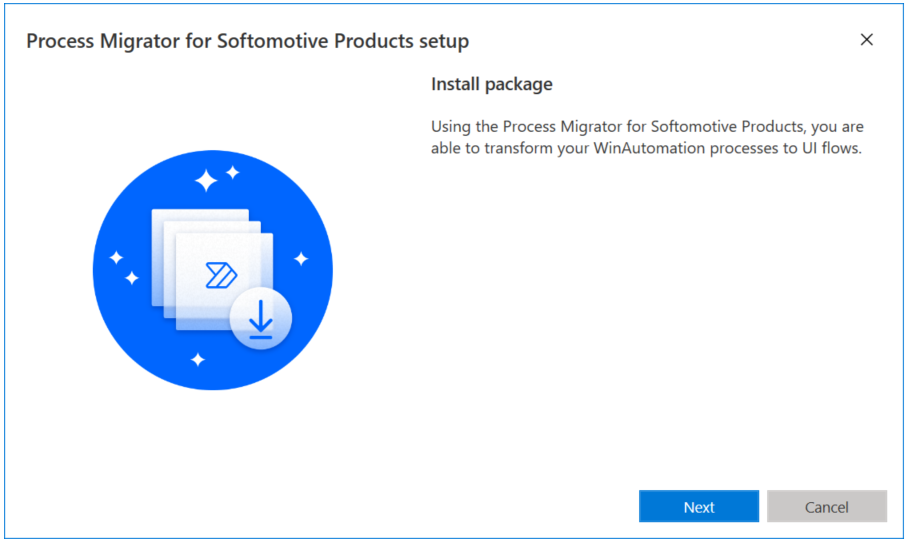
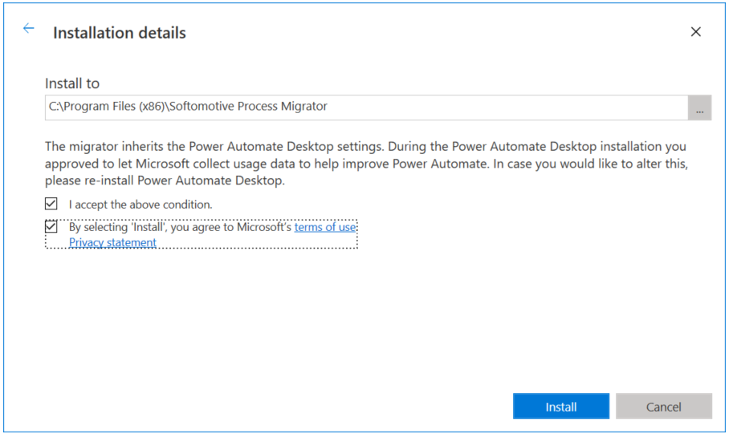
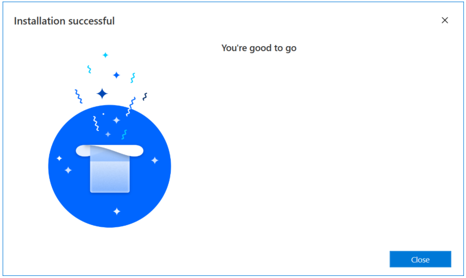
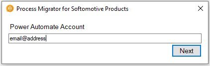
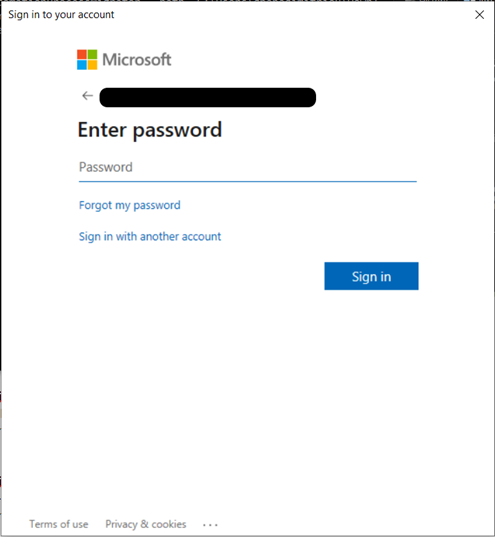
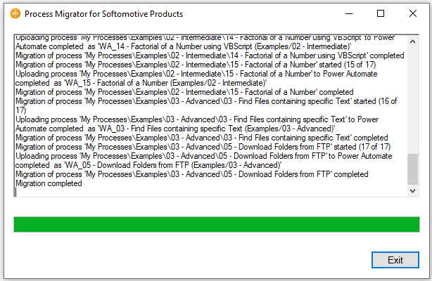
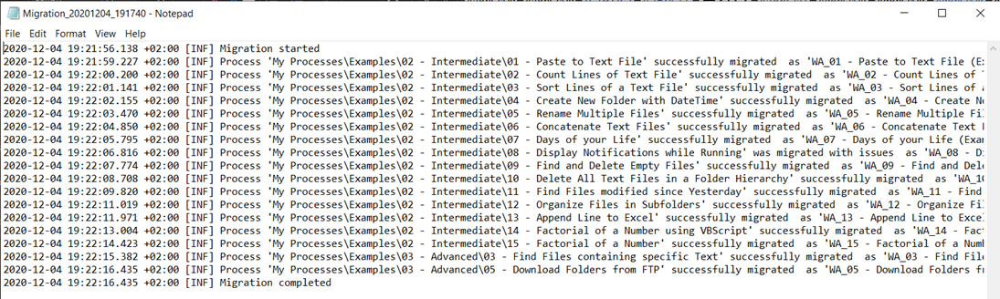
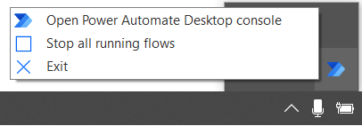
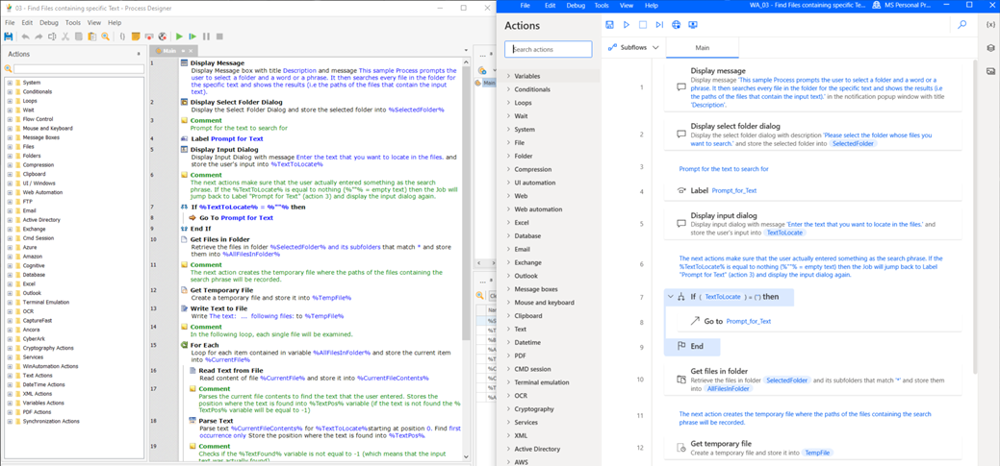

# Process migrator for Softomotive products (preview)
[!INCLUDE [cc-beta-prerelease-disclaimer](../includes/cc-beta-prerelease-disclaimer.md)]

> [!IMPORTANT]
> - Effective November 3 2023, the Process migrator for Softomotive products (preview) will be deprecated. “Deprecated” means we intend to remove the feature or capability from a future release. The feature or capability will continue to work until it is officially removed. This deprecation notification can span a few months or years. After removal, the feature or capability will no longer work. This notice is to allow you sufficient time to plan, migrate and update your code before the feature or capability is removed.
> - You may migrate your flows to Power Automate until the deprecation date of the Process migrator for Softomotive products. 

Process migrator for Softomotive products (preview) enables users to convert automations into desktop flows for use in Power Automate.

This migration utility redefines automations to their equivalent Power Automate desktop flow action definitions where such parity exists. 

Some actions have been deprecated because they don't fit into the Power Platform ecosystem. However, workarounds should be applicable to overcome what appears to be missing functionality. 
 
## Prerequisites

For Process migrator for Softomotive products (preview) to be able to install and function as expected, the following Prerequisites are needed: 

 - The latest publicly available version of Power Automate for desktop installed 
 - Access to a Power Automate environment. Follow the get started documentation if you haven't already provisioned an environment 

## Installing Process migrator for Softomotive products (preview) 

After successfully [downloading the setup file](https://go.microsoft.com/fwlink/?linkid=2151571) of the Process migrator for Softomotive products (preview), run it to install it on your machine.  

> [!NOTE]
> - Make sure you are performing a clean installation of Process migrator for Softomotive products (preview). 
 Also, the migrator will only function as intended when migrating into an evironment with V1 schema enabled.  If the enviroment you are attempting to migrate into has V2 schema enabled, the migration utlity will not function as intended.  If you require an environment with V1 schema enabled, please contact your Power Platform administrator.
  
> - Uninstall any previous installations of the application. 
> - Remove any previous installation residue (empty installation folders etc.) 
> - Install the latest version of the application. 
 

In the displayed dialog, select an installation path and accept Microsoft's terms of use.

Now, you can run the Process migrator for Softomotive products (preview).

## Running Process migrator for Softomotive products (preview) 

1. After launching Process migrator for Softomotive products (preview), you'll be prompted to populate your Power Automate account.

    

    The application might prompt you to connect to the account you use to access your environments in order to save the migrated processes as desktop flows.

    

1. Select the Softomotive product from which you want to migrate processes. 

    

### Completing migration and accessing the migrated processes

1. During the migration, a dialog will display information about the current state of the migration and a progress bar.

    

1. When the migration is completed, an autogenerated log file will be displayed showing the migrated processes.

    
 
1. You can access the exported logs at **C:\Users\{username}\AppData\Local\Microsoft\Process migrator for Softomotive products\Logs**

    

    > [!NOTE]
    > For the migrated desktop flows to be visible, some time is required. To instantly view the migrated desktop flows in Power Automate:
    >- Sign out and sign in again in Power Automate, or
    >- Restart the Power Automate service by exiting the service and re-running Power Automate.  

   

1. Now, you can modify the migrated processes (now desktop flows) through Power Automate.

    

    > [!TIP]
    > Running the Process migrator for Softomotive products (preview) will be paused once an encrypted process has been encountered, waiting for the password to be inserted by the user. It's advised to group processes based on whether they are encrypted or not. This way, unencrypted processes will be migrated without supervision and the encrypted ones will have the required user attendance.  

[!INCLUDE[footer-include](../includes/footer-banner.md)]
