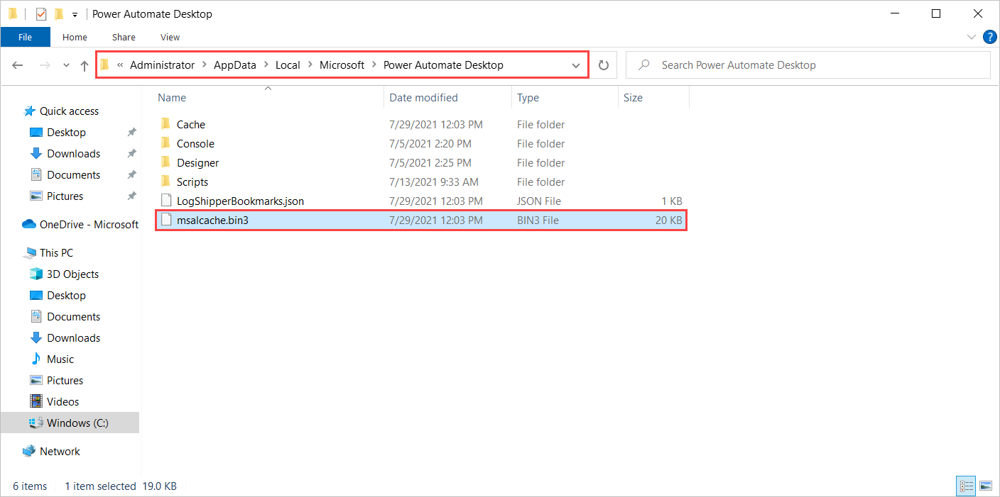
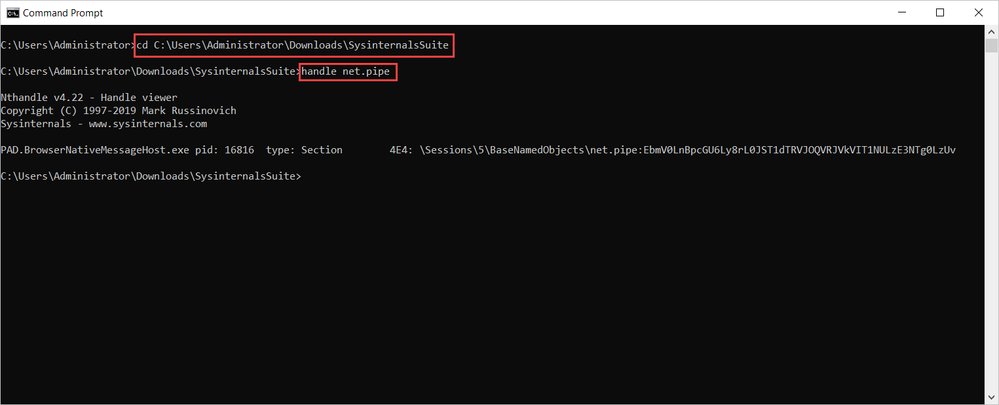
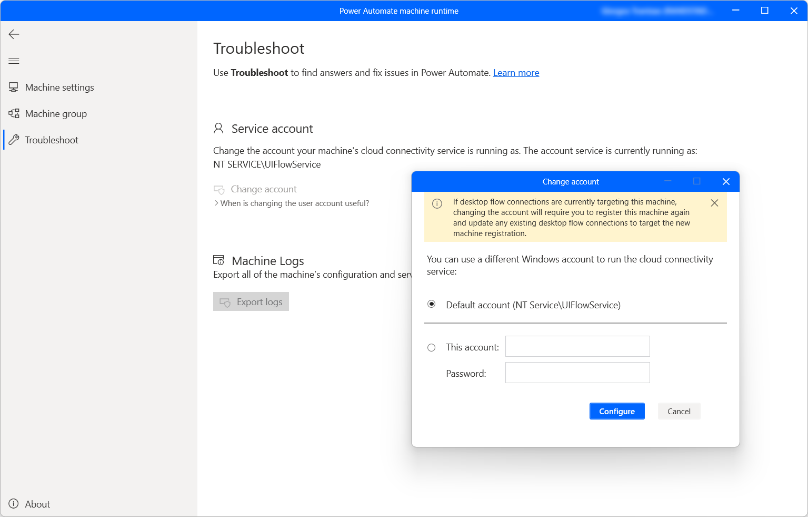
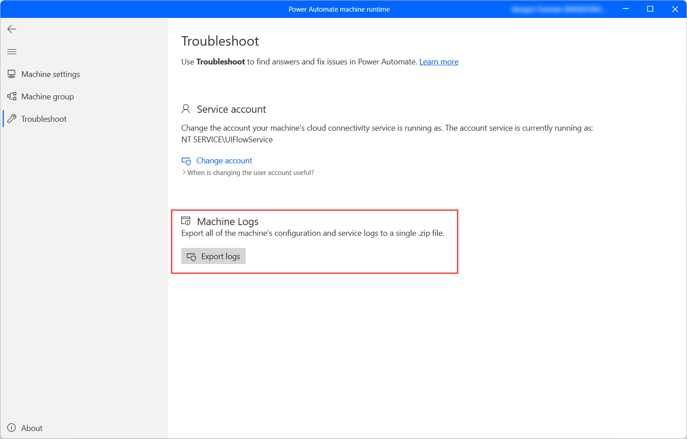

# Troubleshooting Power Automate

To open the troubleshoot tool: 
1. Open **Power Automate machine runtime**
1. Select **Troubleshoot**
1. Select **Launch Troubleshoot tool**  

>[!NOTE]
>You need to have admin privileges to open the troubleshoot tool from Power Automate machine runtime.  

## Resolve sign in and sign out issues

Power Automate uses a file named **msalcache.bin3** to acquire tokens and authenticate users.

If you encounter errors while signing in or signing out, try to delete this file to erase all the stored tokens. To delete the file, navigate to **C:\Users\Username\AppData\Local\Microsoft\Power Automate**. 

> [!NOTE]
> If the **AppData** folder isn't visible in your user folder, try to [display hidden files](https://support.microsoft.com/windows/show-hidden-files-0320fe58-0117-fd59-6851-9b7f9840fdb2).

If you have installed Power Automate in another drive, replace **C** with the letter of the respective drive. Also, replace **Username** with the name of your user folder.

After deleting the **msalcache.bin3** file, restart the Power Automate service and sign in to your account.



## Resolve failed connection between Power Automate components

In some cases, Power Automate may display an error indicating that the connection between its components couldn't be established.

The cause of this error can be another process running a named pipes server in the same machine. This process probably runs with elevated rights using the localhost endpoint. As a result, it blocks other applications from using the endpoint.

To identify whether another process is indeed the issue:

- Close Power Automate and use the Windows Task Manager to ensure that its process isn't still running.

- Download the [Sysinternals Suite](/sysinternals/downloads/sysinternals-suite).

- Extract the zip file to a folder on your desktop.

- Run a command prompt session as administrator.

- Navigate to the folder in which you've extracted Sysinternals.

- Run the following command: 

  ``` CMD
  handle net.pipe
  ```
  Running this command should display a list of processes that use named pipes and the address they listen to.

  

- Identify whether a process displaying the string **EbmV0LnBpcGU6Ly8rLw==** exists.

- If such a process exists, stop the process identified in the previous step and try again to launch Power Automate.

As a permanent fix, you can stop the process causing the issue from running. Alternatively,  if it's an internal process, you can change it to use a more specific endpoint, such as **net.pipe://localhost/something**. 

If none of the above is possible, specify Power Automate executables to run as administrator. However, this solution may not solve the issue in all cases, and it will cause a UAC prompt to appear each time.

## Change the on-premises Service account
The UIFlowService uses the virtual account “NT SERVICE\UIFlowService”. This account needs the ability to “Logon as a service” in order to successfully startup.

Most environments wouldn't require to change the default configuration. If your company has some restrictions in place, you can either ask your domain administrator to grant “NT SERVICE\UIFlowService” the right to “Logon as a service” or change the account here with an allowed one.
1. Select **Change account**
1. Select **This account**
1. Provide the new account. Ex: DOMAIN\AlexJohnson  
1. Provide the password of this account and select Configure
 


## Collect Machine logs 
There are several logs you can collect for the machine’s configuration and service logs, and you should always start with the logs. 
In the Troubleshoot tool, select Exports logs link, as shown in the following image.



This file is saved to the desktop as a zip file.
