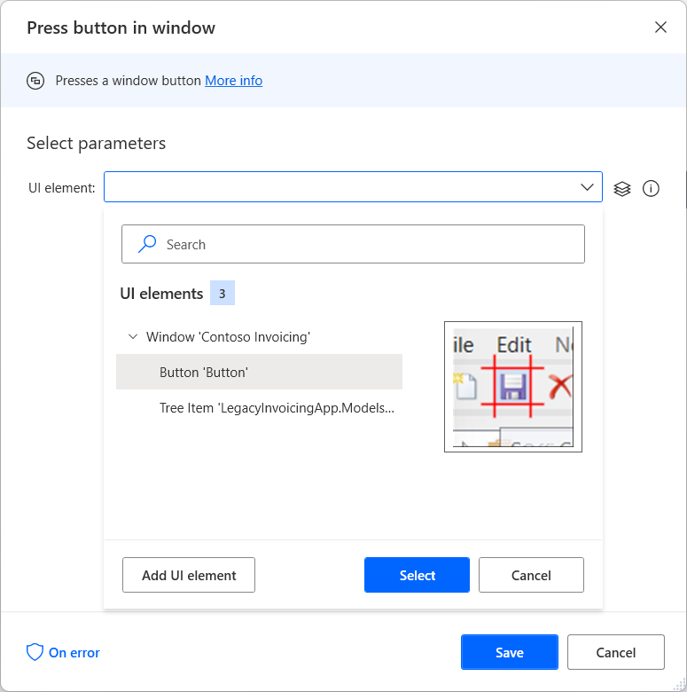
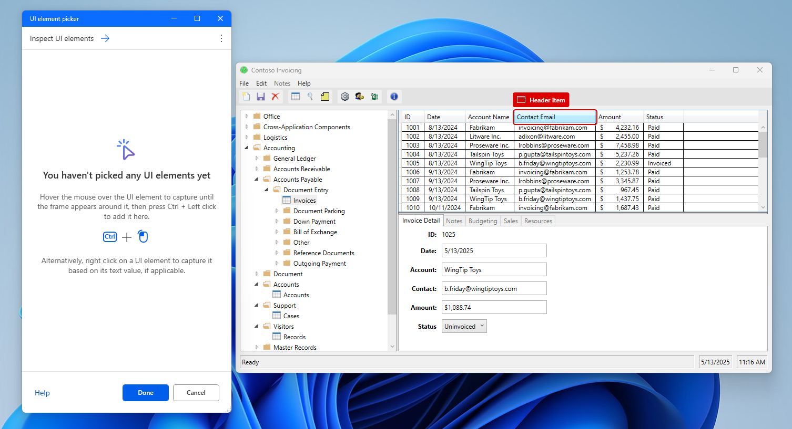
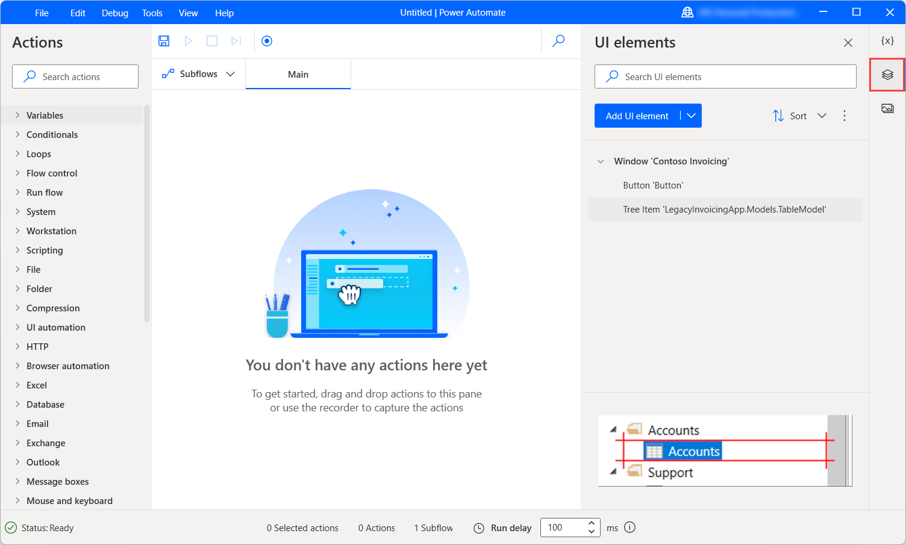

# Automate using UI elements

Desktop flows utilize UI elements to interact with applications and web pages without resorting to image recognition and absolute coordinates. UI elements are used as input in most UI automation and browser automation actions and identify specific elements on windows and web pages.

## UI elements

When deploying a UI automation or browser automation action, you may be required to provide a UI element as input. To add a new UI element, you can do it directly from the action properties or through the UI elements pane of the flow designer.

Each one of these action groups accepts a different category of UI elements. UI automation actions accept UI elements captured from desktop applications, while browser automation actions accept UI  elements captured from web pages.

> [!NOTE]
> UI automation actions can use only UI elements for desktop applications, while the browser automation actions can use only UI elements for webpages. Therefore, incompatible UI elements aren't available for selection. 

To add a new UI element to your flow, select to add a new UI element through an action or the UI elements pane, highlight the respective element, and press **Left Ctrl + Left click**. When the selection is finished, select **Done**. 

Any captured UI elements will be added to the UI elements pane. To access the UI elements pane, select the UI elements tab on the right-hand side of the flow designer.

Elements can be sorted alphabetically through the **Sort** option of the  UI elements tab. To remove all the UI elements that aren't used in any action, select the dots icon next to the **Sort** option and then **Remove unused UI elements**.

To rename or delete a UI element, right-click on the respective item and select the appropriate function.

To find where a specific UI element is being used in the flow, right-click on it and select **Find usages**. The results will display all the actions that use this UI element. Double-click on a result to highlight the action on the workspace.

## UI elements types

UI automation and browser automation actions accept two different kinds of UI elements. UI automation actions accept only UI elements captured from desktop applications, while browser automation actions accept only UI elements captured from web pages.

To distinguish a UI element for a desktop application from a UI element for a web page, check its parent selector element. UI elements for desktop applications usually have the desktop as their parent element, while the UI elements for web pages have a webpage as their parent element.

### UI elements for web pages

To capture a UI element from a webpage, you need to install the appropriate browser extension. You can find more information about the supported browsers and the required extension in [Use browsers and manage extensions](using-browsers.md).

When the browser extension isn't able to communicate with Power Automate, the browser window is identified as a desktop application. As a result, Power Automate tries to grab UI elements for a desktop application and not a web page.

## UI elements properties

All UI elements consist of one or more selectors that pinpoint the UI or web component that Power Automate interacts with.

>[!NOTE]
> Users can create multiple selectors for a UI element. Whenever a selector fails, Power Automate uses the following selector in order.

To manage the selectors of a UI element, right-click on it and select **Edit**. This option brings up the selector builder, where you can edit the selectors with a visual editor or a text editor.

Each selector consists of multiple elements representing the hierarchical structure of the UI element in the application or web page. The attributes describe each element uniquely and distinguish it from other elements.

All selectors are displayed with a default friendly name that makes them easily accessible. To rename a selector, right-click on its name and select **Rename**. 

When you edit a UI element with multiple selectors, you are able to disable a selector by right-clicking on it and selecting **Disable**. This functionality can be helpful during testing.

After editing the selectors, press **Save** to apply the implemented changes. Saving applies the changes of all the selectors in a single step.

You can find more information regarding selectors and how to build them manually in [Build a custom selector](build-custom-selectors.md).

[!INCLUDE[footer-include](../includes/footer-banner.md)]

