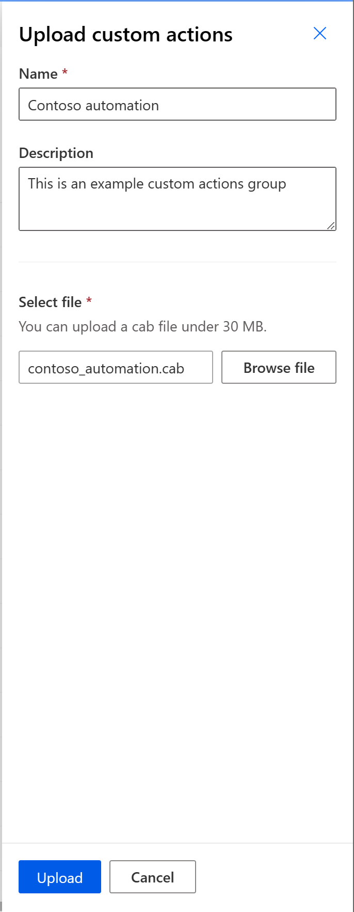
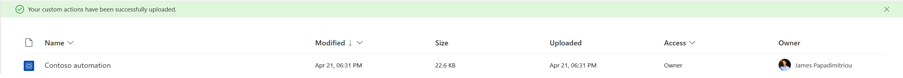
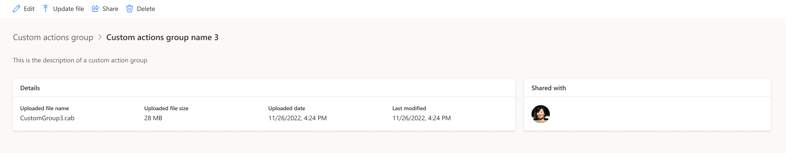
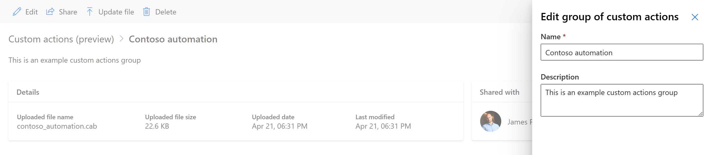
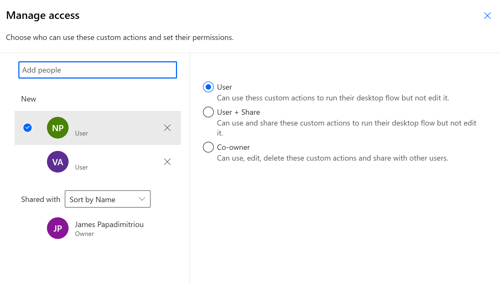
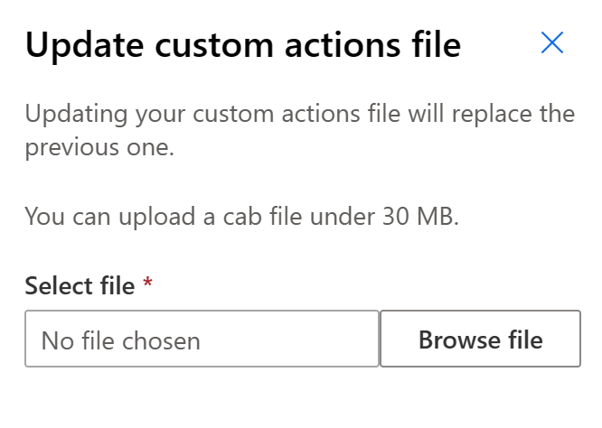

# Uploading custom actions to an environment (preview)

> [!IMPORTANT]
> Power Automate for desktop v2.32 and newer is required

> [!NOTE]
> In order to upload a custom actions groups to an environment make sure that: 
> - You are assigned with the Desktop Flow Module Developer role  in the Power Platform Administration Center.
> - You have access to the respective environment.

Visit the Power Automate portal.

Go to Custom actions (preview) under Data: 

  

Click on the Upload custom action button, located at the top of the screen: 

 
Provide the requisite information for you custom actions group:
-	Name (required): this is how your custom actions group’s name will appear in the Custom actions(preview) list, the asset library and, once included in a desktop flow, in the actions tree
-	Description (optional): A brief description of the custom actions. This information will be visible in the asset library, when the custom actions group is selected
-	Select file: Here you must select the signed .cab file, containing the custom actions group (module) developed with the Custom actions SDK (link to the SDK) and any potential .dll dependencies.

Once you have successfully filled the requisite name and selected the respective .cab file, click the Upload button.

The newly uploaded custom actions group appears in the list: 
 

By clicking on an uploaded custom actions, you will go into its details page: 

 
From there you can: 
-	Edit the uploaded custom actions, modifying its name and/or description. 
 
-	Share (manage who has access to the custom actions uploaded and the type of access they have). 
- There are three types of access a maker can have regarding custom actions:
  - User -  can only use the respective custom actions in desktop flows
  -	User + Share – can use and share the custom actions
  -	Co-owner – can also update/delete the custom actions 

>[!IMPORTANT]
> For someone to be a Co-owner, they have to be assigned with the Desktop Flow Module Developer role in the respective environment

 
- Update file (Co-owners only) for when you want to update the existing custom actions etc. by uploading a .cab file.

 
- Delete the custom actions (Co-owners only). Deleting a custom actions group will make all desktop flows that have a dependency on it erroneous.

[!INCLUDE[footer-include](../includes/footer-banner.md)]