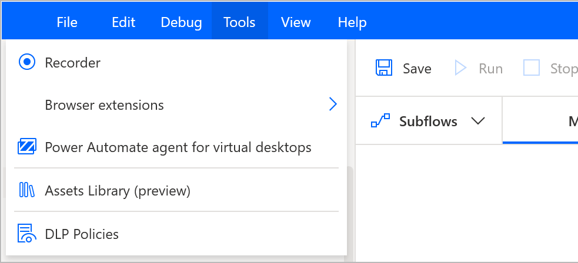
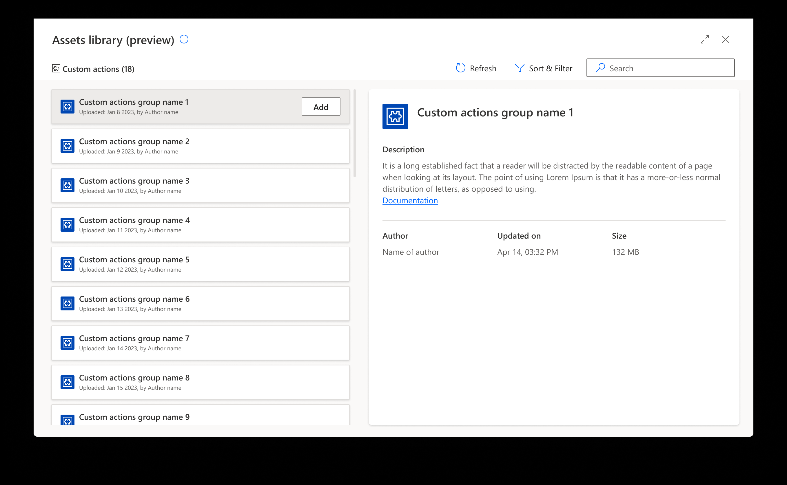

# Using custom actions in desktop flows (preview)

> [!IMPORTANT]
> Power Automate for desktop v2.32 and newer is required

You can include custom actions (preview) in desktop flows through the [Assets library (preview)](./assets-library.md).

Though Power Automate for desktop’s designer open the Assets library (preview). 
You can do that either through the dedicated button 

or through the entry under the Tools bar:

In the Custom actions (preview) tab, you will find the custom actions (preview) uploaded in the respective environment you are working in. 
> [!NOTE] 
> Only custom actions (preview) shared with you are visible.

 
 

Once you have concluded the inclusion of custom actions (preview) and close the Assets library (preview), they will all be listed at the bottom of the Actions tree, under the **Custom Actions** section: 

 
To include a custom action (preview) in a desktop flow, simply drag and drop or double click it.

[!INCLUDE[footer-include](../includes/footer-banner.md)]