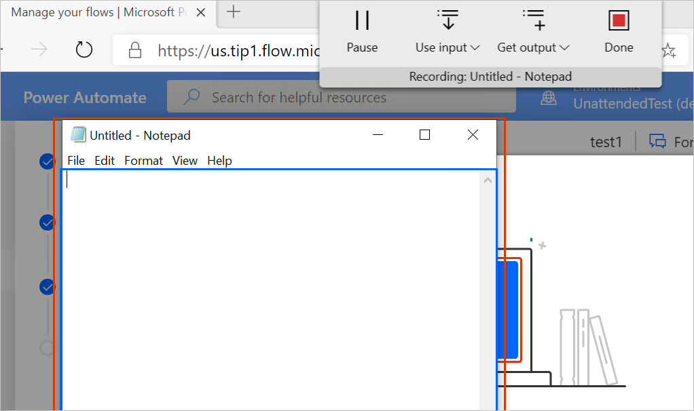
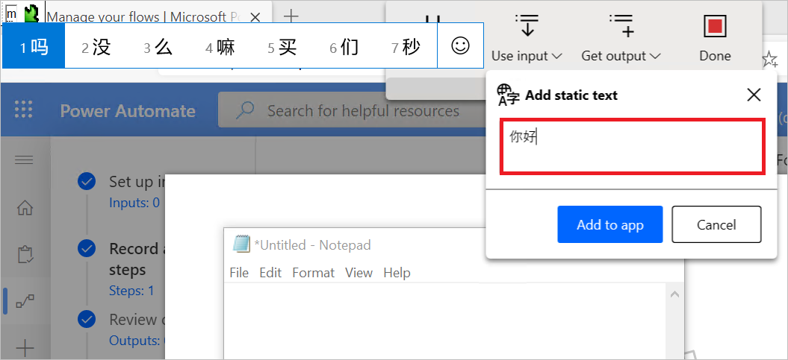
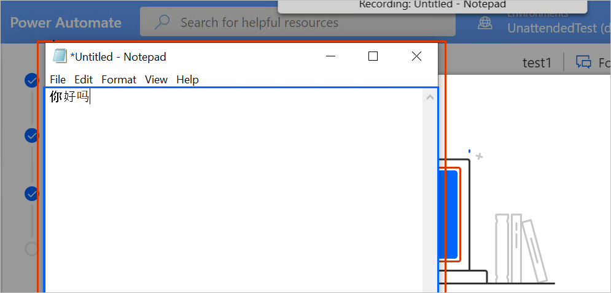
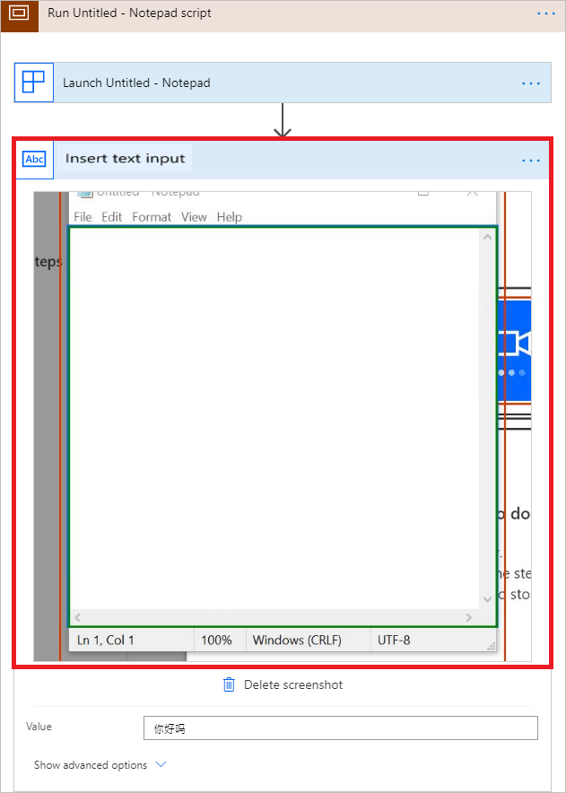
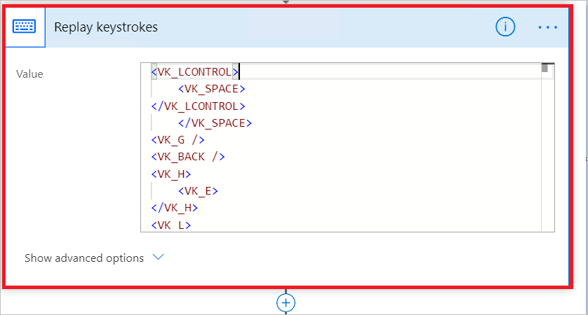

# Use Input Method Editors (IMEs) in UI flows

You can use the **Add static text** feature to record text input, in any language, using IMEs or regular keyboards in your UI flows. Use **Add static text** if you want the automation to insert the same text each time your UI flow runs. 

>[!TIP]
>Use **Text input** if you intend to use dynamic text that changes each time your UI flow runs.

## Invoke IME

Follow these steps after you've started recording and you're ready to insert static text input:

1. Select the control into which you want to enter the static text.

   

1. Select **Use Input** on the recorder, and then select **Add static text**.

   

   You'll see an input box into which you'll enter the static text. You can use IME, English, or any international keyboard.

   

1. Enter the text.

1. Select **Add to app** and then select the control into which you want to insert the text. You'll see the text 
inserted into the control. 

   This text is entered automatically at playback time, even if the playback machines do not have the same keyboard layouts or IME that was used in the recording.

   

   >[!TIP]
   >In the Web designer, expand the **Insert text input** action to review or edit the text.

   

## Use the replay keystroke action

If you recorded any text input without using the **Add static text** option, each keystroke is recorded and played back chronologically. This includes any special keys like CTRL, ALT, Windows, etc. in any English or international keyboard layouts.

In the designer, you can review and edit the recording information in the
[virtual-key](https://docs.microsoft.com/windows/win32/inputdev/virtual-key-codes) format under the **Replay keystroke** action. 

> [!NOTE]
> An older version of the UI flows recorder used the **SendKeys** and **PostElement** actions. These actions will be deprecated. We recommend that you upgrade to the latest version of the UI flows recorder and then re-record your scripts to take advantage of the new features.

## Troubleshooting tips

1. If you record keyboard actions with the **Replay keystroke** mode, you have to make sure the playback machine is using the same keyboard as the recording time, because under different keyboards, the same keystrokes replay sequences may input different values.

1. You can only apply **Use input** to controls that are text type. Currently **Use input** cannot enter text into other types of controls such as combo Box, dropdown, ListView, etc.

## Next steps

- Learn how to [set up UI flows](setup.md). 
- Learn more about the [different types of flows](..\flow-types.md) you can use to automate your workflows.

[!INCLUDE[footer-include](../includes/footer-banner.md)]