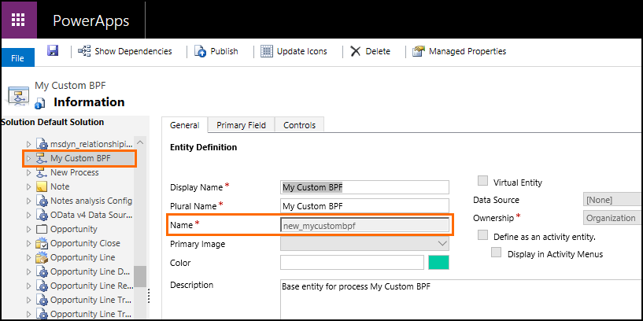
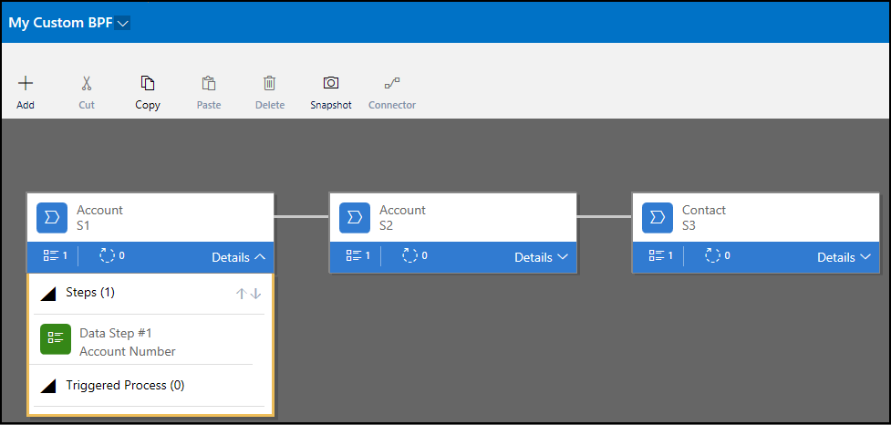

# Work with business process flows using code
[!INCLUDE [view-pending-approvals](../includes/cc-rebrand.md)]

A *business process flow* lets you create more efficient and streamlined sales, service, and other business processes. It creates a visualization of your business process by placing special controls at the top of the entity forms. Users are guided through various stages of sales, marketing, or service processes towards completion. Each process supports multiple stages and steps. You can add or remove steps, change the order of stages, or add new entities to the business process flow.  
  
Different business process flow instances can run concurrently against the same entity record. Users can switch between concurrent business process instances, and resume their work at a current stage in the process. 

This topic provides information about how you can programmatically work with business process flows.

> [!NOTE]
> You don't have to write code to work with business process flows. For information about using the UI to create and manage business process flows, see [Business Process Flows overview](../business-process-flows-overview.md)  

<a name="PrereqsBPF"></a>   
## Prerequisites for business process flow 

Custom entities and entities that have updated UI forms can participate in the business process flow. The updated UI entities have the <xref:Microsoft.Xrm.Sdk.Metadata.EntityMetadata.IsAIRUpdated> property set to `true`. 

To enable an entity for the business process flow, set the <xref:Microsoft.Xrm.Sdk.Metadata.EntityMetadata.IsBusinessProcessEnabled> property to `true`.

> [!IMPORTANT]
>  Enabling an entity for business process flow is a one way process. You can’t reverse it.

   
<a name="DefineBPF"></a>   
## Define business process flow
  
Use the visual business process flow designer to define a business process flow. More information: [Create a business process flow](../create-business-process-flow.md)

By default, a business process flow record is created in the `Draft` state.  

A business process flow definition is stored in the <xref:Microsoft.Dynamics.CRM.workflow> entity, and the stage information for the business process flow is stored in the <xref:Microsoft.Dynamics.CRM.processstage> entity.
  
<a name="ActivateBPF"></a>   
## Activate business process flow  
 Before you can use the process flow, you have to activate it. To activate it, you must have the `prvActivateBusinessProcessFlow` privilege for the `Workflow` entity. Use the <xref:Microsoft.Xrm.Sdk.Messages.UpdateRequest> message to set the state of the `Workflow` entity record to `Activated`. More information: [Perform specialized operations using Update](/dynamics365/customer-engagement/developer/org-service/perform-specialized-operations-using-update) 

 > [!NOTE]
 > You can also use the business process flow designer to activate a business process flow. 

<a name="BPFEntity"></a>   
## Business process flow entity 
 Once you activate a business process flow definition by changing the state of the corresponding `Workflow` entity record or by using the business process flow designer, a custom entity with the following name is automatically created to store the activated business process flow instances: "*\<activesolutionprefix>*_*\<uniquename>*", where the uniquename is derived from the name you specify.  
  
 For example, if you specified "My Custom BPF" as the name of the business process flow definition and are using the default publisher (new) for your active solution, the name of the custom entity created for storing process instances will be "new_mycustombpf".  
  
 If the `uniquename` value isn't available for a business process flow definition, for example if the business process flow was imported as part of solution from an earlier version, the default name of the custom entity will be "`\<activesolutionprefix>_bpf_<GUID_BPF_Definition>`:  
  
> [!IMPORTANT]
>  The sample business process flow records use system entities to store the corresponding business process flow instance records.  
>   
>  However, any new business process flow definitions you create will use custom entities to store its instance records as explained earlier. 

You can retrieve the name of your business process flow entity using any of the following ways:

- **Using the UI**: Use the customization UI to browse to your business process flow entity:

    
- **Using the Web API**: Use the following request:

    **Request**

    ```
    GET [Organization URI]/api/data/v9.0/workflows?$filter=name eq 'My Custom BPF'&$select=uniquename HTTP/1.1
    ```

    **Response**
    ```
    {  
    "@odata.context":"[Organization URI]/api/data/v9.0/$metadata#workflows(uniquename)",
    "value":[  
         {  
             "@odata.etag":"W/\"1084677\"",
             "uniquename":"new_mycustombpf",
             "workflowid":"2669927e-8ad6-4f95-8a9a-f1008af6956f"
         }
      ]
    }
    ```
- **Using the Organization service**: Use the following code sample:

    ```c#
    QueryExpression query = new QueryExpression
    {
        EntityName = "workflow",
        ColumnSet = new ColumnSet("uniquename"),
        Criteria = new FilterExpression
        {
            Conditions =
            {
                new ConditionExpression
                {
                    AttributeName = "name",
                    Operator = ConditionOperator.Equal,
                    Values = { "My Custom BPF" }
                }
            }
        }
    };
    Workflow Bpf = (Workflow)_serviceProxy.RetrieveMultiple(query).Entities[0]; 
    ```
> [!NOTE]
> The <xref:Microsoft.Xrm.Sdk.Metadata.EntityMetadata.IsBPFEntity> property is `true` for business process flow entities. You can retrieve all the business process flow entities in your instance by running the following Web API request:
> ```http
> GET [Organization URI]/api/data/v9.0/EntityDefinitions?$select=SchemaName,LogicalName,DisplayName&$filter=IsBPFEntity eq true HTTP/1.1
> ```

<a name="BPFSecurity"></a>   
## Manage security for business process flows

The custom entity that is automatically created on activating a business process flow to store business process flow instances adheres to the standard security model as for any other custom entity in Common Data Service. This implies that privileges granted on these entities define the runtime permissions for users for business process flows.

The custom business process flow entity has organization scope. The regular create, retrieve, update and delete privileges on this entity define the permission users would have based on their assigned roles. By default, when the business process flow custom entity is created, only **System Administrator** and **System Customizer** security roles are granted access to it, and you must explicitly grant permissions to the new business process flow entity (for example, **My Custom BPF**) for other security roles as required.


<a name="ManageBPF"></a>   
## Create, retrieve, update, and delete business process flow entity records (process instances)  
 The custom entity that is automatically created on activating a business process flow definition stores all the process instances for the business process flow definition. The custom entity supports the standard programmatic creation and management of records (process instances) using Web API and CRM 2011 endpoint.

> [!IMPORTANT]
> Switching to another process instance for an entity record is only supported through UI (client) or programmatically using information available in this section. You can no longer use the `SetProcess` message (<xref href="Microsoft.Dynamics.CRM.SetProcess?text=SetProcess Action" /> or <xref:Microsoft.Crm.Sdk.Messages.SetProcessRequest>) to programmatically switch processes (set another business process flow as the active process instance) for the target entity record. 

 Lets consider the following example where we have a cross-entity business process flow, "My Custom BPF," with 3 stages: S1:Account, S2:Account, and S3:Contact. 

 
 
### Retrieve all the records (instances) for a business process flow entity
 If the name of your business process flow entity is "new_mycustombpf", use the following query to retrieve all the records (process instances) for your business process flow entity:  
  
```http
GET [Organization URI]/api/data/v9.0/new_mycustombpfs HTTP/1.1 
```

At this point, you might not get any instances in your response as there are none. Run this request after creating an instance of your business process flow definition later in this topic.

> [!NOTE]
> To know how to retrieve the name of your business process flow entity, see the earlier section, [Business process flow entity](#business-process-flow-entity).
  
### Create a business process flow entity record (process instance) 

Create a business process flow entity record (process instance) programmatically if you want to switch to another business process flow for an entity record without using the UI. 

To create a business process flow entity record, you need to specify the following values: 
- Associate the business process flow entity record to a primary entity record by setting the single-valued navigation property using the `@odata.bind` annotation. To find out the navigation-property name that points to the primary entity record for your business process flow definition, use the [CSDL $metadata document](/dynamics365/customer-engagement/developer/webapi/web-api-types-operations.md#csdl-metadata-document). 
- Associate the business process flow entity record to a valid stage specified in the business process flow definition by setting the single-valued navigation property using the `@odata.bind` annotation. To find out the navigation-property name (typically `activestageid`) that points to the stage record for your business process flow definition, use the [CSDL $metadata document](/dynamics365/customer-engagement/developer/webapi/web-api-types-operations.md#csdl-metadata-document).

    Also, you can retrieve information about all the stages for a business process flow definition by using the following Web API request assuming that the ID of your business process flow definition is 2669927e-8ad6-4f95-8a9a-f1008af6956f:

    **Request**

    ```http
    GET [Organization URI]/api/data/v9.0/processstages?$select=stagename&$filter=processid/workflowid eq 2669927e-8ad6-4f95-8a9a-f1008af6956f HTTP/1.1
    ```

    **Response**

    ```http
    {
        "@odata.context": "[Organization URI]/api/data/v9.0/$metadata#processstages(stagename)",
        "value": [
            {
                "@odata.etag": "W/\"858240\"",
                "stagename": "S1",
                "processstageid": "9a9185f5-b75b-4bbb-9c2b-a6626683b99b"
            },
            {
                "@odata.etag": "W/\"858239\"",
                "stagename": "S3",
                "processstageid": "a107e2fd-7543-4c1a-b6b4-b8060ecb1a1a"
            },
            {
                "@odata.etag": "W/\"858238\"",
                "stagename": "S2",
                "processstageid": "19a11fc0-3398-4214-8522-cb2a97f66e4b"
            }
        ]
    }
    ```

Next, use the following request to create an instance of your business process flow definition for an account record (ID=a176be9e-9a68-e711-80e7-00155d41e206) and the active stage set as the first stage of the process instance, S1 (ID=9a9185f5-b75b-4bbb-9c2b-a6626683b99b):

**Request**

```http
POST [Organization URI]/api/data/v9.0/new_mycustombpfs HTTP/1.1 
Content-Type: application/json; charset=utf-8 
OData-MaxVersion: 4.0 
OData-Version: 4.0 
Accept: application/json 

{
    "bpf_accountid@odata.bind": "/accounts(a176be9e-9a68-e711-80e7-00155d41e206)",
    "activestageid@odata.bind": "/processstages(9a9185f5-b75b-4bbb-9c2b-a6626683b99b)"    
}
```

**Response**

```http
HTTP/1.1 204 No Content
OData-Version: 4.0
OData-EntityId: [Organization URI]/api/data/v9.0/new_mycustombpfs(cc3f721b-026e-e811-80ff-00155d513100)
```

Note that if you want to create an instance of your business process flow definition with the active stage set as a stage ***other*** than the first stage, you must also provide `traversedpath` in your request. Traversed path is the comma-delimited string of process stage ids that represent visited stages of the business process flow instance. The following request creates an instance for an account record (ID=679b2464-71b5-e711-80f5-00155d513100) and active stage set as the second stage, S2 (ID=19a11fc0-3398-4214-8522-cb2a97f66e4b).

```http
POST [Organization URI]/api/data/v9.0/new_mycustombpfs HTTP/1.1 
Content-Type: application/json; charset=utf-8 
OData-MaxVersion: 4.0 
OData-Version: 4.0 
Accept: application/json 

{
    "bpf_accountid@odata.bind": "/accounts(679b2464-71b5-e711-80f5-00155d513100)",
    "activestageid@odata.bind": "/processstages(19a11fc0-3398-4214-8522-cb2a97f66e4b)",
    "traversedpath":"9a9185f5-b75b-4bbb-9c2b-a6626683b99b,19a11fc0-3398-4214-8522-cb2a97f66e4b"   
}
```

### Update a business process flow entity record (process instance)

You can update a process instance to move to next or previous stage, abandon a process instance, reactivate a process instance, or finish a process instance. 

#### Stage navigation

To navigate to a different stage, you need to update a process instance record to change its active stage ID and accordingly update the traversed path. Note that you must only move to the next or previous stage while updating a business process flow instance.

To perform stage navigation, you will need the ID of the business process flow instance that you want to update. To retrieve all the instances of your business process flow, see [Retrieve all the records (instances) for a business process flow entity](#retrieve-all-the-records-instances-for-a-business-process-flow-entity) earlier.

Assuming the ID of the process instance you want to update is dc2ab599-306d-e811-80ff-00155d513100, use the following request to update the active stage from S1 to S2:

```http
PATCH [Organization URI]/api/data/v9.0/new_mycustombpfs(dc2ab599-306d-e811-80ff-00155d513100) HTTP/1.1
Content-Type: application/json
OData-MaxVersion: 4.0
OData-Version: 4.0

{
    "activestageid@odata.bind": "/processstages(19a11fc0-3398-4214-8522-cb2a97f66e4b)",
    "traversedpath": "9a9185f5-b75b-4bbb-9c2b-a6626683b99b,19a11fc0-3398-4214-8522-cb2a97f66e4b"
}
```

#### Change the state of a process instance: Abort, Reactivate, or Finish 

A process instance can have one of the following states: **Active**, **Finished**, or **Aborted**. The state is determined by the following attributes on the process instance record:

- **statecode**: Displays the status of the process instance.

    |Value|Label|
    |-----|-----|
    |0    |Active|
    |1    |Inactive|

- **statuscode**: Displays information about status of the process instance.

    |Value|Label|
    |-----|-----|
    |1    |Active|
    |2    |Finished|
    |3    |Aborted|

So, to **Abort** a process instance, use the following request set the `statecode` and `statuscode` values appropriately:

```http
PATCH [Organization URI]/api/data/v9.0/new_mycustombpfs(dc2ab599-306d-e811-80ff-00155d513100) HTTP/1.1   
Content-Type: application/json   
OData-MaxVersion: 4.0   
OData-Version: 4.0 
  
{ 
    "statecode" : "1", 
    "statuscode": "3" 
}
```
 
> [!NOTE]
> You can abort a process instance at any stage.

Similarly, to reactivate a process instance, replace the `statecode` and `statuscode` values in the above code with **0** and **1** respectively.

Finally, to set a process instance status as **Finished**, which is only possible at the last stage of a process instance, replace the `statecode` and `statuscode` values in the above code with **0** and **2** respectively.

#### Cross-entity navigation

For cross-entity navigation in this example, you must set the active stage of the process instance to the last stage, S3 (ID=a107e2fd-7543-4c1a-b6b4-b8060ecb1a1a), update the traversed path accordingly, and set a contact record as the primary entity record as per the business process flow definition.

```http
PATCH [Organization URI]/api/data/v9.0/new_mycustombpfs(dc2ab599-306d-e811-80ff-00155d513100) HTTP/1.1   
Content-Type: application/json   
OData-MaxVersion: 4.0   
OData-Version: 4.0 
  
{
    "activestageid@odata.bind": "/processstages(a107e2fd-7543-4c1a-b6b4-b8060ecb1a1a)",
    "traversedpath":"9a9185f5-b75b-4bbb-9c2b-a6626683b99b,19a11fc0-3398-4214-8522-cb2a97f66e4b,a107e2fd-7543-4c1a-b6b4-b8060ecb1a1a",
    "bpf_contactid@odata.bind": "/contacts(0e3f10b0-da33-e811-80fc-00155d513100)"
}
``` 

### Delete a business process flow entity record (process instance)

Use the following Web API request:

**Request**

```http
DELETE [Organization URI]/api/data/v9.0/new_mycustombpfs(dc2ab599-306d-e811-80ff-00155d513100) HTTP/1.1
```  

**Response**

If the record exists, you’ll get a normal response with status 204 to indicate the delete was successful. If the entity isn’t found, you’ll get a response with status 404.

## Use RetrieveProcessInstances and RetrieveActivePath messages

Use the `RetrieveProcessInstances` message (<xref href="Microsoft.Dynamics.CRM.RetrieveProcessInstances?text=RetrieveActivePath Function" /> or <xref:Microsoft.Crm.Sdk.Messages.RetrieveProcessInstancesRequest>) to retrieve all the business process flow instances for an entity record across all business process definitions. The business process flow instances returned for an entity are ordered based on the `modifiedon` attribute for the instance. For example, the most recently modified business process flow instance will be the *first*  record in the returned collection. The most recently modified business process flow instance is the one that is active on the UI for an entity record.  
  
Each business process flow instance record returned for an entity record as a result of using the `RetrieveProcessInstances` message stores the ID of the active stage in the `processstageid` attribute that can be used to find the active stage, and then move to the previous or next stage. To do so, you first need to find the active path of a business process flow instance and the stages available in the process flow instance using the `RetrieveActivePath` message (<xref href="Microsoft.Dynamics.CRM.RetrieveActivePath?text=RetrieveActivePath Function" /> or <xref:Microsoft.Crm.Sdk.Messages.RetrieveActivePathRequest>).   
  
 Once you have the active stage and the active path information for a business process flow instance, you can use the information to move to a previous or next stage in the active path. Forward navigation of stages must be done in sequence, that is, you should only move forward to the next stage in the active path.   
  
 For the complete sample that code demonstrates the usage of these two methods and stage navigation using the [Organization service](/dynamics365/customer-engagement/developer/org-service/use-organization-service-read-write-data-metadata), see [Sample: Work with business process flows](sample-work-business-process-flows.md). 

<a name="ApplyBPF"></a>   
## Apply business process flow while creating an entity record

This section provides information about the default behavior for applying business process flows automatically to new entity records created in Common Data Service, and how you can override it to apply a business process flow of your choice for new entity records.

By default, for an entity that has multiple business process flows defined for it, the system applies a business process flow to the new entity record using the following multi-step logic:
1. Identify all business process flows applicable to the new entity record  based on the **Workflow.PrimaryEntity** attribute of the business process flow definition records.
2. Identify the business process flow definitions that the current user has access to. For information about how access to a business process flow is determined and managed, see [Manage security for business process flows](#BPFSecurity) earlier in this topic.<br/>  
3. All business process flow definitions in the system are subject to a global order per entity. The order of the business process flow is stored in the **Workflow.ProcessOrder** attribute. The business process flow definitions for an entity are sorted based on this order, and the one with the least order value is picked.
4. Finally, if the entity record is created from a business app (app module), one more level of filtering is applied to pick the business process flow to be applied automatically to the new entity record. When working in an app, users can access only relevant entities, business process flows, views and forms that they have access to by virtue of the security roles assigned to the business app. 
    - If the business app does not contain any business process flow then business process flow is applied as explained until step 3.
    - If the business app has one or more business process flows then only the business process flows present in the app would be applicable. In this case, when the user is working within a business app context, the list of business process flows from step 3 are filtered further to the ones that are part of the business app that are present inside the app module, and are sorted based on the process order. 
    - If no business process flow is available in a business app for the entity or one that the user has access to then no business process flow is applied for the new entity record.

You can override the default logic of business process flows getting applied automatically to new entity records. To do so, set the **ProcessId** attribute of the entity to one of the following values while creating a new entity record:
- Set to **Guid.Empty** to skip setting a business process flow for new entity records. You might want to do that if you are bulk creating entity records, but don't want business process flow to to be applied to them.
- Set it to a specific business process flow entity (as an entity reference). In this case, the system will apply the specified business process flow instead of the default logic.

If you do not set a value for the **ProcessId** attribute while creating a new entity record, the system will apply the default logic as explained earlier.

> [!NOTE]
> Overriding the default logic of business process flows getting applied automatically to new entity records is only supported programmatically. You cannot do this using the UI.

## Legacy process-related attributes in entities

The legacy process-related attributes (such as **ProcessId**, **StageId**, and **TraversedPath**) on entities enabled for business process flows are already deprecated. Manipulating these legacy process related attributes for target entity records does not guarantee consistency of the business process flow state, and is ***not*** a supported scenario. The recommended way is to use the attributes of the business process flow entity as explained earlier in the section [Create, retrieve, update, and delete business process flow entity records (process instances)](#create-retrieve-update-and-delete-business-process-flow-entity-records-process-instances)

The only exception to this is programmatically modifying the **ProcessId** attribute while creating an entity record to override the default application of the business process flow to the new record as explained in the previous section: [Apply business process flow while creating an entity record](#ApplyBPF).

<a name="BKMK_clientSideScript"></a>   
## Client-side programmability support for business process flows  
 There is a client-side object you can use to interact with business process flows in your form scripts. Business process flows trigger client-side events every time a process is either applied to a record, the stage is changed, or its status is changed to `Active`, `Finished`, or `Aborted`. More information: [formContext.data.process (Client API reference)](/dynamics365/customer-engagement/developer/clientapi/reference/formcontext-data-process.md)  
  
<a name="BKMK_MaxSettings"></a>   
## Maximum number of processes, stages, and steps  
 Per entity, the default value for the maximum number of activated business process flows is 10. You can specify a different value by using the `Organization.MaximumActiveBusinessProcessFlowsAllowedPerEntity` attribute. However, if the value is greater than 10, you may see a decrease in your system’s performance when you switch processes or open a record that has an assigned business process flow. This may be especially noticeable if processes span multiple entities.  
  
 The following settings aren’t customizable:  
  
-   The maximum number of stages per entity in the process is 30.  
  
-   The maximum number of steps in each stage is 30.  
  
-   The maximum number of entities that can participate in the process flow is 5.  


[!INCLUDE[footer-include](../includes/footer-banner.md)]