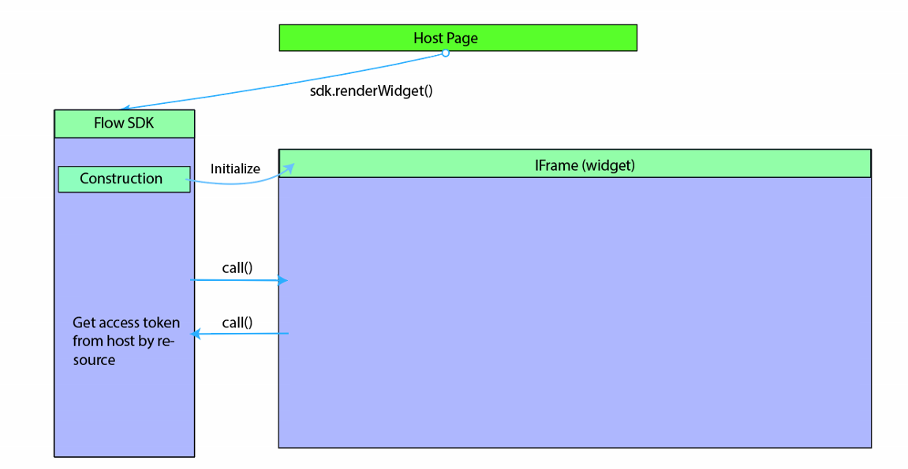
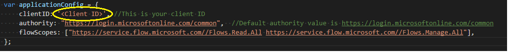
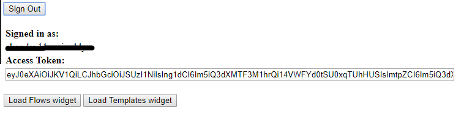

# Integrate Power Automate with websites and apps

Embed Power Automate into your app or website using *flow widgets* to give your users a simple way to automate their personal or professional tasks.

Flow widgets are iframes located in a host document. This document points to a page in the Power Automate designer. These widgets integrate specific Power Automate functionality into the third-party application.

Widgets can be simple. For example, a widget that renders a list of templates with no communication between the host and iframe. Widgets can also be complex. For example, a widget that provisions a cloud flow from a template and then triggers the flow via two-way communication between the host and the widget.

## Prerequisites

- A **Microsoft Account** or
- A work or school account

## Use the unauthenticated widget
To use the unauthenticated templates widget, embed it directly into the host application using an iframe. You don't need the JS SDK or an access token. 

### Show templates for your scenarios
To start, add this code to show the Power Automate templates on your website:

```html
<iframe src="https://make.powerautomate.com/{locale}/widgets/templates/?q={search term}
&pagesize={number of templates}&destination={destination}&category={category}"></iframe>
```

| Parameter | Description |
| --- | --- |
| locale |The four-letter language and region code for the template view. For example, `en-us` represents US English, and `de-de` represents German. |
| search term |The search term for the templates that you want to show in the view. For example, search `SharePoint` to show templates for SharePoint. |
| number of templates |The number of templates that you want to show in the view. |
| destination |The page that opens when users select the template. Enter `details` to show the details about the template, or enter `new` to open the Power Automate designer. |
| category |Filters to the given template category. | 
| parameters.{name} |Additional context to pass into the flow. |

If the destination parameter is `new`, the Power Automate designer opens when users select a template. Users can then create a cloud flow in the designer. See the next section if you want to have the full experience from the widget.

### Passing additional parameters to the flow template

If the user is in a specific context in your website or app, you might want to pass that context to the flow. For example, a user might open a template for *When an item is created* while looking at a certain list in SharePoint. Follow these steps to pass in the list ID as a *parameter* to the flow:

1. Define the parameter in the flow template before you publish it. A parameter looks like `@{parameters('parameter_name')}`.
1. Pass the parameter in the query string of the iframe src. For example, add `&parameters.listName={the name of the list}` if you have a parameter called **listName**.

### Full sample

To show the top four SharePoint templates in German and to start the user with **myCoolList**, use this code:

```html
<iframe src="https://make.powerautomate.com/de-de/widgets/templates/?q=sharepoint%20&pagesize=4&destination=details&parameters.listName=myCoolList"></iframe>
```

## Use the authenticated flow widgets

The following table shows the list of Power Automate widgets that support the full experience within the widget using user authentication access token. You will need to use Power Automate's JavaScript Software Developer Kit (JS SDK) to embed the widgets and provide the required user access token.

| Widget type    | Supported feature                                                                                                                  | 
|----------------|------------------------------------------------------------------------------------------------------------------------------------| 
| flows          | Shows a list of flows in a tab for personal and shared flows. Edit an existing flow or create a new flow from a template or blank. | 
| flowCreation   | Creates a cloud flow from a template Id that the host application provides.                                                                | 
| runtime        | Triggers a manual or hybrid-trigger flow that the host application provides.                                                        | 
| approvalCenter | Embeds approval requests and sent approvals.                                                                                        | 
| templates      | Shows a list of templates. The user chooses one to create a new flow.                                                                         | 

Use the authenticated Flow SDK to allow users to create and manage flows directly from your website or app (instead of navigating to  Power Automate). You'll need to sign the user in with their Microsoft Account or Microsoft Entra to use the authenticated SDK.

> [!NOTE]
> There is no way to hide the Power Automate branding when you use widgets.

## Widget architecture

Power Automate widgets work by embedding an iframe that references Power Automate into a host application. The host provides the access token that's required by the Power Automate widget. Power Automate's JS SDK enables the host application to initialize and manage the widget life cycle.



### JS SDK details

The Power Automate team provides the JS SDK to facilitate integrating Flow widgets in third-party applications. The Flow JS SDK is available as a public link in the Flow service and lets the host application handle events from the widget and interact with the Flow application by sending actions to the widget. Widget events and actions are specific to the widget type.

### Widget initialization

The Flow JS SDK reference needs to be added to the host application before initializing the widget.

```html
<script src="https://flow.microsoft.com/Content/msflowsdk-1.1.js"></script>
```

> [!NOTE]
> - The recommended way to include the Flow JS SDK in your application is using the above reference. Adding a local copy of the Flow JS SDK to your application or web page can result in you using an older unsupported version of the SDK over time causing breaks in functionality.
> - Power Automate stores some data such as user identity and preferences locally leveraging your browsers capabilities. Problems occur if the browser blocks storage of such local data, or third-party cookies set by Power Automate. Users need to enable third party cookies in their browser in order for the widget to load correctly.

Create a JS SDK instance by passing optional hostName and locale values in a JSON object.

```javascript
var sdk = new MsFlowSdk({
    hostName:'https://make.powerautomate.com',
    locale:'en-US'
}); 
```

| Name     | Required/Optional | Description                                                    | 
|----------|-------------------|----------------------------------------------------------------| 
| `hostName` | Optional          | Power Automate host name, for example, https://make.powerautomate.com        | 
| `locale`   | Optional          | Client locale for the widget (defaults to `en-Us` if not specified) | 


Once the JS SDK instance is created you can initialize and embed a Power Automate widget in a parent element in the host application. To do so, add an HTML div:

```html
<div id="flowDiv" class="flowContainer"></div>
```

Then, initialize the Power Automate widget with the JS SDK `renderWidget()` method. Be sure to provide the widget type and corresponding settings.

```javascript
var widget = sdk.renderWidget('<widgettype>', {
        container: 'flowDiv',
        flowsSettings: {},
        templatesSettings: {},
        approvalCenterSettings: {},
        widgetStyleSettings: {}
});
```

Here's a sample style for the container that you can modify to match with the host application's dimensions.

```html
<head>
    <style>
        .flowContainer iframe {
            width: 400px;
            height: 1000px;
            border: none;
            overflow: hidden;
    }
    </style>
</head>
```

These are the parameters for `renderWidget()`: 

| Parameter        | Required/Optional | Description                                                                                 | 
|------------------|-------------------|---------------------------------------------------------------------------------------------| 
| `container`        | Required          | Id of a DIV element on the host page where the widget will be embedded.                   | 
| `environmentId`    | Optional          | Widgets need an environment Id. If you don't provide an Id, a default environment is used. | 
| `flowsSettings`    | Optional          | Power Automate settings object                                                                        | 
| `templatesSettings` | Optional          | Template settings object                                                                    | 
| `approvalCenterSettings` | Optional          | Approval settings object                                                                    | 

### Access tokens

After the JS SDK `renderWidget()` runs, the JS SDK initializes an iframe which points to the Power Automate widget URL. This URL contains all the settings in the query string parameters. The host application needs to get a Power Automate access token for the user (Microsoft Entra ID JWT token with audience `https://service.flow.microsoft.com`) before it initializes the widget. The widget raises a `GET_ACCESS_TOKEN` event to request an access token from the host. The host needs to handle the event and pass the token to the widget:

```javascript
widget.listen("GET_ACCESS_TOKEN", function(requestParam, widgetDoneCallback) {
    widgetDoneCallback(null, {
        token:  '<accesstokenFromHost>'
    });
});
```

The host application is responsible for maintaining the token and passing it with a valid expiry date to the widget when requested. If the widget is open for longer periods, the host should check if the token is expired and refresh the token if it's needed before passing it to the widget.

### Detecting if the widget is ready

After successful initialization, the widget raises an event to notify that the widget is ready. The host can listen to the `WIDGET_READY` event and execute any additional host code.

```javascript
widget.listen("WIDGET_READY", function() {
    console.log("The flow widget is now ready.");
    // other host code on widget ready
});
 ```

## Widget settings

### FlowsSettings 

FlowsSettings can be used to customize the functionality of the Power Automate widget.

```javascript
flowsSettings?: {
    createFromBlankTemplateId?: string;
    flowsFilter?: string;sc
    tab?: string;
};
 ```

| Parameter | Required/Optional | Description | 
|-----------|-------------------|-------------| 
| `createFromBlankTemplateId` | Required | Use the template's GUID when the user selects the **Create from blank** button on the Flow widget | 
| `flowsFilter` | Optional | The Power Automate widget applies the provided filter when listing flows. For example, show flows that reference a specific SharePoint site. <br /> ```flowsFilter: "operations/any(operation: operation/sharepoint.site eq 'https://microsoft.sharepoint.com/teams/ProcessSimple' )"   ``` |                 
| `tab` | Optional | Defaults the active tab to show in the Power Automate widget. <br /> For example, <br /> ```tab:'sharedFlows' ``` displays the Team tab<br /> and ``` tab:'myFlows' ```  Displays the My flows tab. |   

### TemplatesSettings 

This applies to all widgets that enable you to create flows from a template, including Flows, FlowCreation, and Templates widgets.

```javascript
templatesSettings?: {
    defaultParams?: any;
    destination?: string;
    pageSize?: number;
    searchTerm?: string;
    templateCategory?: string;
    useServerSideProvisioning?: boolean;
    enableDietDesigner?: boolean;
};
 ```

| Parameter |Required/Optional | Description                                                                        
|-----------|-------------------|-----------------| 
|`defaultParams` | Optional          | Design time parameters to use when creating a cloud flow from a template, for example: <br /> ``` defaultParams: {'parameters.sharepoint.site': 'https://microsoft.sharepoint.com/teams/ProcessSimple', 'parameters.sharepoint.list': '00001111-aaaa-2222-bbbb-3333cccc4444'   } ```| 
| `destination` | Optional          | Valid values are 'new' or 'details'. When set to 'details', a detail page is shown when creating a cloud flow from a template.     |
| `pageSize` | Optional          | Number of templates to display. Default size = 6 | 
| `searchTerm` | Optional          | Display templates that match the provided search term| 
| `templateCategory` | Optional          | Display templates in a specific category| 
 
### ApprovalCenterSettings

Applies to ApprovalCenter widgets.

 ```javascript
 approvalCenterSettings?: {
    approvalsFilter?: string;
    tab?: string;but
    showSimpleEmptyPage? boolean;
    hideLink?: boolean
};
 ```
| Parameter | Required/Optional | Description | 
|------------|-------------------|--------------| 
| `hideLink`| Optional | When set to `true`, the widget hides the received and the sent approval links | 
| `approvalsFilter`| Optional | The approval widget will apply the specified approval filter when listing the approvals, for example:    The approval widget will apply the specified approval filter when listing the approvals, for example: <br/> ``` approvalsFilter: 'properties/itemlink eq \'https://microsoft.sharepoint.com/teams/ProcessSimple/_layouts/15/listform.aspx?PageType=4&ListId=737e30a6-5bc4-4e9c-bcdc-d34c5c57d938&ID=3&ContentTypeID=0x010010B708969A9C16408696FD23801531C6\'' ```  <br/> <br/>``` approvalsFilter: 'properties/itemlinkencoded eq \'{Your base64 encoded item link url} \'' ```|
| `tab`| Optional | Default active tab to show in the Flow widget. <br/> Valid values : 'receivedApprovals', 'sentApprovals' | 
| `showSimpleEmptyPage`| Optional | Shows an empty page when there are no approvals | 
| `hideInfoPaneCloseButton` | Optional | Hides the info-pane Close button (or the host already has a Close button) | 

<!-- why isn't this: hideInfoPaneCloseButton listed in the approvalCenterSettings? call since other optionals are there -->

## Widget events

The Power Automate widget supports events that let the host listen to widget life-cycle events. The Power Automate widget supports two types of events: one-way notification events (for example, Widget\_Ready) and events raised from the widget to fetch data from the host (Get\_Access\_Token). The host needs to use the widget.listen() method to listen to specific events raised from the widget.

### Usage

```javascript
widget.listen("<WIDGET_EVENT>", function() {
    console.log("The flow widget raised event");
});
```

### Supported events by widget type

| Widget event      | Details                                                         | 
|-------------------|-----------------------------------------------------------------| 
| `WIDGET_READY`      | Widget loaded successfully                                      | 
| `WIDGET_RENDERED`   | Widget loaded and UI rendering is complete                      | 
| `GET_ACCESS_TOKEN`  | Widget request for embed user-access token                      | 
| `GET_STRINGS`       | Allows host to override a set of UI strings shown in the widget | 

### Runtime widget

| Widget event                    | Details                                     | Data                                              | 
|---------------------------------|---------------------------------------------|-----------| 
| `RUN_FLOW_STARTED`                | Triggered and the flow run was started      |           | 
| `RUN_FLOW_COMPLETED`              | Flow run triggered successfully             |           | 
| `RUN_FLOW_DONE_BUTTON_CLICKED`    | User selected Done button on flow run       |           | 
| `RUN_FLOW_CANCEL_BUTTON_CLICKED`  | User selected Cancel button on flow run     |           | 
| `FLOW_CREATION_SUCCEEDED`         | The flow was created successfully           |`{ flowUrl: string, flowId: string, fromTemplate: string } `|
| `WIDGET_CLOSE`                    | Fired when the host should close the widget |       | 

### Flow Creation widget

| Widget event             | Details                                  | Data  | 
|--------------------------|------------------------------------------|-------| 
| `FLOW_CREATION_FAILED`     | Flow creation failed                     |       | 
| `WIDGET_CLOSE`             | Fired when host should close the widget  |       | 
| `TEMPLATE_LOAD_FAILED`     | The template failed to load              |       | 
| `FLOW_CREATION_SUCCEEDED`  | The flow was created successfully        |` { flowUrl: string, flowId: string,fromTemplate?: string } `| 

### Approval widget

| Widget event                      | Details                             | 
|-----------------------------------|-------------------------------------| 
| `RECEIVED_APPROVAL_STATUS_CHANGED`  | Received approval status changed  | 
| `SENT_APPROVAL_STATUS_CHANGED`      | Sent approval status changed      | 

**GET\_STRINGS** event lets you customize text for some of the UI elements shown in the widget. The following strings can be customized:

| String key                     | Use in the widget                                                                                                                  | 
|--------------------------------|------------------------------------------------------------------------------------------------------------------------------------| 
| `FLOW_CREATION_CREATE_BUTTON`    | Text displayed on the create flow button in both flow creation and runtime widget                                                | 
| `FLOW_CREATION_CUSTOM_FLOW_NAME` | The initial value to use for the flow name in the flow creation widget. Only used when the allowCustomFlowName setting is enabled. | 
| `FLOW_CREATION_HEADER`           | Header to use when creating a cloud flow in both the flow creation and runtime widget                                                    | 
| `INVOKE_FLOW_HEADER`             | Header to use when invoking a cloud flow in the runtime widget                                                                           | 
| `INVOKE_FLOW_RUN_FLOW_BUTTON`    | Text displayed on the button used to invoke/run a cloud flow in the runtime widget                                                       | 

### Example

Call `widgetDoneCallback` passing a JSON object with key-value pairs of string key and text to override the default value.

```javascript
widget.listen("GET_STRINGS", function(requestParam, widgetDoneCallback) {
    widgetDoneCallback(null, {
         "FLOW_CREATION_HEADER": "<string override would go here>",
        "INVOKE_FLOW_RUN_FLOW_BUTTON":  "<string override would go here>"
    });
});
```

## Widget actions

The host uses widget actions to send a specific action or message to the widget. Widget JS SDK provides the `notify()` method to send a message or a JSON payload to the widget. Each widget action supports a specific payload signature.

### Usage

```javascript
widget.notify('<WIDGET_ACTION>', parameterMatchingParameterInterface)
    .then(result => console.log(result))
    .catch(error => console.log(error))
 ```

### Example 

Invoke a cloud flow by sending the following command to a runtime widget 

```javascript
widget.notify('triggerFlow', { flowName: flowName, implicitData:implicitData });  
 ```

### Runtime widget

| Widget action                               | Details                                                      | Parameter interface  | 
|---------------------------------------------|--------------------------------------------------------------|----------------------| 
| `triggerFlow`                                 | Triggers a cloud flow run                                          | `{ flowName: string, implicitData?: string } `| 
| `triggerFlowByTemplate`                       | Triggers a cloud flow run by template                              | `{ templateId: string, implicitData?: string, designTimeParameters?: Record<string, any> }` |
| `getTriggerSchema`                            | Gets trigger schema for a cloud flow                               | `{   flowName: string, }` | 
| `closeWidget`                                 | Cancels any pending activity and raises a WIDGET_CLOSE event |                      | 

### Flow Creation widget

| Widget action                               | Details                                                      | Parameter interface  | 
|---------------------------------------------|--------------------------------------------------------------|----------------------| 
| `createFlowFromTemplate`                      | Creates a cloud flow for the selected template                     | `{ templateName: string, designTimeParameters?: Record<string, any> }`| 
| `createFlowFromTemplateDefinition`            | Creates a cloud flow for the selected template definition          | `{ templateDefinition: string }` | 
| `closeWidget`                                 | Cancels any pending activity and raises a WIDGET_CLOSE event |                      | 

### Approval widget

| Widget action  | Details                                           | Parameter interface  | 
|----------------|---------------------------------------------------|----------------------| 
| `closeInfoPane`  | Closes the info-pane displaying approval details  | N/A                  | 

## Configuring your client application

You will need to configure your client application with Flow Service Scopes (Delegated Permissions). If the Microsoft Entra (Microsoft Entra ID) app used for the widget integration uses a 'code grant' authorization flow, the Microsoft Entra app needs to be preconfigured with delegated permissions that are supported by Power Automate. This provides delegated permissions that let the application:

-   Manage approvals
-   Read approvals
-   Read activities
-   Manage flows
-   Read flows

Follow these steps to select one or more delegated permissions:

1.  Go to https://portal.azure.com 
2.  Select **Microsoft Entra ID**.
3.  Select **App registrations** under **Manage**.
4.  Enter the third-party application to be configured for Flow service scopes.
5.  Select **Settings**.
      
6. Select **Required permissions** under **API access**/
7. Select **Add**.
8. Choose **Select an API**.
      
9. Search for **Power Automate service** and select it. Note: Before you can see Power Automate service, your tenant needs to  have at least one Microsoft Entra user signed into the Flow portal (<https://make.powerautomate.com>)
10. Choose the required Flow scopes for your application then select **Save**.
      

Your application will now get a Flow Service token that contains delegated permissions in the \'scp' claim in the JWT token.

## Sample application embedding flow widgets 

A sample JavaScript Single Page Application (SPA) is provided in the resources section so you can experiment with embedding flow widgets in a host page. Using the sample application requires registering a Microsoft Entra application with implicit grant flow enabled.

### Registering a Microsoft Entra app

1.  Sign in to the [Azure portal](https://portal.azure.com/).
2.  In the left navigation pane, select **Microsoft Entra**, then select **App registrations** (Preview) \> New registration.
3.  When the **Register an application** page appears, enter a name for your application.
4.  Under **Supported account types**, select **Accounts** in any organizational directory.
5.  Under the **Redirect URL** section, select the web platform and set the value to the application\'s URL based on your web server.  Configure this value to http://localhost:30662/ to run the sample app.
6.  Select **Register**.
7.  On the app **Overview** page, note the application (client) ID value.
8.  The sample requires [implicit grant flow](/azure/active-directory/develop/v2-oauth2-implicit-grant-flow) to be enabled. In the left navigation pane of the registered application, select **Authentication**.
9.  In **Advanced settings**, under **Implicit grant**, enable both **ID tokens** and **Access tokens** checkboxes. ID tokens and access
    tokens are required since this app needs to sign in users and call Flow API.
10. Select **Save**.

### Running the sample
<!-- todo where should I download from? -->
1.  Download the sample and copy it to a local folder on your device.
2.  Open the index.html file under the FlowSDKSample folder and modify the `applicationConfig` to update the `clientID` to the application ID you registered earlier.
    
3.  The sample app is configured to use Flow scopes **Flows.Read.All** and **Flow.Manage.All.** You can configure additional scopes by updating the **flowScopes** property in **applicationConfig** object.
4.  Run these commands to install the dependency and run the sample app:
    > \> npm install 
    > \> node server.js
5. Open the browser and then enter http://localhost:30662
6. Select the **Sign in** button to authenticate to Microsoft Entra and acquire a cloud flow access token.
7. The **Access Token** text box contains the access token.
    
8. Select **Load Flows widget** or **Load Templates widget** to embed the corresponding widgets.
    

## Resources

### Widget test pages

Find out more about widget integration and settings:

- Templates widget: <[https://make.powerautomate.com/test/templateswidget/](https://make.powerautomate.com/test/templateswidget/)>
- FlowCreation widget: <[https://make.powerautomate.com/test/flowcreationwidget/](https://make.powerautomate.com/test/flowcreationwidget/)>
- Runtime widget: <[https://make.powerautomate.com/test/runtimewidget/](https://make.powerautomate.com/test/runtimewidget/)>
- Approvals center widget: <[https://make.powerautomate.com/test/approvalcenterwidget/](https://make.powerautomate.com/test/approvalcenterwidget/)>
- Flows widget: <[https://make.powerautomate.com/test/managewidget/](https://make.powerautomate.com/test/managewidget/)>

### Supported widget locales

If the initialized locale isn't listed, Flow will default to the closest supported locale.

| Locale     | Language                   | 
|------------|----------------------------| 
| bg-bg      | Bulgarian (Bulgaria)       | 
| ca-es      | Catalan (Catalan)            | 
| cs-cz      | Czech (Czech Republic)     | 
| da-dk      | Danish (Denmark)           | 
| de-de      | German (Germany)           | 
| el-gr      | Greek (Greece)             | 
| en-Us      | English (United States)    | 
| es-es      | Spanish (Castilian)        | 
| et-ee      | Estonian (Estonia)         | 
| eu-es      | Basque (Basque)             | 
| fi-fi      | Finnish (Finland)          | 
| fr-fr      | French (France)            | 
| gl-es      | Galician (Galician)           | 
| hi-HU      | Hungarian (Hungary)        | 
| hi-in      | Hindi (India)              | 
| hr-hr      | Croatian (Croatia)         | 
| id-Id      | Indonesian (Indonesia)     | 
| it-It      | Italian (Italy)            | 
| jp-Jp      | Japanese (Japan)           | 
| kk-kz      | Kazakh (Kazakhstan)        | 
| ko-kr      | Korean (Korea)             | 
| lt-LT      | Lithuanian (Lithuania)     | 
| lv-lv      | Latvian (Latvia)           | 
| ms-my      | Malay (Malaysia)           | 
| nb-no      | Norwegian (Bokmål)         | 
| nl-nl      | Dutch (Netherlands)        | 
| pl-pl      | Polish (Poland)            | 
| pt-br      | Portuguese (Brazil)        | 
| pt-pt      | Portuguese (Portugal)      | 
| ro-ro      | Romanian (Romania)         | 
| ru-ru      | Russian (Russia)           | 
| sk-sk      | Slovak (Slovakia)          | 
| sl-si      | Slovenian (Slovenia)       | 
| sr-cyrl-rs | Serbian (Cyrillic, Serbia) | 
| sr-latn-rs | Serbian (Latin, Serbia)    | 
| sv-se      | Swedish (Sweden)           | 
| th-th      | Thai (Thailand)            | 
| tr-tr      | Turkish (Türkiye)           | 
| uk-ua      | Ukrainian (Ukraine)        | 
| vi-vn      | Vietnamese (Viet Nam)      |

Use of the Power Automate Embed SDK is covered under [the Microsoft Software License Terms](https://go.microsoft.com/fwlink/?linkid=2108407).

[!INCLUDE[footer-include](../includes/footer-banner.md)]
