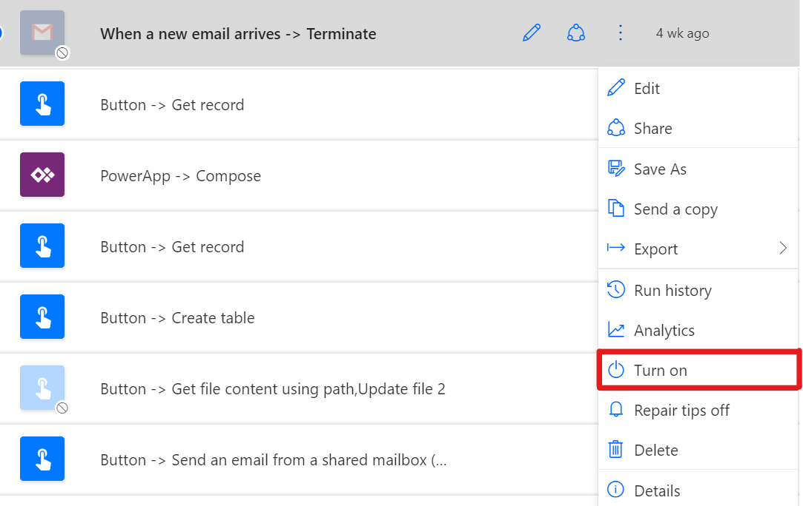
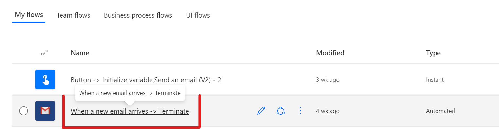
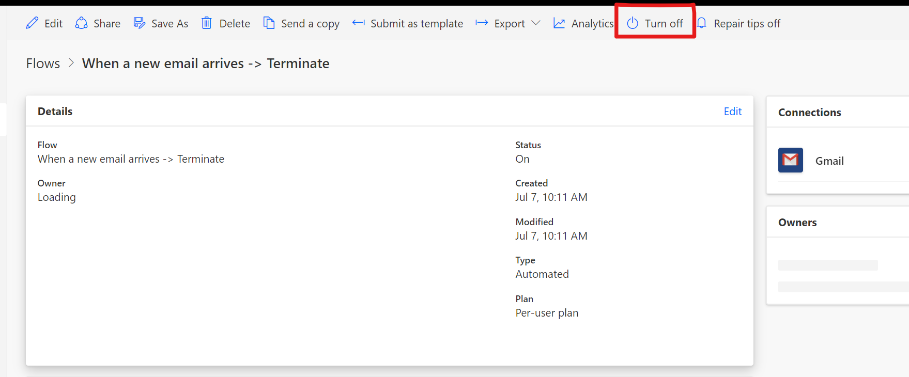

# Turn on/off a flow

## Manage your flows by turning them on or off

There are 2 ways to Turn on/off a flow. The flow is turned on by default and to turn off, use the following steps

1. On the **My flows page**,  select the ellipsis (...) for a flow.

    
2. Select Turn on  or Turn off in the menu that appears.

    
3. Message appears with the new flow status.

    

## Another way to Turn on/off a flow

1. On the **My flows page**, click on the **flow Name**.

    
2. Select **Turn off** or **Turn on** to enable or disable the flow.

    
3. Message appears with the new flow status.

    
