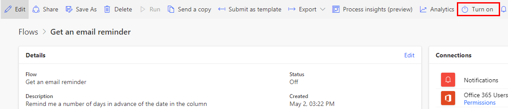

# Turn flows on or off

At times, you might want to turn off a cloud flow to prevent it from running. Follow these steps to turn flows off or on.

## Turn flows off

After you create a cloud flow, it is turned on by default. Follow these steps to turn off a cloud flow.

1. On the left pane, select **My Flows**.

1. Select a cloud flow, and then select **More commands** (...) icon.

    >[!div class="mx-imgBorder"]
    >
    
1. On the menu that appears, select **Turn off**.

1. Verify the new status on the **Details** page by selecting the **More commands** (...) icon, and then selecting **Details**.

    >[!div class="mx-imgBorder"]
    >

>[!NOTE]
>If you turn off a flow, its runs are queued and they'll run when you turn the flow on.

## Turn flows on

If you've turned a cloud flow off, but want to turn it back on so that it will run again, follow one of these procedures.

- If you are on the **Details** page, in the menu at the top, select **Turn on**.

    >[!div class="mx-imgBorder"]
    >

- If you are on the **Flows** page:

    1. Select a cloud flow, and then select **More commands** (...) icon.

    1. On the menu that appears, select **Turn on**. The status changes to **On**.

>[!NOTE]
>If you disable a flow while it's running, the run will continue. If you delete a flow that's running, the current run terminates.

[!INCLUDE[footer-include](includes/footer-banner.md)]