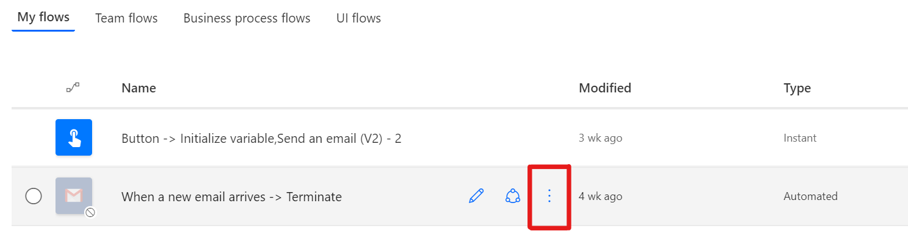
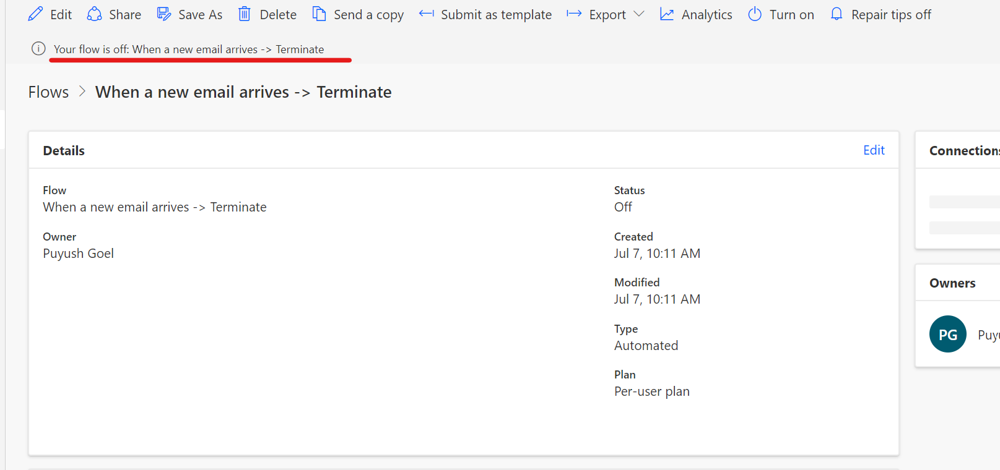
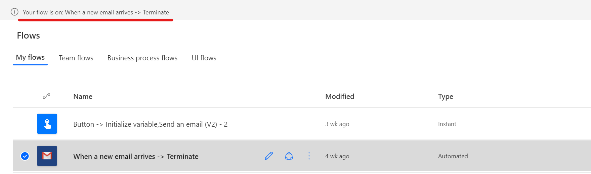

# Turn flows on or off

At times, you might want to turn off a cloud flow to prevent it from running. Follow these steps to turn flows off or on.

## Turn flows off

After you create a cloud flow, it is turned on by default. Follow these steps to turn off a cloud flow.

1. On the **My flows page**,  select the ellipsis (...) for the flow you want to turn off.
    
    
    
1. Select **Turn off** in the menu that appears.

1. A message appears with the new flow status.

    

## Turn flows on

If you've turned a cloud flow off, but want to turn it back on so that it will run again, follow these steps: 

1. On the **My flows page**, select the flow that you want to modify.

1. On the menu at the top of the screen, select **Turn on** to enable or disable the flow.

1. Message appears with the new flow status.

    

>[!NOTE]
>If you disable a flow while it's running, the run will continue. If you delete a flow that's running, the current run terminates.

[!INCLUDE[footer-include](includes/footer-banner.md)]