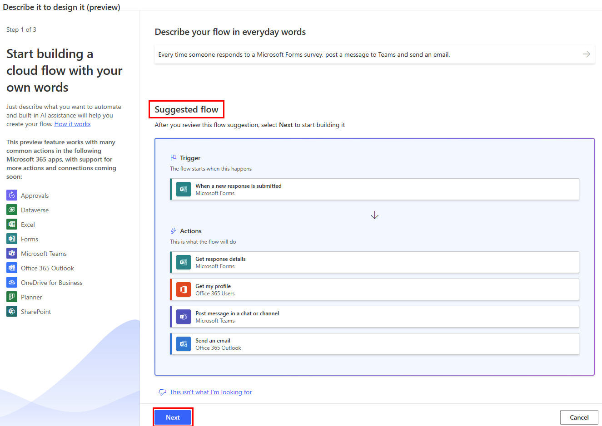
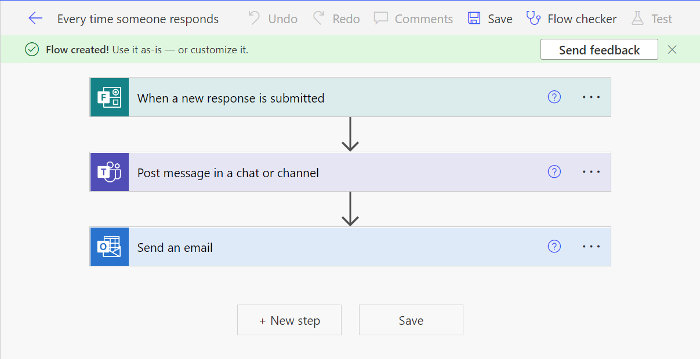

# Create a cloud flow from a description

When building automations with Power Automate, learning which actions you need to might take valuable time, especially if you’re new to the Power Automate. Now you can let Artificial Intelligence (AI) be a copilot and do all the hard work by providing a written description of what you want to automate in everyday language and see the corresponding flow created instantly.

## Prerequisites

- A work or school account with access to a Power Automate [environment](/power-platform/admin/create-environment#create-an-environment-in-the-power-platform-admin-center) that's based in the United States.
  
  >[!NOTE]
  >You cannot create cloud flows from a description if you're logged in with a Microsoft Account.

  >[!TIP]
  >If you don’t have access to an environment that's based in the United States, you can [create a new environment and select United States](](/power-platform/admin/create-environment#create-an-environment-in-the-power-platform-admin-center) as the region.

- Check current [limitations](#limitations) for more information.

## Create a flow from a description

In the following example, we'll build an automated cloud flow that sends a notification via Teams and an email each time someone responds to a Microsoft Forms survey.

1. Navigate to the **Create** page for Power Automate, and select **You describe it, AI Builds it**.

   A screen opens where you can enter a description of what you want to automate. You will also see examples you can use for inspiration and that you can try right away.

1. For this example, enter *Every time someone responds to a Microsoft Forms survey, post a message to Teams and send an email*.
1. Select the **Submit** button.

   Power Automate returns up to three suggested flows that correspond to what you've entered. You can select the preview icon to the right of each flow to see a preview of the flow.  

    

   >[!NOTE]
   >If none of the suggestions correspond to what you’re looking to automate, you can select **This is not what I want**. You will see additional guidance on what you can do next, and this signal will help us improve the AI behind this feature.

1. Select that flow that best suits your needs.
1. Select **Next**.
1. Setup all the connections needed to run the flow.
1. Enter the information needed to run the flow. For example, which form to use and to whom to send the Teams message and email. You can decide to fill in the information on this step or do it later in the designer.
1. Select **Create flow**.

   And there you have it! Your flow has been built – congratulations! You can decide to make any modification and edit the flow or save it and test it.

   

<!-- Behind the tech
===============

The implementation relies on OpenAI Codex, an AI model descendant of GPT-3 that can translate natural language to code, in this case descriptions to cloud flows. Its training data contains both natural language and a large number of sample cloud flows. -->

## Limitations

- Power Automate supports descriptions written in the English language only. Writing descriptions in other languages might work but are not officially supported. 
- Cloud flows are the only type of flow that you can create from a description.
- The AI model that transforms a description into a cloud flow is optimized to automate the main actions for the following applications.

  - Microsoft Excel
  - Microsoft Forms
  - Microsoft 365 Outlook
  - Microsoft OneDrive for Business
  - Microsoft Planner
  - Microsoft SharePoint
  - Microsoft Teams

### See also

[Learn more about cloud flows](./overview-cloud.md).  

<!-- Giving us feedback
==================

Microsoft is committed to developing and deploying AI technologies in a responsible manner. If you find any inappropriate results generated by Power
Automate, please [report it now](https://msrc.microsoft.com/report/abuse?ThreatType=URL&IncidentType=Responsible%20AI&SourceUrl=https://make.powerautomate.com) to help us keep our AI model behaving in a responsible manner. Thank you for taking the time to provide your comments, they help us greatly build better products. -->
