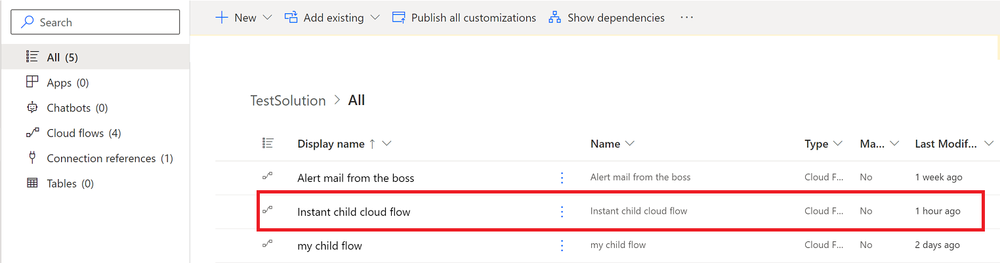
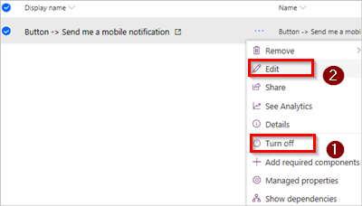

# Edit a solution-aware cloud flow

Solution-aware cloud flows can be found and edited either via the **My flows** lists or via **Solutions**.

> [!IMPORTANT]
> Stop your flow before you begin editing it, or you might lose your changes.

## Edit a solution-aware cloud flow via Solutions

1. Sign into [Power Automate](https://powerautomate.com), and then select **Solutions** from the navigation bar on the left side.
1. Select the solution that contains the flow you want to edit.

   

1. Select **...** (Commands) for your flow, and then select **Turn off**.
1. Select **...** (Commands) for your flow, and then select **Edit**.

   

1. Make your edits in the Power Automate designer, test your changes, and then save your flow.
1. Turn on your flow if you'd like it to run.

## Edit a solution-aware cloud flow via My flows

1. In [Power Automate](https://powerautomate.com), select **My flows** from the navigation bar on the left side.
1. Find the flow you want to edit. Cloud flows you own will be in the **Cloud flows** tab and flows you have co-ownership of will be in the **Shared with me** tab.
1. Select **...** (Commands) for your flow, and then select **Turn off**.
1. Select **...** (Commands) for your flow, and then select **Edit**.

## Learn more

* [Manage and edit a cloud flow](/power-automate/get-started-logic-flow#manage-a-cloud-flow)
* [Create a solution](./overview-solution-flows.md)
* [Create a cloud flow in a solution](./create-flow-solution.md)
* [Export a solution](./export-flow-solution.md)
* [Import a solution](./import-flow-solution.md)
* [Remove a solution-aware flow](./remove-solution-aware-flow.md)

[!INCLUDE[footer-include](includes/footer-banner.md)]
