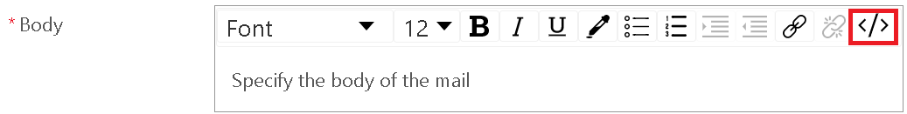
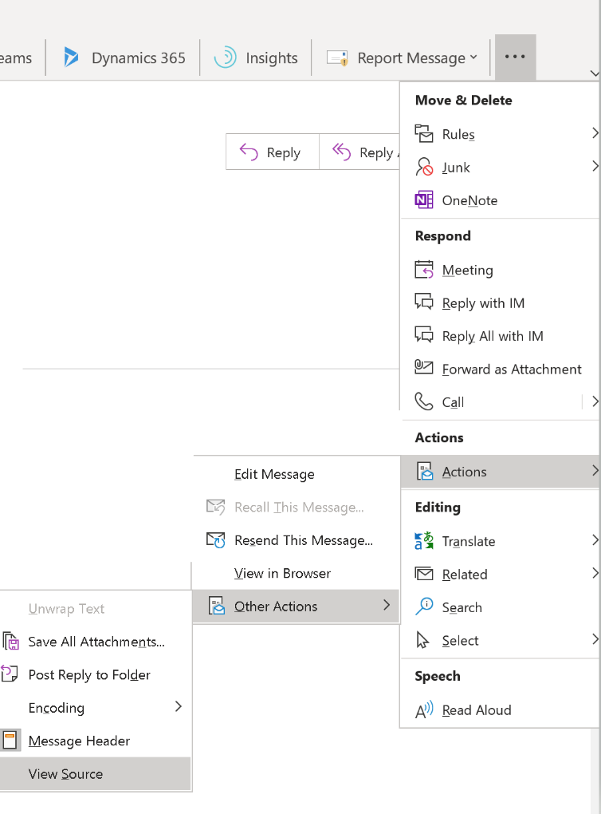
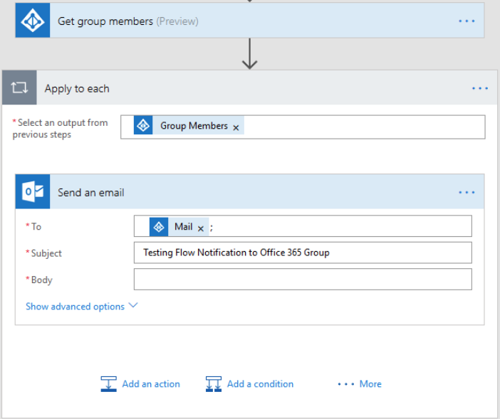

# Customize Microsoft 365 Email with Power Automate

Here are the top how to scenarios about email in Power Automate, with examples on how to achieve them:

1. Send a [beautifully formatted email](#send-a-beautifully-formatted-email).

1. [Add an image](#add-an-image-to-your-email) to your email.

1. Send [email to a distribution list](#send-email-to-a-distribution-list).

1. Send email with [multiple attachments](#send-email-with-multiple-attachments).

1. Send automatic replies from a [shared mailbox](#send-automatic-replies-from-a-shared-mailbox).

1. Change the [date and time format](#change-the-date-and-time-format-of-an-email) of an email.

## Send a beautifully formatted email 

<!--Todo: credits-->
Credits to David Lozzi for these tips in his blog.

You can use HTML to beautify your email. Following are two options that you can use to beautify your messages with HTML:

### Option 1: Write HTML directly into the flow

1. Select the **\</\>** button inside the rich text editor. 

   

1. Enter any HTML content into the body of the email.

### Option 2: Copy HTML from an Outlook email

Alternatively, if you don't know HTML, or don't feel like playing with HTML, follow these steps:

1. Create an email in Outlook, styling it with colors, content placeholders, images, tables, etc.
1. Send the email to yourself.
1. Open the email you sent to yourself in Outlook. Be sure to use a new window. Do not use the preview window in Outlook.
1. Go to the **Message** tab > **More Actions** > **Other Actions** > **View Source**.

   

   The HTML representation of the email opens in your text editor. 
   
1. Find **\<html\>** in the file. 
1. Copy the content between **\<html\>** and **\</html\>**. 
1. Back in Power Automate, select the **\</\>** button in the rich text editor of the **Send an email** action, and then paste in the contents that you copied from Outlook.

### Add an image to your email

Outlook takes the image you included in your email and converts it to plain text. Instead of copy/pasting the plain text into Power Automate, follow these steps: 

1. Upload the image to a cloud-based storage, such as Google Drive, OneDrive for Business, etc. 
1. Get the anonymous visitor URL to the image. 
1. In the Power Automate **Send an email** action, go to the HTML section of rich text editor, look for **\<image src=** in the HTML, and then change the value of the **src** property to the URL of the image from the cloud-based storage provider where you uploaded the image. 

   Your **src** should be similar to: **\<image src="https://url/to/your/images.png"/\>**.

   >[!IMPORTANT]
   >Inline images are limited to a size of 100KB. This may impact the quality of the image.

   

### Send email to a distribution list

The **Send an email** action can send messages to an email-enabled security group or distribution list. Each member of the email-enabled security group or distribution list receives the email in their group mailbox rather than their own mailbox. 

Alternatively, follow these steps if you want users to receive the email in their mailbox: 

1. Add the [Get group members](https://docs.microsoft.com/connectors/azuread/#get-group-members) action from the [Azure AD](https://docs.microsoft.com/connectors/azuread/) connector, and then select the distribution list.

1. Add an **Apply to each** action under the action **Azure AD-Get group members**.

1. Inside the **Apply to each**, add the **Send an email** action, and then add the group members from the **Get group members** action as dynamic content in the **To** field.

   

### Send email with multiple attachments

<!--Todo-->

Blogpost of an example [here](https://flow.microsoft.com/blog/multiple-attachments-single-email/).

Check out the comments for more tips.

### Send automatic replies from a shared mailbox

You can do this in Outlook Web App

1.  Log into the Outlook Web App at [https://outlook.office365.com](https://outlook.office365.com/) using your Office 365 credentials.

1.  Select your profile image (or placeholder image) on the top right.

1.  Choose **Open another mailbox.**

1.  Type in the name or email address of the shared mailbox, and then select it.

1.  Select the **settings icon** on the top right, and then select **Automatic replies.**

1.  Configure your automatic reply. You’re done.

### Change the date and time format of an email 

By default, the email you receive show the UTC time zone. However, your users might want to change it to their local time zone. Follow the steps in this [article](https://support.microsoft.com/help/4557244/converting-time-zone-in-microsoft-power-automate) to convert the time zone.

## Next steps

